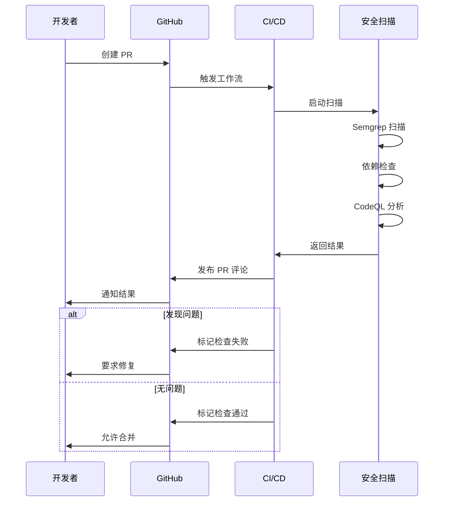
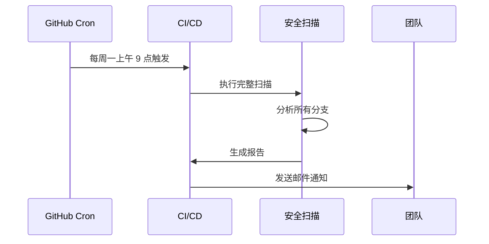

# CI/CD 安全扫描集成指南

> **文档版本**：v1.0
> **创建时间**：2026-01-09
> **适用项目**：订单可视化平台后端

---

## 📋 目录

- [概述](#概述)
- [架构设计](#架构设计)
- [快速开始](#快速开始)
- [工具配置](#工具配置)
- [工作流程](#工作流程)
- [最佳实践](#最佳实践)
- [故障排查](#故障排查)
- [维护指南](#维护指南)

---

## 概述

### 目标

建立自动化安全扫描体系，在代码合并到主分支前发现安全问题，确保代码质量和安全性。

### 扫描工具栈

| 工具 | 用途 | 优势 |
|------|------|------|
| **Semgrep** | 静态代码分析 | 快速、准确、支持自定义规则 |
| **OWASP Dependency-Check** | 依赖漏洞扫描 | 检测第三方库漏洞 |
| **CodeQL** | 语义代码分析 | 深度分析，发现复杂问题 |

### 触发条件

- ✅ **推送到主分支**（main/develop）
- ✅ **创建 Pull Request**
- ✅ **定期扫描**（每周一上午 9 点）
- ✅ **手动触发**（通过 GitHub Actions UI）

---

## 架构设计

### CI/CD 流程图

```
┌─────────────────────────────────────────────────────────────┐
│                     GitHub Repository                        │
└─────────────────────────────────────────────────────────────┘
                            │
                            ▼
        ┌───────────────────────────────────────┐
        │   Push / PR / Schedule / Manual       │
        └───────────────────────────────────────┘
                            │
        ┌───────────────────┼───────────────────┐
        │                   │                   │
        ▼                   ▼                   ▼
┌──────────────┐  ┌──────────────────┐  ┌──────────────┐
│   Semgrep    │  │ Dependency Check │  │   CodeQL     │
│  代码扫描     │  │   依赖漏洞扫描     │  │  语义分析     │
└──────────────┘  └──────────────────┘  └──────────────┘
        │                   │                   │
        └───────────────────┼───────────────────┘
                            │
                            ▼
                ┌───────────────────────┐
                │   SARIF 报告上传       │
                │   GitHub Security     │
                └───────────────────────┘
                            │
                            ▼
                ┌───────────────────────┐
                │   PR 评论通知          │
                │   或邮件通知           │
                └───────────────────────┘
```

### 三级防护机制

`★ Insight ─────────────────────────────────────`
**纵深防御策略**：

1. **快速扫描（Semgrep）**：
   - 2-3 分钟完成
   - 覆盖常见安全问题
   - 支持自定义规则

2. **依赖检查（Dependency-Check）**：
   - 5-10 分钟完成
   - 检测第三方库漏洞
   - 生成详细报告

3. **深度分析（CodeQL）**：
   - 15-30 分钟完成
   - 发现复杂逻辑漏洞
   - 数据流分析
`─────────────────────────────────────────────────`

---

## 快速开始

### 前置要求

1. ✅ GitHub 仓库
2. ✅ 分支保护规则已启用（推荐）
3. ✅ GitHub Actions 已启用（默认启用）

### 安装步骤

#### 步骤 1：提交配置文件

```bash
# 1. 配置文件已在项目中创建
ls -la .github/workflows/security-scan.yml
ls -la .semgrep/semgrep.yaml

# 2. 提交到仓库
git add .github/ .semgrep/
git commit -m "[ci] 添加安全扫描 CI/CD 配置"
git push origin develop
```

#### 步骤 2：验证配置

1. 访问 GitHub 仓库的 **Actions** 标签页
2. 查看工作流是否显示：🔒 安全扫描 (Security Scan)
3. 点击 **Run workflow** 手动触发测试

#### 步骤 3：查看首次扫描结果

```bash
# 等待约 20-30 分钟
# 访问：https://github.com/<owner>/<repo>/actions
# 点击最新的运行记录查看结果
```

---

## 工具配置

### Semgrep 配置

#### 配置文件位置

```
backend/.semgrep/
├── semgrep.yaml           # 主配置文件
└── rules/
    └── custom-java-security.yml  # 自定义规则
```

#### 配置说明

**主配置文件**（`.semgrep/semgrep.yaml`）：

```yaml
rules:
  # 项目自定义规则
  - include: .semgrep/rules/

  # 使用 Semgrep 社区规则
  - include: https://semgrep.dev/p/java

  # 排除误报规则
  - exclude: |
      - generic.secrets.security.detected-bcrypt-hash.detected-bcrypt-hash

options:
  # 排除测试文件
  exclude_paths:
    - '**/test/**'
    - '**/target/**'

  # 严重程度过滤
  severity: WARNING
```

**自定义规则**（`.semgrep/rules/custom-java-security.yml`）：

项目包含 7 条自定义安全规则：

| 规则 ID | 严重程度 | 检测内容 |
|---------|---------|----------|
| `custom.java.logging-sensitive-data` | WARNING | 日志中的敏感信息 |
| `custom.java.sql-injection-risk` | ERROR | SQL 注入风险 |
| `custom.java.hardcoded-crypto-key` | ERROR | 硬编码加密密钥 |
| `custom.java.jwt-without-expiration` | WARNING | JWT 无过期时间 |
| `custom.java.weak-encryption-des` | ERROR | 使用弱加密算法 |
| `custom.java.httpclient-no-timeout` | WARNING | HTTP 客户端无超时 |
| `custom.java.sensitive-operation-no-log` | WARNING | 敏感操作无日志 |

### GitHub Actions 配置

#### 工作流文件结构

```
.github/workflows/security-scan.yml
├── semgrep-scan          # Semgrep 扫描任务
├── dependency-check      # 依赖检查任务
├── code-ql               # CodeQL 分析任务
└── summary-report        # 总结报告任务
```

#### 关键配置项

```yaml
on:
  push:
    branches: [ main, develop ]
  pull_request:
    branches: [ main, develop ]
  schedule:
    - cron: '0 9 * * 1'  # 每周一上午 9 点
  workflow_dispatch:      # 手动触发
```

---

## 工作流程

### Pull Request 场景



### 定期扫描场景



---

## 最佳实践

### 1. 分支保护规则

**推荐配置**：

```json
{
  "required_status_checks": {
    "strict": true,
    "contexts": [
      "Semgrep 代码安全扫描",
      "依赖漏洞扫描",
      "CodeQL 代码分析"
    ]
  },
  "enforce_admins": true,
  "require_pull_request_reviews": true,
  "require_status_checks": true
}
```

**设置步骤**：

1. 进入仓库 **Settings** → **Branches**
2. 点击 **Add rule**
3. 输入分支名称模式：`main` 或 `develop`
4. 勾选 **Require status checks to pass before merging**
5. 选择上述 3 个检查项
6. 保存

### 2. 持续改进

**定期审查**：
- 📅 每月审查扫描结果
- 📊 分析误报率
- 🔧 调整规则配置
- 📝 更新文档

**规则优化**：

```yaml
# 如果某个规则误报率高
rules:
  exclude:
    - rule-id-with-high-false-positive  # 临时排除
```

**自定义规则迭代**：

1. 记录新发现的安全模式
2. 编写自定义规则
3. 测试规则有效性
4. 合并到主配置

### 3. 团队协作

**培训要点**：
- 🎓 如何查看扫描结果
- 🐛 如何处理安全问题
- 📝 如何编写安全代码

**沟通机制**：
- 💬 PR 评论自动通知
- 📧 定期报告邮件
- 📊 月度安全回顾会议

---

## 故障排查

### 常见问题

#### 问题 1：Semgrep 扫描超时

**现象**：
```
Error: Semgrep scan timed out after 300 seconds
```

**原因**：
- 代码量过大
- 规则过多
- 网络问题

**解决方案**：

```yaml
# 增加超时时间
- name: 🔍 运行 Semgrep 扫描
  uses: returntocorp/semgrep@v2
  with:
    timeout: 600  # 增加到 10 分钟
```

或减少扫描范围：

```yaml
# 仅扫描修改的文件
with:
  diff: aware
```

#### 问题 2：依赖检查失败

**现象**：
```
Error: Unable to download NVD data
```

**原因**：
- NVD 数据源不可用
- 网络连接问题

**解决方案**：

```yaml
- name: 🔍 运行 OWASP Dependency Check
  uses: dependency-check/Dependency-Check_Action@main
  with:
    skip: true  # 跳过 NVD 更新（使用缓存）
```

#### 问题 3：CodeQL 内存不足

**现象**：
```
Error: CodeQL analysis out of memory
```

**解决方案**：

```yaml
- name: 🔧 初始化 CodeQL
  uses: github/codeql-action/init@v3
  with:
    languages: ${{ matrix.language }}
    queries: security  # 使用轻量级查询集
```

### 调试技巧

**启用详细日志**：

```yaml
- name: 🔍 运行 Semgrep 扫描
  uses: returntocorp/semgrep@v2
  with:
    config: auto
    debug: true  # 启用调试模式
```

**本地测试**：

```bash
# 在本地运行 Semgrep 扫描
semgrep --config .semgrep/semgrep.yaml .

# 测试单个规则
semgrep --config .semgrep/rules/custom-java-security.yml .
```

---

## 维护指南

### 日常维护

**每日**：
- ✅ 查看新的扫描结果
- ✅ 处理 PR 中的安全问题

**每周**：
- 📊 查看定期扫描报告
- 📝 更新问题追踪列表

**每月**：
- 🎯 审查规则配置
- 📈 分析安全趋势
- 🔧 优化扫描性能

### 版本升级

**Semgrep 升级**：

```yaml
# .github/workflows/security-scan.yml
env:
  SEMGREP_VERSION: 1.147.0  # 更新到最新版本
```

**检查最新版本**：

```bash
# 访问 Semgrep releases
curl -s https://semgrep.dev/api/check-version
```

### 备份与恢复

**备份配置**：

```bash
# 导出当前配置
tar -czf security-scan-config.tar.gz .github/ .semgrep/

# 保存到文档仓库
cp security-scan-config.tar.gz /path/to/docs/backups/
```

**恢复配置**：

```bash
# 解压备份
tar -xzf security-scan-config.tar.gz
```

---

## 附录

### A. 环境变量

| 变量名 | 说明 | 示例值 |
|-------|------|--------|
| `GITHUB_TOKEN` | GitHub API Token | 自动提供 |
| `SEMGREP_VERSION` | Semgrep 版本 | `1.147.0` |
| `JAVA_VERSION` | Java 版本 | `21` |

### B. 状态徽章

在 README.md 中添加状态徽章：

```markdown

```

### C. 相关资源

- [Semgrep 文档](https://semgrep.dev/docs/)
- [GitHub Actions 文档](https://docs.github.com/en/actions)
- [OWASP Dependency-Check](https://owasp.org/www-project-dependency-check/)
- [CodeQL 文档](https://codeql.github.com/docs/)
- [项目安全扫描报告](./代码安全扫描报告_20260109.md)

---

**文档维护者**：开发组
**最后更新**：2026-01-09
**文档版本**：v1.0
