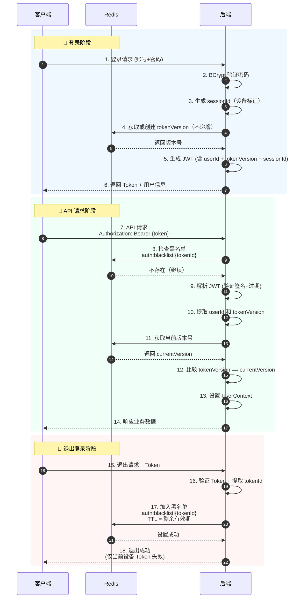

# P0 任务：JWT 认证与退出登录实施指南

> **优先级**：P0（最高优先级）
>
> **预计工期**：2.0 天
>
> **依赖**：plan_53（后端项目初始化）、plan_55（数据库建表）、plan_22（用户登录）
>
> **验收负责人**：后端开发工程师

---

## 一、任务概述

### 1.1 目标

实现完整的 JWT 认证机制，包括：
- **Token 生成**：登录成功后生成 JWT Token
- **Token 验证**：请求时校验 Token ·
- **Token 失效**：退出登录时使 Token 失效
- **用户上下文**：在请求周期内存储当前用户信息

### 1.2 核心流程



### 1.3 技术选型

| 技术 | 版本 | 用途 |
|------|------|------|
| JWT | jjwt-0.11.5 | Token 生成与解析 |
| Redis | 7.0+ | Token 版本控制（实现退出登录） |
| BCrypt | Spring Security | 密码加密验证 |

> **关键设计**：使用 Token 黑名单 + 版本控制双重机制。
> - **登录**：获取或创建版本号（不递增），多设备互不影响
> - **退出登录**：将 token 加入黑名单（TTL = token 剩余有效期）
> - **版本号**：仅用于批量失效场景（密码重置、账号禁用时递增）

---

## 二、前置条件检查

### 2.1 环境准备

```bash
# 1. 确保 Redis 可用
redis-cli ping
# 期望输出：PONG

# 2. 确保数据库已建表
mysql -u root -p -e "USE order_platform; SHOW TABLES LIKE 't_user%';"
# 期望输出：t_user, t_role, t_user_role

# 3. 确保项目可启动
cd order-platform-backend/order-platform-api
mvn clean compile
```

### 2.2 依赖检查

确保父 POM 已添加以下依赖管理：

```xml
<properties>
    <jjwt.version>0.11.5</jjwt.version>
    <spring-boot-starter-data-redis.version>3.2.0</spring-boot-starter-data-redis.version>
</properties>
```

---

## 三、实施步骤

### 步骤 1：添加 Maven 依赖

**文件位置**：`order-platform-backend/pom.xml`

```xml
<!-- JWT 依赖 -->
<dependency>
    <groupId>io.jsonwebtoken</groupId>
    <artifactId>jjwt-api</artifactId>
    <version>${jjwt.version}</version>
</dependency>
<dependency>
    <groupId>io.jsonwebtoken</groupId>
    <artifactId>jjwt-impl</artifactId>
    <version>${jjwt.version}</version>
    <scope>runtime</scope>
</dependency>
<dependency>
    <groupId>io.jsonwebtoken</groupId>
    <artifactId>jjwt-jackson</artifactId>
    <version>${jjwt.version}</version>
    <scope>runtime</scope>
</dependency>

<!-- Redis 依赖 -->
<dependency>
    <groupId>org.springframework.boot</groupId>
    <artifactId>spring-boot-starter-data-redis</artifactId>
</dependency>

<!-- Jakarta Annotation（@NotNull 等注解）-->
<dependency>
    <groupId>jakarta.annotation</groupId>
    <artifactId>jakarta.annotation-api</artifactId>
</dependency>
```

**验证命令**：
```bash
mvn dependency:tree | grep jjwt
```

---

### 步骤 2：配置 Redis 和 JWT 参数

**文件位置**：`order-platform-api/src/main/resources/application.yml`

```yaml
spring:
  # ==================== Redis 配置 ====================
  data:
    redis:
      host: ${REDIS_HOST:localhost}
      port: ${REDIS_PORT:6379}
      password: ${REDIS_PASSWORD:}
      database: ${REDIS_DB:0}
      timeout: 3000ms
      lettuce:
        pool:
          max-active: 20
          max-wait: -1ms
          max-idle: 10
          min-idle: 5

# ==================== JWT 配置 ====================
jwt:
  secret: ${JWT_SECRET:your-256-bit-secret-key-change-in-production-please-use-environment-variable}
  expiration: 7d              # Token 有效期（Duration 格式）
  header: Authorization
  token-prefix: Bearer

# ==================== 认证白名单配置 ====================
auth:
  whitelist:
    exact:                    # 精确匹配
      - /api/auth/login
      - /api/health
      - /doc.html
    prefix:                   # 前缀匹配
      - /swagger
      - /v3/api-docs
      - /webjars
```

**关键参数说明**：

| 参数 | 默认值 | 说明 |
|------|--------|------|
| jwt.secret | 需修改 | 密钥，生产环境必须用环境变量 |
| jwt.expiration | 7d | Token 有效期（Duration 格式：7d, 12h, 30m） |
| jwt.header | Authorization | 请求头名称 |
| jwt.token-prefix | Bearer | Token 前缀 |
| auth.whitelist.exact | - | 精确匹配的白名单路径 |
| auth.whitelist.prefix | - | 前缀匹配的白名单路径 |

**安全警告**：
> ⚠️ **生产环境必须通过环境变量设置 JWT_SECRET**
>
> ```bash
> export JWT_SECRET=$(openssl rand -base64 32)
> ```

---

### 步骤 3：创建 JWT 配置属性类

**文件位置**：`order-platform-common/src/main/java/.../security/JwtProperties.java`

```java
package com.company.order.visual.common.security;

import lombok.Data;
import org.springframework.boot.context.properties.ConfigurationProperties;
import org.springframework.stereotype.Component;

import java.time.Duration;

/**
 * JWT 配置属性
 *
 * 从 application.yml 读取配置：
 * jwt.secret          - JWT 密钥
 * jwt.expiration      - Token 过期时间（Duration 格式）
 * jwt.header          - 请求头名称
 * jwt.token-prefix    - Token 前缀
 */
@Data
@Component
@ConfigurationProperties(prefix = "jwt")
public class JwtProperties {

    /**
     * JWT 密钥（至少 256 位）
     */
    private String secret;

    /**
     * Token 过期时间，默认 7 天
     * 支持格式：7d, 12h, 30m, 60s
     */
    private Duration expiration = Duration.ofDays(7);

    /**
     * 请求头名称
     */
    private String header = "Authorization";

    /**
     * Token 前缀
     */
    private String tokenPrefix = "Bearer";
}
```

---

### 步骤 4：创建 JWT 工具类

**文件位置**：`order-platform-common/src/main/java/.../security/JwtProvider.java`

```java
package com.company.order.visual.common.security;

import io.jsonwebtoken.*;
import io.jsonwebtoken.security.Keys;
import jakarta.annotation.PostConstruct;
import lombok.RequiredArgsConstructor;
import lombok.extern.slf4j.Slf4j;
import org.springframework.stereotype.Component;

import javax.crypto.SecretKey;
import java.nio.charset.StandardCharsets;
import java.util.Date;

/**
 * JWT 工具类
 *
 * 核心职责：
 * 1. 生成 JWT Token（包含 tokenVersion + tokenId）
 * 2. 解析 JWT Token
 * 3. 验证 Token 有效性
 * 4. 从 Token 提取用户 ID、Token 版本、Token ID
 */
@Slf4j
@Component
@RequiredArgsConstructor
public class JwtProvider {

    private final JwtProperties jwtProperties;

    private SecretKey secretKey;

    /**
     * 初始化密钥
     * 确保 secret 至少 256 位（32 字节）
     */
    @PostConstruct
    public void init() {
        byte[] keyBytes = jwtProperties.getSecret().getBytes(StandardCharsets.UTF_8);
        this.secretKey = Keys.hmacShaKeyFor(keyBytes);

        if (keyBytes.length < 32) {
            log.warn("JWT_SECRET 长度不足 32 字节，当前：{} 字节，建议使用：openssl rand -base64 32", keyBytes.length);
        }
    }

    /**
     * 生成 Token
     *
     * @param userId       用户 ID
     * @param tokenVersion Token 版本号（从 Redis 获取）
     * @return JWT Token
     */
    public String generateToken(Long userId, Long tokenVersion) {
        Date now = new Date();
        Date expiryDate = new Date(now.getTime() + jwtProperties.getExpiration().toMillis());

        // 生成唯一的 tokenId（用于黑名单）
        String tokenId = UUID.randomUUID().toString().replace("-", "");

        return Jwts.builder()
                .claim("userId", userId)
                .claim("tokenVersion", tokenVersion)
                .claim("tokenId", tokenId)           // 用于黑名单
                .issuedAt(now)
                .expiration(expiryDate)
                .signWith(secretKey)
                .compact();
    }

    /**
     * 解析 Token 获取 Claims（私有方法，消除重复代码）
     *
     * @param token JWT Token
     * @return JWT Claims
     */
    private Claims parseClaims(String token) {
        return Jwts.parser()
                .verifyWith(secretKey)
                .build()
                .parseSignedClaims(token)
                .getPayload();
    }

    /**
     * 从 Token 中提取用户 ID
     *
     * @param token JWT Token
     * @return 用户 ID
     */
    public Long getUserIdFromToken(String token) {
        return parseClaims(token).get("userId", Long.class);
    }

    /**
     * 从 Token 中提取 Token 版本号
     *
     * @param token JWT Token
     * @return Token 版本号
     */
    public Long getTokenVersionFromToken(String token) {
        return parseClaims(token).get("tokenVersion", Long.class);
    }

    /**
     * 从 Token 中提取 Token ID（用于黑名单）
     *
     * @param token JWT Token
     * @return Token ID
     */
    public String getTokenIdFromToken(String token) {
        return parseClaims(token).get("tokenId", String.class);
    }

    /**
     * 验证 Token 有效性（签名和过期）
     *
     * @param token JWT Token
     * @return true=有效，false=无效
     */
    public boolean validateToken(String token) {
        try {
            parseClaims(token);
            return true;
        } catch (SecurityException e) {
            log.error("JWT 签名无效：{}", e.getMessage());
        } catch (MalformedJwtException e) {
            log.error("JWT 格式错误：{}", e.getMessage());
        } catch (ExpiredJwtException e) {
            log.error("JWT 已过期：{}", e.getMessage());
        } catch (UnsupportedJwtException e) {
            log.error("不支持的 JWT：{}", e.getMessage());
        } catch (IllegalArgumentException e) {
            log.error("JWT 字符串为空：{}", e.getMessage());
        }
        return false;
    }

    /**
     * 获取 Token 剩余有效时间（秒）
     * 用于设置黑名单 TTL
     *
     * @param token JWT Token
     * @return 剩余秒数，已过期返回 0
     */
    public long getRemainingSeconds(String token) {
        try {
            Date expiration = parseClaims(token).getExpiration();
            long remaining = expiration.getTime() - System.currentTimeMillis();
            return Math.max(0, remaining / 1000);
        } catch (Exception e) {
            return 0;
        }
    }

    /**
     * 获取 Token 过期时间
     *
     * @param token JWT Token
     * @return 过期时间
     */
    public Date getExpirationDateFromToken(String token) {
        return parseClaims(token).getExpiration();
    }

    // ==================== Token 一次解析（避免重复） ====================

    /**
     * Token 信息（一次解析，避免重复）
     */
    @Data
    public static class TokenInfo {
        /**
         * 用户 ID
         */
        private Long userId;

        /**
         * Token 版本号
         */
        private Long tokenVersion;

        /**
         * Token ID（用于黑名单）
         */
        private String tokenId;

        /**
         * 过期时间
         */
        private Date expiration;
    }

    /**
     * 一次解析获取所有 Token 信息
     *
     * @param token JWT Token
     * @return TokenInfo，解析失败返回 null
     */
    public TokenInfo parseTokenInfo(String token) {
        try {
            Claims claims = parseClaims(token);
            TokenInfo info = new TokenInfo();
            info.setUserId(claims.get("userId", Long.class));
            info.setTokenVersion(claims.get("tokenVersion", Long.class));
            info.setTokenId(claims.get("tokenId", String.class));
            info.setExpiration(claims.getExpiration());
            return info;
        } catch (Exception e) {
            log.error("Token 解析失败：{}", e.getMessage());
            return null;
        }
    }
}
```

**设计要点**：

| 方法 | 职责 | 返回值 |
|------|------|--------|
| `generateToken(userId, tokenVersion)` | 生成 Token（含版本号 + tokenId） | String |
| `parseTokenInfo(token)` | 一次解析获取所有信息（推荐） | TokenInfo |
| `getUserIdFromToken(token)` | 提取用户 ID | Long |
| `getTokenVersionFromToken(token)` | 提取 Token 版本号 | Long |
| `getTokenIdFromToken(token)` | 提取 Token ID（黑名单用） | String |
| `validateToken(token)` | 验证签名和过期 | boolean |
| `getRemainingSeconds(token)` | 获取剩余有效期（黑名单 TTL） | long |
| `getExpirationDateFromToken(token)` | 获取过期时间 | Date |

---

### 步骤 5：创建用户上下文（UserContext）

**文件位置**：`order-platform-common/src/main/java/.../security/UserHolder.java`

```java
package com.company.order.visual.common.security;

import lombok.Data;

/**
 * 用户上下文信息
 */
@Data
public class UserContext {

    /**
     * 用户 ID
     */
    private Long userId;

    /**
     * 用户名
     */
    private String username;

    /**
     * 用户编码
     */
    private String userCode;

    /**
     * 真实姓名
     */
    private String realName;

    public UserContext(Long userId) {
        this.userId = userId;
    }

    public UserContext(Long userId, String username) {
        this.userId = userId;
        this.username = username;
    }
}
```

**文件位置**：`order-platform-common/src/main/java/.../security/UserHolder.java`

```java
package com.company.order.visual.common.security;

import lombok.extern.slf4j.Slf4j;
import org.springframework.core.NamedThreadLocal;

/**
 * 用户上下文持有器（ThreadLocal）
 *
 * 职责：
 * 1. 在请求进入时存储当前用户信息
 * 2. 在请求处理期间提供用户信息访问
 * 3. 在请求结束时清理上下文（防止内存泄漏）
 *
 * 使用示例：
 * <pre>
 * // 设置用户信息
 * UserHolder.set(userId);
 *
 * // 获取用户 ID
 * Long userId = UserHolder.getUserId();
 *
 * // 清理（必须）
 * UserHolder.clear();
 * </pre>
 */
@Slf4j
public class UserHolder {

    /**
     * 用户上下文 ThreadLocal
     * 使用 NamedThreadLocal 便于调试
     */
    private static final ThreadLocal<UserContext> CONTEXT = new NamedThreadLocal<>("UserContext");

    /**
     * 设置用户上下文
     *
     * @param userId 用户 ID（为 null 时不设置，与 set(UserContext) 行为一致）
     */
    public static void set(Long userId) {
        if (userId != null) {
            CONTEXT.set(new UserContext(userId));
        }
    }

    /**
     * 设置用户上下文（完整信息）
     *
     * @param context 用户上下文（为 null 时不设置）
     */
    public static void set(UserContext context) {
        if (context != null) {
            CONTEXT.set(context);
        }
    }

    /**
     * 获取当前用户 ID
     *
     * @return 用户 ID，未登录返回 null
     */
    public static Long getUserId() {
        UserContext context = CONTEXT.get();
        return context != null ? context.getUserId() : null;
    }

    /**
     * 获取用户上下文
     *
     * @return 用户上下文，未登录返回 null
     */
    public static UserContext get() {
        return CONTEXT.get();
    }

    /**
     * 检查用户是否已登录
     *
     * @return true=已登录，false=未登录
     */
    public static boolean isLoggedIn() {
        return CONTEXT.get() != null;
    }

    /**
     * 清理用户上下文
     *
     * ⚠️ 必须在请求结束时调用，防止 ThreadLocal 内存泄漏
     */
    public static void clear() {
        CONTEXT.remove();
    }
}
```

**关键设计**：

1. **ThreadLocal 隔离**：每个请求线程独立的用户上下文
2. **请求结束清理**：防止 Web 容器线程复用导致的内存泄漏
3. **NamedThreadLocal**：便于调试时识别 ThreadLocal 变量

---

### 步骤 6：创建 Token 版本服务

**文件位置**：`order-platform-common/src/main/java/.../security/TokenVersionService.java`

```java
package com.company.order.visual.common.security;

import lombok.RequiredArgsConstructor;
import lombok.extern.slf4j.Slf4j;
import org.springframework.data.redis.core.RedisTemplate;
import org.springframework.stereotype.Service;

import java.util.concurrent.TimeUnit;

/**
 * Token 版本服务 + 黑名单服务
 *
 * 核心设计：
 * 1. 版本号：用于批量失效场景（密码重置、账号禁用）
 * 2. 黑名单：用于单设备退出登录（不影响其他设备）
 *
 * Redis 数据结构：
 * - auth:version:{userId} = tokenVersion (Long)           (TTL: 30天)
 * - auth:blacklist:{tokenId} = "1" (String)               (TTL: token 剩余有效期)
 *
 * 职责：
 * 1. 获取/递增 Token 版本号
 * 2. 将 Token 加入黑名单（退出登录）
 * 3. 检查 Token 是否在黑名单
 */
@Slf4j
@Service
@RequiredArgsConstructor
public class TokenVersionService {

    private final RedisTemplate<String, Object> redisTemplate;

    /**
     * 版本号 Redis Key 前缀
     */
    private static final String VERSION_KEY_PREFIX = "auth:version:";

    /**
     * 黑名单 Redis Key 前缀
     */
    private static final String BLACKLIST_KEY_PREFIX = "auth:blacklist:";

    /**
     * 版本号过期时间（30天无登录则过期）
     */
    private static final long VERSION_EXPIRE_DAYS = 30;

    /**
     * 获取版本号 Key
     */
    private String getVersionKey(Long userId) {
        return VERSION_KEY_PREFIX + userId;
    }

    /**
     * 获取黑名单 Key
     */
    private String getBlacklistKey(String tokenId) {
        return BLACKLIST_KEY_PREFIX + tokenId;
    }

    /**
     * 获取当前 Token 版本号
     *
     * @param userId 用户 ID
     * @return 当前版本号，不存在返回 0
     */
    public Long getVersion(Long userId) {
        String key = getVersionKey(userId);
        Object version = redisTemplate.opsForValue().get(key);
        return version != null ? Long.parseLong(version.toString()) : 0L;
    }

    /**
     * 获取或创建版本号（登录时调用，不递增）
     *
     * @param userId 用户 ID
     * @return 当前版本号，不存在则初始化为 1
     */
    public Long getOrCreateVersion(Long userId) {
        String key = getVersionKey(userId);
        Object version = redisTemplate.opsForValue().get(key);
        if (version != null) {
            return Long.parseLong(version.toString());
        }
        // 不存在则初始化为 1，设置过期时间
        redisTemplate.opsForValue().set(key, 1L, VERSION_EXPIRE_DAYS, TimeUnit.DAYS);
        log.debug("Token 版本已初始化，用户：{}，版本：1", userId);
        return 1L;
    }

    /**
     * 使所有 Token 失效（密码重置、账号禁用等场景）
     *
     * @param userId 用户 ID
     */
    public void invalidateAll(Long userId) {
        String key = getVersionKey(userId);
        redisTemplate.opsForValue().increment(key);
        log.info("用户 {} 所有 Token 已失效（版本号递增）", userId);
    }

    /**
     * 验证 Token 版本是否有效
     *
     * @param userId         用户 ID
     * @param tokenVersion   Token 中的版本号
     * @return true=有效，false=已失效
     */
    public boolean isValid(Long userId, Long tokenVersion) {
        Long currentVersion = getVersion(userId);
        return tokenVersion.equals(currentVersion);
    }

    /**
     * 将 Token 加入黑名单（退出登录时调用）
     *
     * @param tokenId        Token ID
     * @param ttlSeconds     TTL（秒），通常为 token 剩余有效期
     */
    public void addToBlacklist(String tokenId, long ttlSeconds) {
        String key = getBlacklistKey(tokenId);
        redisTemplate.opsForValue().set(key, "1", ttlSeconds, TimeUnit.SECONDS);
        log.info("Token 已加入黑名单，TTL：{} 秒", ttlSeconds);
    }

    /**
     * 检查 Token 是否在黑名单
     *
     * @param tokenId Token ID
     * @return true=在黑名单（已失效），false=正常
     */
    public boolean isBlacklisted(String tokenId) {
        String key = getBlacklistKey(tokenId);
        return Boolean.TRUE.equals(redisTemplate.hasKey(key));
    }
}
```

**Redis 数据结构**：

```
auth:version:{userId}     = token_version (Long)      (TTL: 30天)
auth:blacklist:{tokenId}  = "1" (String)              (TTL: token 剩余有效期)
```

**设计优势**：

| 方面 | 原 TokenStore 方案 | 版本号 + 黑名单方案 |
|------|-------------------|------------------|
| 退出登录 | ❌ 删除 key 无效 | ✅ 黑名单立即生效 |
| 多设备支持 | ❌ 互相踢出 | ✅ 互不影响 |
| 批量失效 | ❌ 需遍历 key | ✅ 递增版本号 |
| Redis 查询 | 2 次 | 2 次（黑名单 + 版本） |

**重要行为说明**：

| 场景 | 行为 | 说明 |
|------|------|------|
| **多设备登录** | ✅ 互不影响 | 每个设备有独立的 tokenId，退出登录只影响当前设备 |
| **退出登录** | ✅ 仅当前设备失效 | Token 加入黑名单，其他设备继续正常使用 |
| **密码重置** | ✅ 所有设备失效 | 递增版本号，所有设备需重新登录 |
| **账号禁用** | ✅ 所有设备失效 | 递增版本号 + 拒绝认证 |

---

### 步骤 7：创建认证过滤器

**文件位置**：`order-platform-common/src/main/java/.../security/JwtAuthenticationFilter.java`

```java
package com.company.order.visual.common.security;

import jakarta.servlet.FilterChain;
import jakarta.servlet.ServletException;
import jakarta.servlet.http.HttpServletRequest;
import jakarta.servlet.http.HttpServletResponse;
import lombok.Data;
import lombok.RequiredArgsConstructor;
import lombok.extern.slf4j.Slf4j;
import org.springframework.boot.context.properties.ConfigurationProperties;
import org.springframework.lang.NonNull;
import org.springframework.stereotype.Component;
import org.springframework.util.StringUtils;
import org.springframework.web.filter.OncePerRequestFilter;

import java.io.IOException;
import java.util.List;

/**
 * JWT 认证过滤器
 *
 * 职责：
 * 1. 从请求头提取 Token
 * 2. 检查黑名单
 * 3. 验证 Token 有效性（JWT 签名 + 版本号验证）
 * 4. 解析用户信息并设置到 UserHolder
 * 5. 请求结束后清理 UserHolder
 *
 * 执行时机：在 Spring Security 之前
 */
@Slf4j
@Component
@RequiredArgsConstructor
public class JwtAuthenticationFilter extends OncePerRequestFilter {

    private final JwtProvider jwtProvider;
    private final TokenVersionService tokenVersionService;
    private final JwtProperties jwtProperties;
    private final AuthWhitelistProperties whitelistProperties;

    @Override
    protected void doFilterInternal(
            @NonNull HttpServletRequest request,
            @NonNull HttpServletResponse response,
            @NonNull FilterChain filterChain) throws ServletException, IOException {

        // 白名单直接放行
        if (isWhitelisted(request)) {
            filterChain.doFilter(request, response);
            return;
        }

        try {
            // 1. 提取 Token
            String token = extractToken(request);
            if (token == null) {
                sendUnauthorized(response, "缺少认证令牌");
                return;
            }

            // 2. 一次解析获取所有信息
            JwtProvider.TokenInfo tokenInfo = jwtProvider.parseTokenInfo(token);
            if (tokenInfo == null) {
                sendUnauthorized(response, "令牌无效或已过期");
                return;
            }

            // 3. 检查黑名单（快速失败）
            if (tokenVersionService.isBlacklisted(tokenInfo.getTokenId())) {
                sendUnauthorized(response, "令牌已失效");
                return;
            }

            // 4. 验证版本号（用于批量失效场景）
            if (!tokenVersionService.isValid(tokenInfo.getUserId(), tokenInfo.getTokenVersion())) {
                sendUnauthorized(response, "令牌已失效");
                return;
            }

            // 5. 设置用户上下文
            UserHolder.set(tokenInfo.getUserId());

            log.debug("用户认证成功，用户ID：{}", tokenInfo.getUserId());

            // 6. 继续过滤器链
            filterChain.doFilter(request, response);

        } catch (Exception e) {
            // 其他异常不应该在这里发生，让它传播
            log.error("认证过滤器异常", e);
            sendUnauthorized(response, "认证过程异常");
        } finally {
            // 7. 清理用户上下文（请求结束后）
            UserHolder.clear();
        }
    }

    /**
     * 判断是否为白名单路径
     */
    private boolean isWhitelisted(@NonNull HttpServletRequest request) {
        String path = request.getRequestURI();

        // 精确匹配优先
        if (whitelistProperties.getExact() != null &&
            whitelistProperties.getExact().contains(path)) {
            return true;
        }

        // 前缀匹配（仅用于静态资源）
        // 必须检查 "/" 后缀，防止 "/swagger../../admin" 绕过
        if (whitelistProperties.getPrefix() != null) {
            for (String prefix : whitelistProperties.getPrefix()) {
                if (path.equals(prefix) || path.startsWith(prefix + "/")) {
                    return true;
                }
            }
        }

        return false;
    }

    /**
     * 从请求头提取 Token
     */
    private String extractToken(HttpServletRequest request) {
        String headerName = jwtProperties.getHeader();
        String tokenPrefix = jwtProperties.getTokenPrefix();

        String bearerToken = request.getHeader(headerName);
        if (StringUtils.hasText(bearerToken) && bearerToken.startsWith(tokenPrefix + " ")) {
            return bearerToken.substring(tokenPrefix.length() + 1);
        }
        return null;
    }

    /**
     * 返回 401 未授权
     */
    private void sendUnauthorized(HttpServletResponse response, String message) throws IOException {
        response.setStatus(HttpServletResponse.SC_UNAUTHORIZED);
        response.setContentType("application/json;charset=UTF-8");
        response.getWriter().write("{\"code\":401,\"message\":\"" + message + "\",\"timestamp\":" + System.currentTimeMillis() + "}");
    }
}

/**
 * 认证白名单配置
 */
@Data
@Component
@ConfigurationProperties(prefix = "auth.whitelist")
public class AuthWhitelistProperties {

    /**
     * 精确匹配的路径
     */
    private List<String> exact;

    /**
     * 前缀匹配的路径
     */
    private List<String> prefix;
}
```

**白名单配置**（已在 application.yml 中配置）：

| 路径 | 类型 | 说明 |
|------|------|------|
| `/api/auth/login` | 精确匹配 | 登录接口 |
| `/api/health` | 精确匹配 | 健康检查 |
| `/doc.html` | 精确匹配 | Knife4j 文档 |
| `/swagger` | 前缀匹配 | Swagger 资源 |
| `/v3/api-docs` | 前缀匹配 | OpenAPI 文档 |
| `/webjars` | 前缀匹配 | Webjar 资源 |

**安全设计**：
- 白名单可通过配置文件管理，无需重新编译
- 精确匹配防止路径遍历攻击
- 前缀匹配检查 "/" 后缀，防止 `/swagger../../admin` 绕过
- 异常分类处理：JWT 异常返回 401，其他异常抛出

---

### 步骤 8：注册过滤器

**文件位置**：`order-platform-api/src/main/java/.../config/WebConfig.java`

```java
package com.company.order.visual.api.config;

import org.springframework.context.annotation.Configuration;
import org.springframework.web.servlet.config.annotation.WebMvcConfigurer;

/**
 * Web MVC 配置
 *
 * 说明：保留此类用于未来扩展（如 CORS、静态资源、拦截器等配置）
 * JWT 认证过滤器通过 FilterConfig 注册，此处无需重复配置
 */
@Configuration
public class WebConfig implements WebMvcConfigurer {
    // 预留：未来可在此添加 CORS、资源映射、拦截器等配置
}
```

**文件位置**：`order-platform-api/src/main/java/.../config/FilterConfig.java`

```java
package com.company.order.visual.api.config;

import com.company.order.visual.common.security.JwtAuthenticationFilter;
import org.springframework.boot.web.servlet.FilterRegistrationBean;
import org.springframework.context.annotation.Bean;
import org.springframework.context.annotation.Configuration;
import org.springframework.core.Ordered;

/**
 * 过滤器配置
 */
@Configuration
public class FilterConfig {

    @Bean
    public FilterRegistrationBean<JwtAuthenticationFilter> jwtFilterRegistration(
            JwtAuthenticationFilter jwtAuthenticationFilter) {

        FilterRegistrationBean<JwtAuthenticationFilter> registration = new FilterRegistrationBean<>();
        registration.setFilter(jwtAuthenticationFilter);
        registration.addUrlPatterns("/api/*");
        registration.setName("JwtAuthenticationFilter");
        registration.setOrder(Ordered.HIGHEST_PRECEDENCE);
        return registration;
    }
}
```

---

### 步骤 9：实现登录接口（生成 Token）

**文件位置**：`order-platform-user/src/main/java/.../service/impl/AuthServiceImpl.java`

```java
package com.company.order.visual.user.service.impl;

import com.company.order.visual.common.response.ResponseCode;
import com.company.order.visual.common.response.Result;
import com.company.order.visual.common.security.JwtProvider;
import com.company.order.visual.common.security.TokenVersionService;
import com.company.order.visual.user.converter.UserConverter;
import com.company.order.visual.user.dto.LoginRequest;
import com.company.order.visual.user.dto.LoginResponse;
import com.company.order.visual.user.dto.UserVO;
import com.company.order.visual.user.entity.User;
import com.company.order.visual.user.mapper.UserMapper;
import com.company.order.visual.user.service.AuthService;
import com.baomidou.mybatisplus.core.conditions.query.LambdaQueryWrapper;
import jakarta.annotation.Resource;
import lombok.extern.slf4j.Slf4j;
import org.springframework.security.crypto.bcrypt.BCryptPasswordEncoder;
import org.springframework.stereotype.Service;

/**
 * 认证服务实现
 */
@Slf4j
@Service
@RequiredArgsConstructor
public class AuthServiceImpl implements AuthService {

    @Resource
    private UserMapper userMapper;

    private final JwtProvider jwtProvider;
    private final TokenVersionService tokenVersionService;
    private final UserConverter userConverter;
    private final BCryptPasswordEncoder passwordEncoder;  // 注入 Spring Security 的单例 Bean
    private final JwtProperties jwtProperties;  // JWT 配置属性

    @Override
    public Result<LoginResponse> login(LoginRequest request) {
        // 1. 查找用户（支持用户名/邮箱/手机号）
        User user = findUserByAccount(request.getAccount());
        if (user == null) {
            return Result.fail(ResponseCode.UNAUTHORIZED, "账号或密码错误");
        }

        // 2. 验证密码
        if (!passwordEncoder.matches(request.getPassword(), user.getPassword())) {
            return Result.fail(ResponseCode.UNAUTHORIZED, "账号或密码错误");
        }

        // 3. 验证用户状态
        if (!user.getIsEnabled()) {
            return Result.fail(ResponseCode.FORBIDDEN, "账号已被禁用");
        }
        if (user.getIsLocked()) {
            return Result.fail(ResponseCode.FORBIDDEN, "账号已被锁定");
        }
        if (user.getIsDeleted()) {
            return Result.fail(ResponseCode.UNAUTHORIZED, "账号不存在");
        }

        // 4. 获取或创建 Token 版本号（不递增）
        Long tokenVersion = tokenVersionService.getOrCreateVersion(user.getId());

        // 5. 生成 Token（含版本号 + tokenId）
        String token = jwtProvider.generateToken(user.getId(), tokenVersion);

        // 6. 加载用户角色信息
        UserVO userVO = userConverter.toVO(user);

        // 7. 构造响应
        LoginResponse response = new LoginResponse();
        response.setToken(token);
        response.setUserInfo(userVO);
        response.setExpiresIn(jwtProperties.getExpiration().toSeconds()); // 转换为秒

        log.info("用户登录成功：{}", user.getUsername());

        return Result.ok(response);
    }

    /**
     * 按账号查找用户（支持用户名/邮箱/手机号）
     *
     * 设计说明：
     * 单次 OR 查询，利用数据库索引。
     * 建议在 t_user 表上添加联合索引：
     * CREATE INDEX idx_account_lookup ON t_user(username, email, phone, is_deleted);
     */
    private User findUserByAccount(String account) {
        return userMapper.selectOne(
                new LambdaQueryWrapper<User>()
                        .eq(User::getIsDeleted, false)
                        .and(wrapper -> wrapper
                                .eq(User::getUsername, account)
                                .or()
                                .eq(User::getEmail, account)
                                .or()
                                .eq(User::getPhone, account)
                        )
        );
    }
}
```

**文件位置**：`order-platform-user/src/main/java/.../controller/AuthController.java`

```java
package com.company.order.visual.user.controller;

import com.company.order.visual.common.response.Result;
import com.company.order.visual.user.dto.LoginRequest;
import com.company.order.visual.user.dto.LoginResponse;
import com.company.order.visual.user.service.AuthService;
import io.swagger.v3.oas.annotations.Operation;
import io.swagger.v3.oas.annotations.tags.Tag;
import jakarta.annotation.Resource;
import jakarta.validation.Valid;
import org.springframework.web.bind.annotation.*;

/**
 * 认证控制器
 */
@Tag(name = "认证接口", description = "用户登录、退出登录")
@RestController
@RequestMapping("/api/auth")
public class AuthController {

    @Resource
    private AuthService authService;

    /**
     * 用户登录
     */
    @Operation(summary = "用户登录", description = "支持用户名/邮箱/手机号登录")
    @PostMapping("/login")
    public Result<LoginResponse> login(@Valid @RequestBody LoginRequest request) {
        return authService.login(request);
    }

    /**
     * 退出登录
     */
    @Operation(summary = "退出登录", description = "使当前设备 Token 失效（不影响其他设备）")
    @PostMapping("/logout")
    public Result<Void> logout(@RequestHeader(value = "Authorization", required = false) String authorization) {
        if (authorization == null || !authorization.startsWith("Bearer ")) {
            return Result.fail(ResponseCode.UNAUTHORIZED, "认证令牌格式错误");
        }
        String token = authorization.substring("Bearer ".length());
        authService.logout(token);
        return Result.ok();
    }
}
```

---

### 步骤 10：实现退出登录接口

**文件位置**：`order-platform-user/src/main/java/.../service/AuthService.java`

```java
package com.company.order.visual.user.service;

import com.company.order.visual.common.response.Result;
import com.company.order.visual.user.dto.LoginRequest;
import com.company.order.visual.user.dto.LoginResponse;

/**
 * 认证服务接口
 */
public interface AuthService {

    /**
     * 用户登录
     *
     * @param request 登录请求
     * @return 登录响应（包含 Token）
     */
    Result<LoginResponse> login(LoginRequest request);

    /**
     * 退出登录
     *
     * @param token JWT Token
     */
    void logout(String token);
}
```

**文件位置**：`order-platform-user/src/main/java/.../service/impl/AuthServiceImpl.java`（添加退出方法）

```java
@Override
public void logout(String token) {
    // 1. 先验证 Token 有效性
    if (!jwtProvider.validateToken(token)) {
        log.warn("退出登录时 Token 无效或已过期");
        return;
    }

    // 2. 提取 Token ID
    String tokenId = jwtProvider.getTokenIdFromToken(token);

    // 3. 加入黑名单，TTL = Token 剩余有效期
    long ttlSeconds = jwtProvider.getRemainingSeconds(token);
    if (ttlSeconds > 0) {
        tokenVersionService.addToBlacklist(tokenId, ttlSeconds);
    }

    log.info("用户退出登录成功，tokenId：{}，TTL：{} 秒", tokenId, ttlSeconds);
}
```

---

## 四、验收测试

### 4.1 功能验收清单

| 序号 | 测试项 | 测试步骤 | 预期结果 |
|------|--------|----------|----------|
| 1 | 登录成功 | POST /api/auth/login | 返回 Token 和用户信息 |
| 2 | Token 访问 | GET /api/user/list + Token | 返回用户列表 |
| 3 | 无 Token 访问 | GET /api/user/list（无 Header） | 返回 401 |
| 4 | 无效 Token | GET /api/user/list + 假 Token | 返回 401 |
| 5 | 退出登录 | POST /api/auth/logout | 当前设备 Token 失效 |
| 6 | 多设备登录 | 两个设备分别登录 | 各自独立有效 |
| 7 | 单设备退出 | 设备 A 退出登录 | 设备 A 失效，设备 B 仍可用 |
| 8 | Token 过期 | 使用已过期的 Token | 返回 401 |

### 4.2 接口测试用例

```bash
# ==================== 测试脚本 ====================

# 1. 登录获取 Token
curl -X POST http://localhost:8080/api/auth/login \
  -H "Content-Type: application/json" \
  -d '{
    "account": "admin",
    "password": "123456"
  }'

# 期望响应：
# {
#   "code": 200,
#   "message": "success",
#   "data": {
#     "token": "eyJhbGciOiJIUzI1NiJ9...",
#     "userInfo": {...},
#     "expiresIn": 604800
#   },
#   "timestamp": 1705334400000
# }

# 2. 使用 Token 访问接口
export TOKEN="eyJhbGciOiJIUzI1NiJ9..."

curl -X GET http://localhost:8080/api/users/list \
  -H "Authorization: Bearer $TOKEN"

# 期望响应：用户列表数据

# 3. 测试无 Token 访问
curl -X GET http://localhost:8080/api/users/list

# 期望响应：401 {"code":401,"message":"缺少认证令牌"}

# 4. 多设备登录测试
# 设备 A 登录
export TOKEN_A=$(curl -s -X POST http://localhost:8080/api/auth/login \
  -H "Content-Type: application/json" \
  -d '{"account": "admin", "password": "123456"}' \
  | jq -r '.data.token')

# 设备 B 登录
export TOKEN_B=$(curl -s -X POST http://localhost:8080/api/auth/login \
  -H "Content-Type: application/json" \
  -d '{"account": "admin", "password": "123456"}' \
  | jq -r '.data.token')

# 两个 Token 都应该有效
curl -X GET http://localhost:8080/api/users/list -H "Authorization: Bearer $TOKEN_A"  # 200
curl -X GET http://localhost:8080/api/users/list -H "Authorization: Bearer $TOKEN_B"  # 200

# 5. 设备 A 退出登录
curl -X POST http://localhost:8080/api/auth/logout \
  -H "Authorization: Bearer $TOKEN_A"

# 期望响应：200 {"code":200,"message":"success"}

# 6. 验证：设备 A 失效，设备 B 仍可用
curl -X GET http://localhost:8080/api/users/list -H "Authorization: Bearer $TOKEN_A"  # 401
curl -X GET http://localhost:8080/api/users/list -H "Authorization: Bearer $TOKEN_B"  # 200
```

### 4.3 性能验收

| 指标 | 目标值 | 测试方法 |
|------|--------|----------|
| 登录响应时间 | < 500ms | JMeter 压测 |
| JWT 校验时间 | < 10ms | 代码计时 |
| Redis 查询时间 | < 5ms | Redis LATENCY |

---

## 五、常见问题排查

### 5.1 Token 校验失败

**问题**：返回 401 "令牌无效或已过期"

**排查步骤**：

```bash
# 1. 检查 Token 格式
echo $TOKEN | cut -d'.' -f2 | base64 -d | jq .

# 2. 检查黑名单
redis-cli
> GET auth:blacklist:{tokenId}

# 3. 检查 Redis 版本号
redis-cli
> GET auth:version:{user_id}

# 4. 解析 Token 中的版本号并与 Redis 比较
echo $TOKEN | cut -d'.' -f2 | base64 -d | jq .tokenVersion

# 5. 检查 Token 过期时间
echo $TOKEN | cut -d'.' -f2 | base64 -d | jq .exp
```

**常见原因**：
- Token 在黑名单中（用户已退出登录）
- 版本号不匹配（密码重置、账号禁用等）
- Token 已超过 JWT 过期时间（7天）
- Redis 数据丢失（重启后版本号重置）

### 5.2 Redis 连接失败

**问题**：登录时报错 "Unable to connect to Redis"

**解决方案**：

```bash
# 1. 检查 Redis 是否运行
redis-cli ping

# 2. 检查配置
grep -A 10 "spring.data.redis" application.yml

# 3. 测试连接
redis-cli -h localhost -p 6379
```

### 5.3 密钥长度不足

**问题**：日志提示 "JWT_SECRET 长度不足"

**解决方案**：

```bash
# 生成安全的密钥
export JWT_SECRET=$(openssl rand -base64 32)

# 在 application.yml 中引用
jwt:
  secret: ${JWT_SECRET}
```

### 5.4 跨域问题

**问题**：前端请求时报 CORS 错误

**解决方案**：

添加 CORS 配置：

```java
@Configuration
public class CorsConfig implements WebMvcConfigurer {
    @Override
    public void addCorsMappings(CorsConfigurationRegistry registry) {
        registry.addMapping("/api/**")
                .allowedOriginPatterns("*")
                .allowedMethods("GET", "POST", "PUT", "DELETE", "OPTIONS")
                .allowedHeaders("*")
                .allowCredentials(true)
                .maxAge(3600);
    }
}
```

---

## 六、文件清单

### 6.1 新增文件

| 文件路径 | 说明 |
|----------|------|
| `order-platform-common/.../security/JwtProperties.java` | JWT 配置属性（使用 Duration） |
| `order-platform-common/.../security/JwtProvider.java` | JWT 工具类（含 tokenId 支持） |
| `order-platform-common/.../security/UserHolder.java` | 用户上下文（ThreadLocal） |
| `order-platform-common/.../security/UserContext.java` | 用户上下文信息 |
| `order-platform-common/.../security/TokenVersionService.java` | Token 版本控制 + 黑名单服务 |
| `order-platform-common/.../security/JwtAuthenticationFilter.java` | 认证过滤器 |
| `order-platform-common/.../security/AuthWhitelistProperties.java` | 白名单配置属性 |
| `order-platform-api/.../config/FilterConfig.java` | 过滤器注册配置 |
| `order-platform-user/.../service/AuthService.java` | 认证服务接口 |
| `order-platform-user/.../service/impl/AuthServiceImpl.java` | 认证服务实现 |
| `order-platform-user/.../controller/AuthController.java` | 认证控制器 |

### 6.2 修改文件

| 文件路径 | 修改内容 |
|----------|----------|
| `pom.xml` | 添加 jjwt、redis 依赖 |
| `application.yml` | 添加 JWT、Redis、白名单配置 |

### 6.3 数据库索引

```sql
-- 建议添加联合索引，优化登录查询
CREATE INDEX idx_account_lookup ON t_user(username, email, phone, is_deleted);
```

---

## 七、后续任务

完成本任务后，可以继续：

| 任务 | 说明 |
|------|------|
| plan_22 | 用户 CRUD（创建、更新、删除） |
| plan_23 | 角色权限管理 |
| plan_56 | Knife4j API 文档配置 |

---

**文档版本**：v2.0
**创建日期**：2026-01-19
**更新日期**：2026-01-19
**维护者**：后端开发组

---

## 更新日志

### v2.1 (2026-01-19)
- ✅ **修复致命缺陷**：登录时不再递增 tokenVersion，实现真正的多设备互不影响
- ✅ **优化性能**：新增 `parseTokenInfo()` 方法，一次解析获取所有 Token 信息
- ✅ **修复 BUG**：调整 `UserHolder.clear()` 位置，确保业务代码可访问用户上下文
- ✅ **新增方法**：`TokenVersionService.getOrCreateVersion()` 替代 `nextVersion()`

### v2.0 (2026-01-19)
- ✅ 修复多设备登录问题 - 使用黑名单替代全局版本失效
- ✅ 修复 findUserByAccount() - 改为单次 OR 查询
- ✅ 修复退出登录 - 使用黑名单机制，不影响其他设备
- ✅ 移除不必要的静态工厂方法
- ✅ 改进异常处理 - 分类处理 JWT 异常
- ✅ 修复时间单位 - 使用 Duration 类型
- ✅ 白名单配置化 - 支持配置文件管理

### v1.0 (2026-01-19)
- 初始版本
