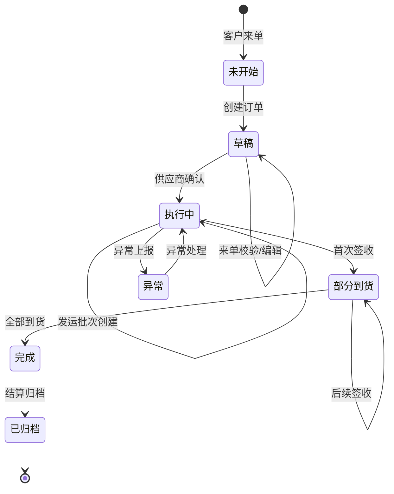
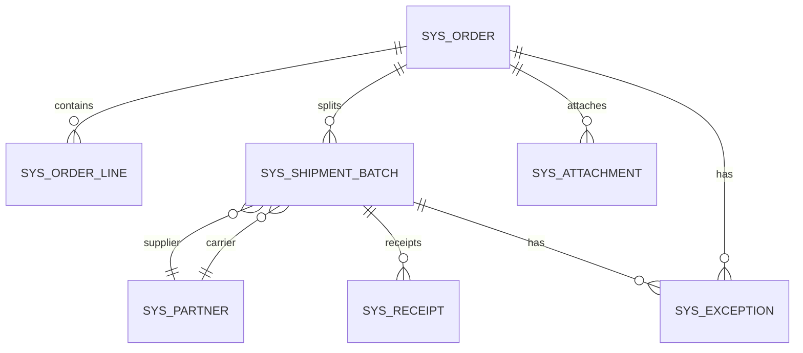

# 订单可视化数字化管理平台 - 技术设计文档

> **版本**：v1.0
> **日期**：2025-01-16
> **技术栈**：Vue3 + Spring-Boot + MySQL + MyBatis-Plus

---

## 一、项目概述

### 1.1 项目背景

公司业务链条：**客户下单 → 对接产地供应商 → 安排第三方物流 → 多收货点签收**

当前面临的核心问题：
- 资料分散在文件夹与个人电脑，检索困难
- 流程不可视，异常处理不闭环
- 一单多线路难以统一管理与回溯 
- 数据口径不统一，影响经营分析

### 1.2 项目目标

建立以**销售订单**为核心的可视化管理平台：
- 业务地图 + 流程时间线 + 资料一键可查
- 大屏看板展示经营与履约现状
- 实现流程效率提升30%，资料检索效率提升80%

### 1.3 核心指标

| 指标 | 定义 |
|------|------|
| 订单数量 | 按创建时间统计 |
| 在途订单 | 发运已启动但未完成签收的订单 |
| 准时率 | 按时签收订单数 / 总完成订单数 × 100% |
| 异常件数 | 存在到货差异或运输异常的订单数 |

---

## 二、需求分析

### 2.1 业务流程全景

```
+=============================================================================+
|                              订单全生命周期                                  |
+=============================================================================+
|                                                                              |
|  +---------+    +----------+    +---------+    +---------+    +---------+   |
|  | 订单发起 | -> | 合作方   | -> | 发运执行 | -> | 到货验收 | -> | 结算归档 |   |
|  |         |    | 确认     |    |         |    |         |    |         |   |
|  +---------+    +----------+    +---------+    +---------+    +---------+   |
|      |              |              |              |              |         |
|      v              v              v              v              v         |
|  未开始/草稿     执行中         执行中        部分到货        完成/归档      |
|                                                                              |
+=============================================================================+
```

### 2.2 19个核心环节

| 阶段 | 环节 | 责任角色 | 订单状态 |
|------|------|----------|----------|
| 订单发起 | 客户来单、创建订单、来单校验 | 客户经理 | 未开始→草稿 |
| 合作方确认 | 供应商选择、资质审核、供应商确认、客户确认报价 | 采购专员 | 执行中 |
| 发运执行 | 发运批次安排/确认、附件上传、物流安排、在途跟踪、异常处理 | 运营专员 | 执行中 |
| 到货验收 | 到货签收、差异处理、全部到货完成 | 收货方/运营 | 部分到货→完成 |
| 结算归档 | 结算对账、对账复核、订单归档 | 客户经理 | 完成→已归档 |

### 2.3 角色与权限

| 角色 | 职责 | 权限范围 |
|------|------|----------|
| 客户经理 | 客户来单收集、订单创建与跟进、结算对账 | 订单CRUD、附件上传、结算操作 |
| 采购专员 | 供应商选择、资质审核与合作确认 | 供应商管理、报价确认 |
| 运营专员 | 发运计划制定、物流安排、在途跟踪、异常处理 | 发运管理、在途更新 |
| 收货方 | 到货验收、签收确认 | 签收确认、差异记录 |
| 系统管理员 | 权限配置、数据维护、系统管理 | 全部配置权限 |

### 2.4 订单状态机



---

## 三、系统架构设计

### 3.1 系统架构图

```
+============================================================================+
|                            展示层 (Vue3)                                    |
+============================================================================+
|  订单管理  |  合作方管理  |  发运管理  |  看板中心  |  附件中心  |  系统管理  |
+============================================================================+
                                        |
                                        v
+============================================================================+
|                          应用层 (Spring-Boot)                               |
+============================================================================+
|  订单服务  |  合作方服务  |  发运服务  |  看板服务  |  附件服务  |  用户服务  |
+============================================================================+
                                        |
                                        v
+============================================================================+
|                        数据访问层 (MyBatis-Plus)                            |
+============================================================================+
|  OrderMapper  |  PartnerMapper  |  ShipmentMapper  |  AttachmentMapper     |
+============================================================================+
                                        |
                                        v
+============================================================================+
|                          数据层 (MySQL 8.0)                                 |
+============================================================================+
|  订单库  |  合作方库  |  发运库  |  附件库  |  用户权限库  |  看板配置库      |
+============================================================================+
```

### 3.2 技术栈选型

| 层次 | 技术选型 | 理由 |
|------|----------|------|
| 前端框架 | Vue3 + TypeScript | 现代化响应式框架，生态成熟 |
| UI组件库 | Element Plus / Ant Design Vue | 企业级组件库，开箱即用 |
| 地图组件 | 高德地图 / 百度地图 API | 国内主流，支持路线规划 |
| 图表组件 | ECharts | 功能强大，支持大屏可视化 |
| 后端框架 | Spring Boot 2.7+ | 企业级标准，生态完善 |
| ORM框架 | MyBatis-Plus | 提升开发效率，内置CRUD |
| 数据库 | MySQL 8.0 | 成熟稳定，支持JSON字段 |
| 文件存储 | 本地存储 / OSS | 支持扩展云存储 |
| 安全框架 | Spring Security + JWT | 无状态认证，便于扩展 |

### 3.3 模块划分

```
com.company.order.visual
├── controller          // 控制器层
├── service             // 业务逻辑层
│   └── impl
├── mapper              // 数据访问层
├── entity              // 实体类
├── dto                 // 数据传输对象
├── vo                  // 视图对象
├── config              // 配置类
├── common              // 公共模块
│   ├── constant        // 常量定义
│   ├── exception       // 异常处理
│   ├── enums           // 枚举定义
│   └── util            // 工具类
└── security            // 安全模块
```

---

## 四、数据模型设计

### 4.1 核心实体定义

#### 4.1.1 订单主表 (sys_order)

| 字段名 | 类型 | 说明 | 约束 |
|--------|------|------|------|
| id | BIGINT | 主键 | PK |
| order_no | VARCHAR(50) | 订单号（唯一） | UK |
| customer_id | BIGINT | 客户ID | FK |
| customer_name | VARCHAR(200) | 客户名称 | |
| total_amount | DECIMAL(18,2) | 订单总金额 | |
| status | TINYINT | 订单状态 | 0:未开始 1:草稿 2:执行中 3:部分到货 4:完成 5:已归档 |
| source_type | TINYINT | 订单来源 | 1:线下 2:线上 3:导入 |
| remark | TEXT | 备注 | |
| creator_id | BIGINT | 创建人ID | |
| create_time | DATETIME | 创建时间 | |
| update_time | DATETIME | 更新时间 | |

#### 4.1.2 订单行表 (sys_order_line)

| 字段名 | 类型 | 说明 | 约束 |
|--------|------|------|------|
| id | BIGINT | 主键 | PK |
| order_id | BIGINT | 订单ID | FK |
| product_code | VARCHAR(50) | 产品编码 | |
| product_name | VARCHAR(200) | 产品名称 | |
| quantity | DECIMAL(18,2) | 数量 | |
| unit | VARCHAR(20) | 单位 | |
| unit_price | DECIMAL(18,2) | 单价 | |
| line_amount | DECIMAL(18,2) | 行金额 | |
| sort_order | INT | 排序号 | |

#### 4.1.3 合作方表 (sys_partner)

| 字段名 | 类型 | 说明 | 约束 |
|--------|------|------|------|
| id | BIGINT | 主键 | PK |
| partner_no | VARCHAR(50) | 合作方编码 | UK |
| partner_name | VARCHAR(200) | 合作方名称 | |
| partner_type | TINYINT | 类型 | 1:供应商 2:承运商 |
| contact_person | VARCHAR(100) | 联系人 | |
| contact_phone | VARCHAR(50) | 联系电话 | |
| address | VARCHAR(500) | 地址 | |
| on_time_rate | DECIMAL(5,2) | 准时率(%) | |
| exception_rate | DECIMAL(5,2) | 异常率(%) | |
| status | TINYINT | 状态 | 1:正常 0:停用 |

#### 4.1.4 发运批次表 (sys_shipment_batch)

| 字段名 | 类型 | 说明 | 约束 |
|--------|------|------|------|
| id | BIGINT | 主键 | PK |
| batch_no | VARCHAR(50) | 批次号 | UK |
| order_id | BIGINT | 订单ID | FK |
| supplier_id | BIGINT | 供应商ID | FK |
| carrier_id | BIGINT | 承运商ID | FK |
| pickup_address | VARCHAR(500) | 提货地址 | |
| pickup_time | DATETIME | 计划提货时间 | |
| delivery_address | VARCHAR(500) | 交货地址 | |
| delivery_time | DATETIME | 计划交货时间 | |
| actual_pickup_time | DATETIME | 实际提货时间 | |
| actual_delivery_time | DATETIME | 实际交货时间 | |
| tracking_no | VARCHAR(100) | 物流单号 | |
| status | TINYINT | 状态 | 1:待提货 2:在途 3:已到货 4:异常 |

#### 4.1.5 签收记录表 (sys_receipt)

| 字段名 | 类型 | 说明 | 约束 |
|--------|------|------|------|
| id | BIGINT | 主键 | PK |
| receipt_no | VARCHAR(50) | 签收单号 | UK |
| batch_id | BIGINT | 批次ID | FK |
| receipt_time | DATETIME | 签收时间 | |
| receipt_person | VARCHAR(100) | 签收人 | |
| receipt_quantity | DECIMAL(18,2) | 签收数量 | |
| difference_quantity | DECIMAL(18,2) | 差异数量 | |
| difference_reason | VARCHAR(500) | 差异原因 | |
| status | TINYINT | 状态 | 1:正常 2:有差异 |

#### 4.1.6 附件表 (sys_attachment)

| 字段名 | 类型 | 说明 | 约束 |
|--------|------|------|------|
| id | BIGINT | 主键 | PK |
| file_name | VARCHAR(200) | 文件名 | |
| file_path | VARCHAR(500) | 存储路径 | |
| file_size | BIGINT | 文件大小(字节) | |
| file_type | VARCHAR(50) | 文件类型 | |
| business_type | TINYINT | 业务类型 | 1:合同 2:报价 3:物流凭证 4:签收单 5:资质 6:其他 |
| business_id | BIGINT | 关联业务ID | |
| tag | VARCHAR(200) | 标签（逗号分隔） | |
| uploader_id | BIGINT | 上传人ID | |
| upload_time | DATETIME | 上传时间 | |

#### 4.1.7 异常记录表 (sys_exception)

| 字段名 | 类型 | 说明 | 约束 |
|--------|------|------|------|
| id | BIGINT | 主键 | PK |
| exception_no | VARCHAR(50) | 异常单号 | UK |
| order_id | BIGINT | 订单ID | FK |
| batch_id | BIGINT | 批次ID | FK |
| exception_type | TINYINT | 异常类型 | 1:运输延迟 2:到货差异 3:凭证缺失 4:其他 |
| exception_desc | TEXT | 异常描述 | |
| status | TINYINT | 处理状态 | 1:待处理 2:处理中 3:已处理 |
| handler_id | BIGINT | 处理人ID | |
| handle_time | DATETIME | 处理时间 | |
| handle_result | TEXT | 处理结果 | |

### 4.2 实体关系图 (ERD)



---

## 五、功能模块详细设计

### 5.1 订单管理模块

**功能清单**：
- 订单创建/编辑/删除/查询
- 订单行维护
- 订单状态流转
- 订单详情查看

**核心接口**：
```
POST   /api/order/create      创建订单
PUT    /api/order/update      更新订单
DELETE /api/order/delete      删除订单
GET    /api/order/list        订单列表
GET    /api/order/{id}        订单详情
PUT    /api/order/status      状态变更
```

### 5.2 合作方管理模块

**功能清单**：
- 供应商/承运商信息维护
- 资质文件管理
- 履约表现统计（准时率、异常率）

**核心接口**：
```
POST   /api/partner/create    创建合作方
PUT    /api/partner/update    更新合作方
GET    /api/partner/list      合作方列表
GET    /api/partner/performance/{id}  履约表现
```

### 5.3 发运管理模块

**功能清单**：
- 发运批次创建（支持一单多批次）
- 提货/到货信息录入
- 物流跟踪
- 在途状态更新

**核心接口**：
```
POST   /api/shipment/batch/create      创建发运批次
PUT    /api/shipment/batch/update      更新批次信息
GET    /api/shipment/batch/list        批次列表
PUT    /api/shipment/batch/track       更新物流状态
```

### 5.4 收货签收模块

**功能清单**：
- 签收单上传
- 到货照片上传
- 差异记录与处理闭环
- 签收确认（在线/线下）

**核心接口**：
```
POST   /api/receipt/create      创建签收记录
PUT    /api/receipt/confirm     签收确认
GET    /api/receipt/list        签收列表
```

### 5.5 附件中心模块

**功能清单**：
- 批量上传
- 统一命名（订单号-环节-文件类型-日期）
- 标签分类
- 全文检索与筛选

**核心接口**：
```
POST   /api/attachment/upload      上传附件
GET    /api/attachment/list        附件列表
GET    /api/attachment/search      附件搜索
DELETE /api/attachment/delete      删除附件
```

### 5.6 业务地图与时间线

**功能清单**：
- 地图展示发货点到收货点线路
- 多线路叠加展示
- 时间线展示关键节点
- 异常状态高亮

**核心接口**：
```
GET    /api/visual/map/{orderId}      获取订单线路数据
GET    /api/visual/timeline/{orderId} 获取订单时间线
```

### 5.7 大屏看板模块

**看板布局**：
```
+=====================================================================+
|  +---------+  +---------+  +---------+  +---------+                  |
|  | 订单总数 |  | 在途订单 |  | 准时率  |  | 异常件数 |  KPI区        |
|  +---------+  +---------+  +---------+  +---------+                  |
+=====================================================================+
|  +=================+  +=================+  +=================+        |
|  |                 |  |                 |  |                 |        |
|  |    地图区       |  |    趋势区       |  |    榜单区       |        |
|  |  起运地/到货地  |  |  发运/到货趋势  |  |  承运商排名     |        |
|  |  分布+线路热度  |  |  异常数量趋势   |  |  供应商异常率   |        |
|  |                 |  |                 |  |                 |        |
|  +=================+  +=================+  +=================+        |
+=====================================================================+
|  +============================================================+     |
|  |                    筛选条件 + 订单明细列表                    |     |
|  +============================================================+     |
+=====================================================================+
```

**核心接口**：
```
GET    /api/dashboard/kpi          获取KPI指标
GET    /api/dashboard/map          获取地图数据
GET    /api/dashboard/trend        获取趋势数据
GET    /api/dashboard/ranking      获取榜单数据
```

### 5.8 系统管理模块

**功能清单**：
- 用户管理
- 角色权限管理
- 字典管理
- 系统配置

---

## 六、接口设计规范

### 6.1 RESTful API 规范

**统一响应格式**：
```json
{
  "code": 200,
  "message": "success",
  "data": {},
  "timestamp": 1705334400000
}
```

**状态码规范**：
| code | 说明 |
|------|------|
| 200 | 成功 |
| 400 | 参数错误 |
| 401 | 未认证 |
| 403 | 无权限 |
| 404 | 资源不存在 |
| 500 | 服务器错误 |

**接口命名规范**：
| 操作 | 方法 | 路径 |
|------|------|------|
| 查询列表 | GET | /api/{resource}/list |
| 查询详情 | GET | /api/{resource}/{id} |
| 创建 | POST | /api/{resource}/create |
| 更新 | PUT | /api/{resource}/update |
| 删除 | DELETE | /api/{resource}/delete |

### 6.2 核心接口定义

#### 订单创建接口
```yaml
POST /api/order/create
Request:
  orderNo: string
  customerId: long
  orderLines: Array<{
    productCode: string
    productName: string
    quantity: decimal
    unit: string
    unitPrice: decimal
  }>
Response:
  orderId: long
  orderNo: string
```

#### 看板KPI接口
```yaml
GET /api/dashboard/kpi
Query:
  startDate: date
  endDate: date
  customerIds?: string  // 逗号分隔
Response:
  totalOrders: int
  inTransitOrders: int
  onTimeRate: decimal
  exceptionCount: int
```

---

## 七、界面设计

### 7.1 页面结构

```
+=====================================================================+
|  Logo   |  订单管理  合作方  发运管理  看板中心  系统管理  |  用户     |
+=====================================================================+
|  面包屑导航                                                         |
+=====================================================================+
|                                                                     |
|                      主内容区                                        |
|                                                                     |
+=====================================================================+
```

### 7.2 订单详情页布局

```
+=====================================================================+
|  订单基础信息区                                                      |
|  +=========================================================+         |
|  | 订单号 | 客户 | 状态 | 金额 | 创建时间                          |         |
|  +=========================================================+         |
+=====================================================================+
|  +==============+  +========================================+         |
|  |              |  |    业务地图                              |         |
|  |    时间线    |  |    - 发货点 -> 收货点线路展示             |         |
|  |              |  |    - 异常状态高亮                        |         |
|  |              |  +========================================+         |
|  |              |  |                                          |         |
|  |              |  |    附件中心                              |         |
|  |              |  |    - 合同 | 报价 | 凭证 | 签收单           |         |
|  |              |  +========================================+         |
|  +==============+                                                   |
+=====================================================================+
```

### 7.3 交互规范

| 交互场景 | 操作规范 |
|----------|----------|
| 列表查询 | 支持多条件筛选，分页加载 |
| 表单提交 | 必填项校验，保存确认 |
| 文件上传 | 支持拖拽上传，显示进度 |
| 状态变更 | 需填写变更原因 |
| 异常处理 | 弹窗提示，引导处理 |

---

## 八、安全与权限

### 8.1 权限模型

采用 **RBAC（基于角色的访问控制）**：

```
用户(User) ←→ 角色(Role) ←→ 权限(Permission)
```

**权限粒度**：模块级 + 操作级

| 权限代码 | 说明 |
|----------|------|
| order:view | 查看订单 |
| order:edit | 编辑订单 |
| order:delete | 删除订单 |
| partner:manage | 合作方管理 |
| shipment:manage | 发运管理 |
| dashboard:view | 看板查看 |
| system:admin | 系统管理 |

### 8.2 数据安全

| 安全措施 | 实现方式 |
|----------|----------|
| 认证 | JWT Token，过期时间2小时 |
| 接口鉴权 | @PreAuthorize注解 |
| 敏感数据 | 记录操作日志 |
| 文件安全 | 文件类型校验，大小限制100MB |
| SQL注入 | MyBatis预编译 |
| XSS防护 | 前端输入过滤 |

### 8.3 操作审计

**审计日志表** (sys_audit_log)：
```
id | user_id | operation | resource_type | resource_id | ip_address | create_time
```

---

## 九、部署方案

### 9.1 云端部署方案

```
+=====================================================================+
|                        Nginx (反向代理)                              |
|                    SSL终止 + 负载均衡                                |
+========================================+==============================+
                                        |
        +-------------------------------+-------------------------------+
        v                                                               v
+=======================+                              +=======================+
|    应用服务器 1      |                              |    应用服务器 2      |
|    (Spring-Boot)     |                              |    (Spring-Boot)     |
+===========+===========+                              +===========+===========+
            |                                                   |
            +-------------------+-------------------+
                                v
                    +=======================+
                    |    MySQL 主从集群      |
                    |    (RDS 云数据库)      |
                    +=======================+
                                |
                    +=======================+
                    |    OSS 文件存储       |
                    +=======================+
```

### 9.2 本地部署方案

```
+=====================================================================+
|                        单服务器部署                                  |
+=====================================================================+
|  Nginx (80/443)                                                      |
|    |-- Spring-Boot应用 (8080)                                        |
|    |-- Vue静态文件                                                   |
|                                                                      |
|  MySQL (3306)                                                        |
|  本地文件存储 (/data/files)                                         |
+=====================================================================+
```

### 9.3 数据备份策略

| 备份类型 | 频率 | 保留周期 |
|----------|------|----------|
| 数据库全量备份 | 每日 | 30天 |
| 数据库增量备份 | 每小时 | 7天 |
| 文件存储备份 | 每日 | 30天 |

---

## 十、附录

### 10.1 数据迁移方案

**迁移步骤**：
1. 历史订单数据清洗（Excel → 统一格式）
2. 附件文件收集与归类
3. 数据导入脚本开发
4. 校验数据一致性
5. 切换上线

**数据口径调整**：
- 历史订单状态按新规则统一
- 附件按命名规范重命名

### 10.2 培训计划

| 培训对象 | 培训内容 | 培训方式 |
|----------|----------|----------|
| 客户经理 | 订单创建、附件上传、结算操作 | 线上+现场 |
| 采购专员 | 合作方管理、资质审核 | 线上 |
| 运营专员 | 发运管理、在途跟踪、异常处理 | 线上+现场 |
| 管理员 | 系统配置、权限管理 | 现场 |

### 10.3 交付清单

| 序号 | 交付物 | 说明 |
|------|--------|------|
| 1 | 订单可视化管理平台 | 含8大功能模块 |
| 2 | 数据库脚本 | 建表语句+初始化数据 |
| 3 | 部署文档 | 云端/本地部署说明 |
| 4 | 操作手册 | 用户使用指南 |
| 5 | 接口文档 | API文档（Swagger） |
| 6 | 源代码 | 前后端完整代码 |

### 10.4 开发里程碑

```
阶段1（1-2周）：框架搭建 + 数据库设计
阶段2（2-3周）：核心功能开发（订单、合作方、发运）
阶段3（1-2周）：可视化功能（地图、时间线、看板）
阶段4（1周）：测试与优化
阶段5（1周）：部署与培训
```

---

**文档结束**

> 本文档基于《可视化数字化管理平台解决方案v1217.pdf》和《业务流程分析.md》编写
> 未经授权，请勿传播
