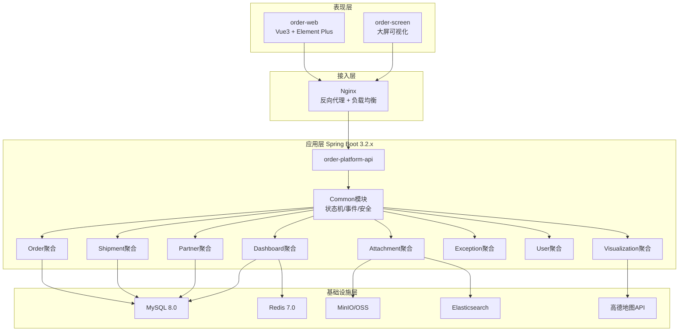
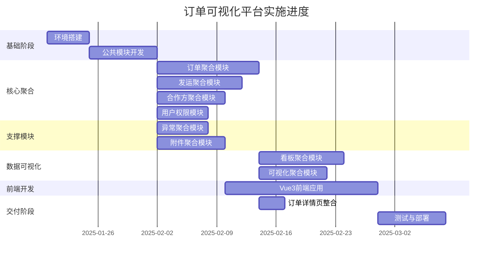

# 总体计划：订单可视化数字化管理平台

## 项目概述

### 项目背景
公司业务链条为：**客户下单 → 对接产地供应商 → 安排第三方物流 → 多收货点签收**。当前面临的核心问题：
- 资料分散在文件夹与个人电脑，检索困难
- 流程不可视，异常处理不闭环
- 一单多线路难以统一管理与回溯
- 数据口径不统一，影响经营分析

### 项目目标
建立以**销售订单**为核心的可视化管理平台：
- 业务地图 + 流程时间线 + 资料一键可查
- 大屏看板展示经营与履约现状
- 实现流程效率提升30%，资料检索效率提升80%

### 项目价值
- 统一数据口径，消除信息孤岛
- 全流程可视化，提升管理透明度
- 异常闭环管理，降低运营风险

---

## 可视化视图

### 系统逻辑图


### 模块关系矩阵
| 模块 | 主要输入 | 主要输出 | 责任角色 | 依赖 |
| --- | --- | --- | --- | --- |
| plan_52 环境搭建 | 项目配置 | 项目结构/运行环境 | 架构师 | - |
| plan_02 公共模块 | 项目配置 | 统一能力/安全/状态机 | 基础服务 | 环境搭建 |
| plan_07 订单聚合 | 客户需求 | 订单数据/状态事件 | 客户经理 | 公共模块 |
| plan_12 发运聚合 | 订单数据 | 批次数据/签收记录 | 运营专员 | 公共模块 |
| plan_17 合作方聚合 | 合作方信息 | 供应商/承运商数据 | 采购专员 | 公共模块 |
| plan_21 用户权限 | 用户信息 | 权限控制 | 系统管理员 | 公共模块 |
| plan_24 异常聚合 | 异常上报 | 异常处理记录 | 运营专员 | 公共模块 |
| plan_27 附件聚合 | 文件上传 | 附件元数据/索引 | 所有角色 | 公共模块 |
| plan_31 看板聚合 | 业务数据 | KPI指标/图表数据 | 管理层 | 订单/发运/合作方 |
| plan_34 可视化聚合 | 订单/发运数据 | 地图/时间线数据 | 管理层 | 订单/发运 |
| plan_37 前端应用 | 后端API | 用户界面 | 所有角色 | 所有后端模块 |
| plan_50 详情页整合 | 各模块数据 | 订单详情视图 | 所有角色 | 订单/发运/附件 |
| plan_45 测试部署 | 系统代码 | 部署包/文档 | 运维/测试 | 所有模块 |

### 项目时间线


---

## 需求定义

### 功能需求

#### 1. 订单管理模块
- 订单创建/编辑/删除/查询
- 订单行维护（产品、数量、单价）
- 订单状态流转（草稿→执行中→部分到货→完成→归档）
- 订单详情查看（基础信息、时间线、地图、附件）

#### 2. 发运管理模块
- 发运批次创建（支持一单多批次）
- 提货/到货信息录入
- 物流跟踪（对接第三方物流API）
- 在途状态更新

#### 3. 合作方管理模块
- 供应商/承运商信息维护
- 资质文件管理
- 履约表现统计（准时率、异常率）

#### 4. 用户权限模块
- 用户管理（创建、编辑、删除、状态管理）
- 角色管理（角色分配、权限配置）
- 菜单管理（动态菜单、权限控制）
- 数据权限（全部/部门/本人/自定义）

#### 5. 异常处理模块
- 异常上报（运输延迟、到货差异、凭证缺失）
- 异常分配（分配处理人）
- 处理反馈（处理记录、反馈闭环）

#### 6. 附件中心模块
- 批量上传（支持拖拽）
- 统一命名（订单号-环节-文件类型-日期）
- 标签分类
- 全文检索与筛选

#### 7. 业务地图与时间线
- 地图展示发货点到收货点线路
- 多线路叠加展示
- 时间线展示关键节点
- 异常状态高亮

#### 8. 大屏看板模块
- KPI指标卡片（订单总数、在途订单、准时率、异常件数）
- 地图可视化（起运地/到货地分布、线路热度）
- 趋势图表（发运/到货趋势、异常数量趋势）
- 排行榜（承运商排名、供应商异常率）

### 非功能需求
| 类型 | 要求 |
|------|------|
| **性能要求** | API响应时间 P95 < 500ms；订单列表查询 P95 < 200ms；附件检索 P95 < 2s；并发支持 1000 QPS |
| **安全要求** | JWT Token认证；RBAC权限模型；数据权限过滤；BCrypt密码加密；操作审计日志 |
| **可用性** | 系统可用性 > 99%；数据备份（每日全量、每小时增量） |
| **可维护性** | 代码规范（阿里巴巴Java手册）；单元测试覆盖率 > 70%；API文档自动生成 |
| **兼容性** | Chrome 90+、Edge 90+；MySQL 8.0+；JDK 21 |

---

## 任务分解树

```
plan_01 总体计划（预估107个工作日）
├── plan_52 环境搭建（预估5天）
│   ├── plan_53 后端项目初始化（预估1.5天）
│   ├── plan_54 前端项目初始化（预估1天）
│   ├── plan_55 数据库建表（预估1.5天）
│   └── plan_56 API启动模块配置（预估1天）
├── plan_02 公共模块（预估8天）
│   ├── plan_03 统一响应与异常处理（预估1.5天）
│   ├── plan_04 安全认证JWT（预估2天）
│   ├── plan_05 状态机引擎（预估2.5天）
│   └── plan_06 事件总线（预估2天）
├── plan_07 订单聚合模块（预估12天）
│   ├── plan_08 订单数据模型（预估2天）
│   ├── plan_09 订单状态机（预估3天）
│   ├── plan_10 订单CRUD服务（预估3天）
│   ├── plan_11 订单API接口（预估4天）
│   └── plan_70 订单事件溯源（预估2天）
├── plan_12 发运聚合模块（预估10天）
│   ├── plan_13 发运数据模型（预估1.5天）
│   ├── plan_14 批次管理（预估2.5天）
│   ├── plan_15 签收管理（预估2天）
│   └── plan_16 物流跟踪（预估4天）
├── plan_17 合作方聚合模块（预估8天）
│   ├── plan_18 合作方数据模型（预估1.5天）
│   ├── plan_19 合作方CRUD（预估2.5天）
│   └── plan_20 履约统计（预估4天）
├── plan_21 用户权限模块（预估6天）
│   ├── plan_22 用户管理（预估2天）
│   └── plan_23 角色权限（预估4天）
├── plan_24 异常聚合模块（预估6天）
│   ├── plan_25 异常上报与记录（预估2天）
│   └── plan_26 异常处理流程（预估4天）
├── plan_27 附件聚合模块（预估8天）
│   ├── plan_28 文件上传下载（预估2天）
│   ├── plan_29 标签管理（预估1.5天）
│   └── plan_30 全文检索集成（预估4.5天）
├── plan_31 看板聚合模块（预估10天）
│   ├── plan_32 KPI计算服务（预估5天）
│   └── plan_33 数据聚合服务（预估5天）
├── plan_34 可视化聚合模块（预估8天）
│   ├── plan_35 地图服务（预估4天）
│   └── plan_36 时间线服务（预估4天）
├── plan_37 前端应用（预估18天）
│   ├── plan_38 Vue3项目初始化（预估2天）
│   ├── plan_39 订单管理页面（预估3天）
│   ├── plan_40 发运管理页面（预估2天）
│   ├── plan_41 合作方管理页面（预估2天）
│   ├── plan_42 附件中心页面（预估2天）
│   ├── plan_43 系统管理页面（预估3天）
│   └── plan_44 大屏可视化（预估4天）
├── plan_50 订单详情页整合（预估3天）
│   └── plan_51 详情页组件整合（预估3天）
└── plan_45 测试与部署（预估8天）
    ├── plan_46 单元测试与集成测试（预估2天）
    ├── plan_47 性能测试与优化（预估2天）
    ├── plan_48 部署方案设计（预估2天）
    └── plan_49 文档编写与培训（预估2天）
```

---

## 依赖关系

### 模块间依赖
- plan_52（环境搭建）→ plan_02（公共模块）
- plan_02（公共模块）→ 所有业务模块
- plan_07/12/17 → plan_31（看板依赖业务数据）
- plan_07/12 → plan_34（可视化依赖订单发运数据）
- 所有后端模块 → plan_37（前端依赖所有后端API）
- 所有模块 → plan_45（测试部署依赖所有模块）

### 关键路径


---

## 技术栈

### 编程语言
- **Java 21**：LTS版本，Virtual Threads提升并发性能
- **TypeScript 5.2+**：类型安全，提升代码质量

### 框架/库
| 技术 | 版本 | 用途 |
|------|------|------|
| Spring Boot | 3.2.x | 企业级后端框架 |
| Spring StateMachine | 3.2.0 | 状态机引擎 |
| MyBatis-Plus | 3.5.x | ORM增强 |
| Knife4j | 4.4.0 | API文档 |
| Hutool | 5.8.x | 工具类库 |
| Vue 3 | 3.3.4+ | 前端框架 |
| Element Plus | 2.4.2+ | UI组件库 |
| ECharts | 5.4.3+ | 图表库 |
| Pinia | 2.1.7 | 状态管理 |

### 数据库
- **MySQL 8.0+**：业务数据存储，支持JSON字段
- **Redis 7.0+**：缓存+分布式锁
- **Elasticsearch 8.11+**：附件全文检索

### 工具
- **Maven 3.9+**：Java项目构建
- **Vite 4.4+**：前端构建工具
- **Git**：版本控制
- **Docker**：容器化部署

### 第三方服务
- **高德地图 API**：地图可视化
- **MinIO / OSS**：对象存储

---

## 数据流向

### 输入源
| 来源 | 数据类型 | 格式 |
|------|----------|------|
| 客户下单 | 订单信息 | 表单/Excel导入 |
| 供应商 | 合作方信息 | 表单/文件 |
| 物流公司 | 物流跟踪数据 | API对接 |
| 用户操作 | 系统操作日志 | 自动记录 |

### 处理流程
```
┌──────────────┐      ┌──────────────┐      ┌──────────────┐
│  数据采集     │ ---> │  状态机流转   │ ---> │  事件记录     │
│  (表单/API)   │      │  (验证/约束)   │      │  (不可变)     │
└──────────────┘      └──────────────┘      └──────────────┘
                            │
                            ▼
┌──────────────┐      ┌──────────────┐      ┌──────────────┐
│  聚合根更新   │ <--- │  业务规则执行  │ ---> │  投影更新     │
│  (Order等)    │      │  (领域服务)    │      │  (看板/视图)   │
└──────────────┘      └──────────────┘      └──────────────┘
```

### 输出目标
| 输出 | 目标 | 格式 |
|------|------|------|
| 订单列表 | 前端页面 | JSON/表格 |
| KPI指标 | 大屏看板 | JSON/图表 |
| 事件日志 | 审计追溯 | JSON |
| 统计报表 | Excel导出 | .xlsx |

---

## 验收标准

### 功能验收
- [ ] 订单完整生命周期流转正常
- [ ] 发运批次创建与签收闭环完成
- [ ] 附件上传/下载/检索功能正常
- [ ] 用户权限控制生效（菜单级、按钮级、数据级）
- [ ] 地图正确显示发货点到收货点线路
- [ ] 大屏KPI数据准确且实时更新
- [ ] 异常上报/处理/反馈闭环完整

### 性能验收
- [ ] API响应时间 P95 < 500ms
- [ ] 订单列表查询 P95 < 200ms
- [ ] 附件检索 P95 < 2s
- [ ] 并发支持 1000 QPS

### 质量验收
- [ ] 单元测试覆盖率 > 70%
- [ ] 代码符合阿里巴巴Java手册规范
- [ ] SonarQube扫描无重大问题
- [ ] API文档完整（Knife4j）

---

## 风险评估

### 技术风险
| 风险 | 影响 | 应对 |
|------|------|------|
| JDK 21兼容性 | 高 | 验证第三方库支持，准备降级方案 |
| Elasticsearch配置 | 中 | 提前验证与Spring Boot集成 |
| 状态机复杂度 | 高 | 充分测试状态流转规则 |

### 资源风险
| 风险 | 影响 | 应对 |
|------|------|------|
| 人力不足 | 高 | 优先核心功能，辅助功能可延后 |
| 服务器资源 | 中 | 使用Docker本地验证 |

### 时间风险
| 风险 | 影响 | 应对 |
|------|------|------|
| 需求变更 | 高 | 严格控制变更，评审后执行 |
| 技术难点 | 中 | 提前技术预研 |

---

## 项目统计

- **总计划文件**：56 个
- **2级任务（模块）**：13 个
- **3级任务（具体任务）**：42 个
- **预估总耗时**：107.0 工作日
- **建议执行周期**：5-6个月

---

## 后续步骤

1. 查看各模块详细计划文档（plan_02 ~ plan_56）
2. 根据需要调整计划
3. 确认无误后开始执行 plan_52（环境搭建）
