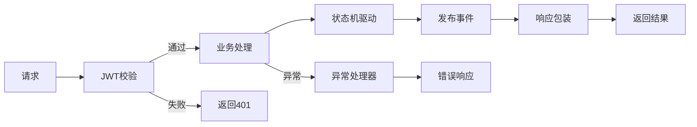
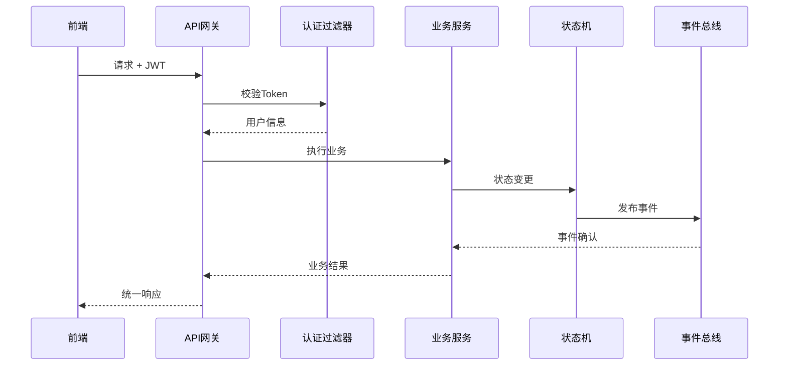

# 模块：公共模块

## 模块概述

### 模块目标
构建项目的基础能力模块，包括统一响应、异常处理、安全认证、状态机引擎和事件总线。

### 在项目中的位置
这是所有业务模块的基础设施，提供统一的开发能力和规范，确保业务模块可以专注于业务逻辑实现。

---

## 依赖关系

### 前置条件
- **前置任务**：plan_52（环境搭建）
- **前置数据**：项目框架、用户表、权限表
- **前置环境**：Spring Boot项目、Redis缓存

### 后续影响
- **后续任务**：所有业务模块（订单、发运、合作方等）
- **产出数据**：
  - 统一响应格式和异常处理机制
  - JWT认证和Token校验
  - 状态机引擎和事件总线

---

## 子任务分解

- [ ] plan_03 - 统一响应与异常处理（预估1.5天）
- [ ] plan_04 - 安全认证JWT（预估2天）
- [ ] plan_05 - 状态机引擎（预估2.5天）
- [ ] plan_06 - 事件总线（预估2天）

---

## 可视化输出

### 模块流程图

### 接口协作图

### 资源分配表
| 资源类型 | 负责人 | 参与时段 | 关键产出 | 风险/备注 |
| --- | --- | --- | --- | --- |
| 统一响应 | 开发者 | 第1-2天 | Result类、GlobalException | 响应格式规范 |
| 安全认证 | 安全专家 | 第2-4天 | JWT工具、过滤器 | Token过期处理 |
| 状态机引擎 | 架构师 | 第4-7天 | StateMachine配置 | 状态流转复杂 |
| 事件总线 | 开发者 | 第6-8天 | EventPublisher | 事件幂等性 |

---

## 技术方案

### 架构设计
采用分层设计，各组件职责清晰：
- **统一响应层**：Result包装、全局异常处理
- **安全认证层**：JWT签发/校验、用户上下文
- **状态机层**：Spring StateMachine封装
- **事件总线层**：领域事件发布/订阅

### 核心技术选型
- **JWT**：io.jsonwebtoken:jjwt-api:0.11.5
- **状态机**：Spring StateMachine 3.2.0
- **事件处理**：Spring ApplicationEvent + @EventListener

### 数据模型
- t_user：用户表
- t_role：角色表
- t_user_role：用户角色关联表
- t_event：事件日志表（事件溯源）

### 接口设计
- 认证接口：/api/auth/login、/api/auth/refresh
- 状态机接口：状态变更、状态查询
- 事件接口：事件发布、事件查询

---

## 执行摘要

### 输入
- 环境搭建完成的项目框架
- 安全规范文档
- 状态机设计文档

### 处理
1. 实现统一响应Result类和全局异常处理器
2. 实现JWT签发、校验、刷新机制
3. 封装Spring StateMachine，提供统一状态机API
4. 实现事件总线，支持事件发布和订阅

### 输出
- 可复用的公共模块
- 安全认证能力
- 状态机驱动能力
- 事件驱动能力

---

## 验收标准

### 功能验收
- [ ] 统一响应Result包装正常工作
- [ ] 异常被全局处理器捕获并返回规范格式
- [ ] JWT登录成功获取Token，Token校验正常
- [ ] 状态机状态流转正确，事件日志记录完整
- [ ] 事件发布和订阅机制正常工作

### 性能验收
- [ ] JWT校验耗时 < 10ms
- [ ] 状态机状态变更 < 50ms
- [ ] 事件发布 < 20ms

---

## 交付物清单

### 代码文件
- `response/Result.java`：统一响应类
- `exception/GlobalExceptionHandler.java`：全局异常处理器
- `exception/BusinessException.java`：业务异常
- `security/JwtProvider.java`：JWT工具类
- `security/JwtAuthenticationFilter.java`：JWT过滤器
- `statemachine/StateMachineManager.java`：状态机管理器
- `event/EventPublisher.java`：事件发布器
- `event/EventHandler.java`：事件处理器

### 配置文件
- `StateMachineConfig.java`：状态机配置
- `SecurityConfig.java`：安全配置

### 文档
- 公共模块使用手册
- 状态机配置指南
- JWT集成说明
