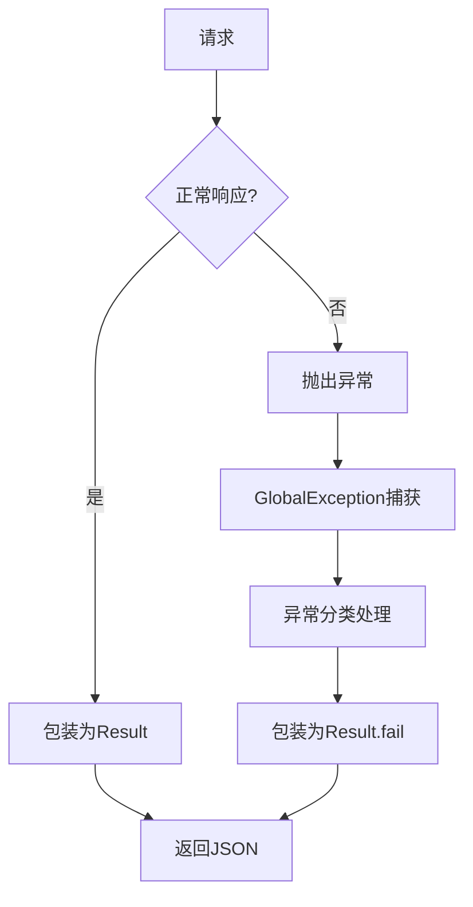

# 任务：统一响应与异常处理

## 任务概述

### 任务描述
实现统一的API响应格式和全局异常处理机制，确保所有接口返回格式一致。

### 任务目的
提供规范化的响应格式和错误处理机制，提升前端对接体验。

---

## 依赖关系

### 前置条件
- **前置任务**：plan_52（环境搭建）
- **需要的资源**：Spring Boot项目
- **环境要求**：无特殊要求

### 对后续的影响
- **后续任务**：所有业务模块
- **提供的产出**：Result类、全局异常处理器

---

## 可视化辅助

### 步骤流程图


### 响应格式图
```
┌─────────────────────────────────────┐
│           统一响应格式                │
├─────────────────────────────────────┤
│  code: Integer    // 业务状态码       │
│  message: String  // 提示信息        │
│  data: T         // 业务数据         │
│  timestamp: Long  // 响应时间戳      │
└─────────────────────────────────────┘
```

### 风险监控表
| 风险项 | 等级 | 触发信号 | 应对策略 | 责任人 |
|--------|------|----------|----------|--------|
| 异常未捕获 | 高 | 500错误 | 完善异常处理器 | 开发者 |
| 错误码混乱 | 中 | 前端困惑 | 统一错误码定义 | 开发者 |

---

## 执行步骤

### 步骤1：创建Result类
- **操作**：创建通用响应结果类
- **输入**：响应结构定义
- **输出**：Result.java
- **注意事项**：使用泛型支持不同数据类型

### 步骤2：创建错误码枚举
- **操作**：定义统一错误码
- **输入**：业务错误场景
- **输出**：ErrorCode.java
- **注意事项**：遵循5位数字规范

### 步骤3：创建业务异常类
- **操作**：定义可抛出的业务异常
- **输入**：错误码枚举
- **输出**：BusinessException.java
- **注意事项**：支持动态错误消息

### 步骤4：创建全局异常处理器
- **操作**：使用@RestControllerAdvice
- **输入**：各类异常
- **输出**：GlobalExceptionHandler.java
- **注意事项**：按异常类型分别处理

### 步骤5：配置响应包装
- **操作**：使用ResponseAdvice自动包装
- **输入**：Controller返回值
- **输出**：ResponseAdvice.java
- **注意事项**：排除Swagger等特殊接口

---

## 核心接口定义

### 主要类/接口
```java
// 统一响应结果
public class Result<T> {
    private Integer code;
    private String message;
    private T data;
    private Long timestamp;

    public static <T> Result<T> ok(T data);
    public static <T> Result<T> fail(String message);
    public static <T> Result<T> error(ErrorCode errorCode);
}

// 业务异常
public class BusinessException extends RuntimeException {
    private final ErrorCode errorCode;

    public BusinessException(ErrorCode errorCode);
    public BusinessException(ErrorCode errorCode, String message);
}

// 全局异常处理器
@RestControllerAdvice
public class GlobalExceptionHandler {
    @ExceptionHandler(BusinessException.class)
    public Result<?> handleBusinessException(BusinessException e);

    @ExceptionHandler(MethodArgumentNotValidException.class)
    public Result<?> handleValidationException(MethodArgumentNotValidException e);

    @ExceptionHandler(Exception.class)
    public Result<?> handleException(Exception e);
}
```

### 数据结构
- ErrorCode：错误码枚举（200成功、400客户端错误、500服务器错误）

---

## 文件操作清单

### 需要创建的文件
- `order-platform-common/src/main/java/{package}/response/Result.java`
- `order-platform-common/src/main/java/{package}/response/ErrorCode.java`
- `order-platform-common/src/main/java/{package}/exception/BusinessException.java`
- `order-platform-common/src/main/java/{package}/exception/GlobalExceptionHandler.java`
- `order-platform-common/src/main/java/{package}/config/ResponseAdvice.java`

### 需要读取的文件
- `plan_56_API启动模块配置.md` - 避免重复配置

---

## 验收标准

### 功能验收
1. [ ] 正常接口返回Result格式
2. [ ] 业务异常返回400和错误信息
3. [ ] 系统异常返回500和日志
4. [ ] 参数校验异常返回字段错误信息

### 质量验收
- [ ] 错误码定义完整
- [ ] 异常日志记录完整

---

## 注意事项

### 技术注意点
- ResponseAdvice要排除Swagger接口
- 异常堆栈不要返回给前端

### 安全注意点
- 敏感信息不要通过错误信息泄露
- 异常堆栈只记录在日志

### 性能注意点
- 异常处理不应影响正常请求性能
