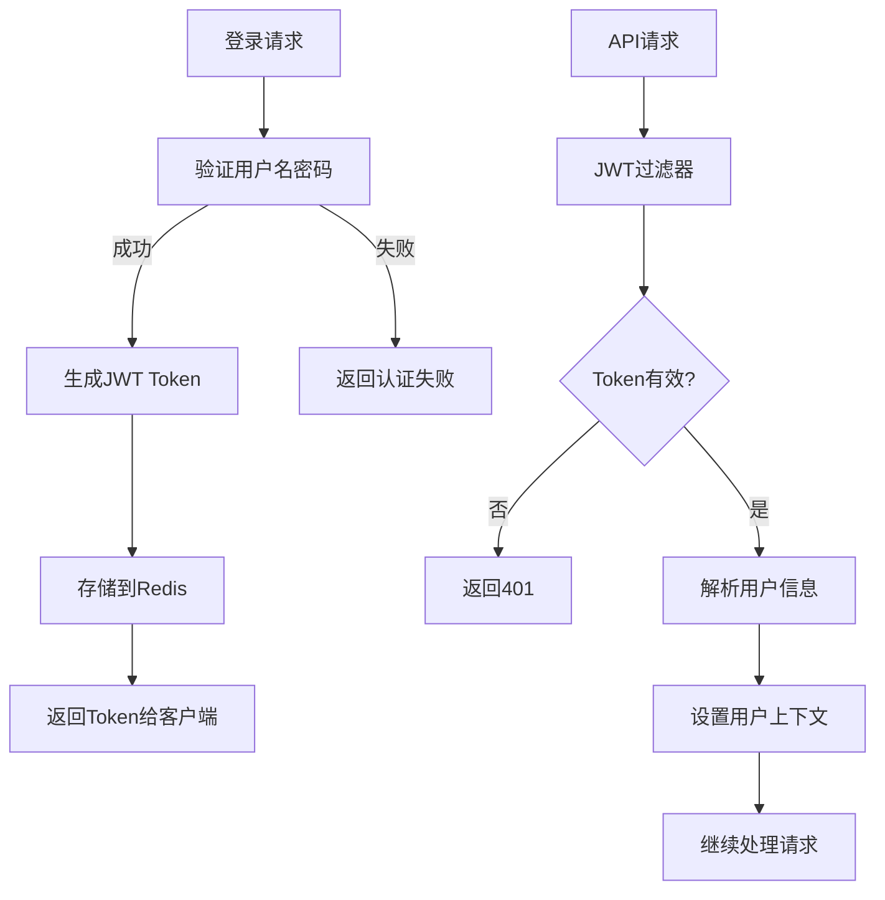
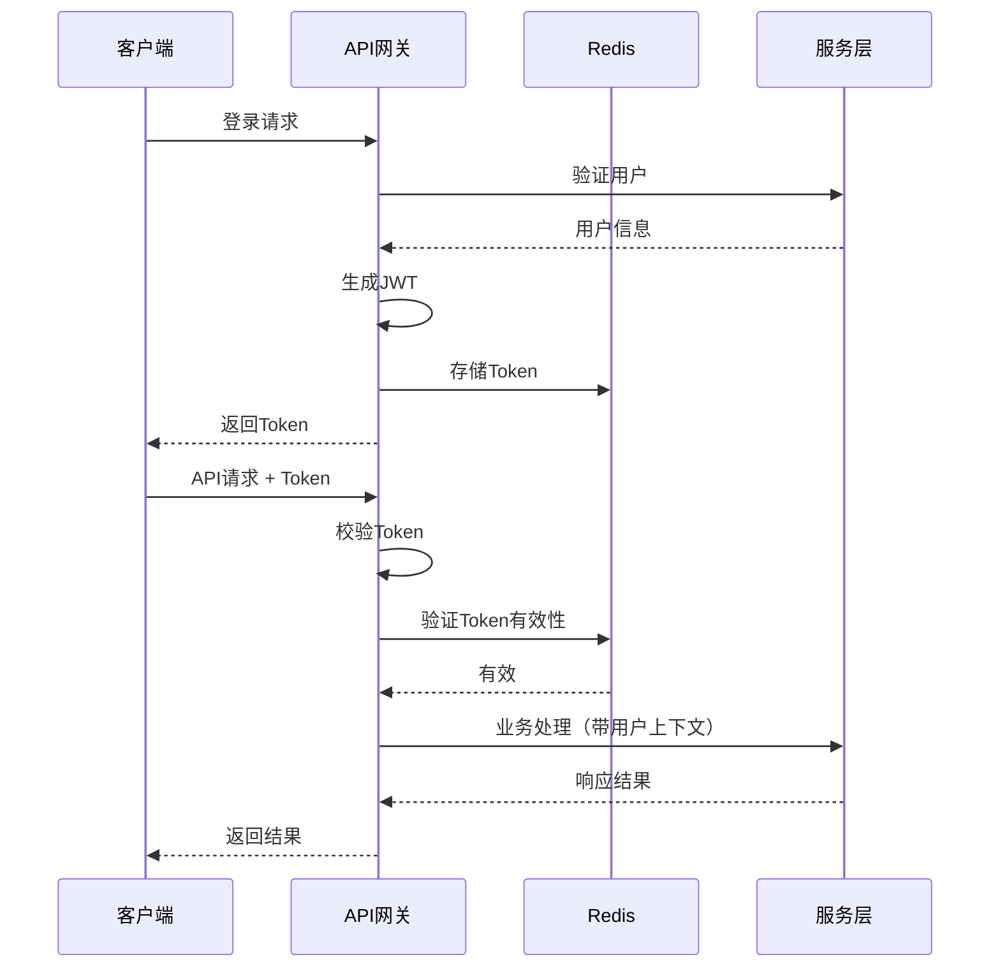

# 任务：安全认证JWT

## 任务概述

### 任务描述
实现基于JWT的用户认证机制，包括登录、Token校验、Token刷新和用户上下文管理。

### 任务目的
提供安全的API访问控制，确保只有经过认证的用户才能访问业务接口。

---

## 依赖关系

### 前置条件
- **前置任务**：plan_03（统一响应与异常处理）、plan_55（数据库建表）
- **需要的资源**：用户表、Redis
- **环境要求**：Redis可用

### 对后续的影响
- **后续任务**：所有业务模块
- **提供的产出**：JWT工具类、认证过滤器、用户上下文

---

## 可视化辅助

### 步骤流程图


### 认证流程图


### 风险监控表
| 风险项 | 等级 | 触发信号 | 应对策略 | 责任人 |
|--------|------|----------|----------|--------|
| Token泄露 | 高 | 异常访问 | Token有效期控制 | 安全专家 |
| Token过期 | 中 | 401错误 | 提供刷新机制 | 开发者 |
| Redis故障 | 高 | 无法校验 | 降级为本地校验 | 运维 |

---

## 执行步骤

### 步骤1：添加JWT依赖
- **操作**：在pom.xml添加jjwt依赖
- **输入**：依赖版本号
- **输出**：可用的JWT库
- **注意事项**：使用0.11.5以上版本

### 步骤2：创建JWT工具类
- **操作**：实现Token生成和解析
- **输入**：用户信息、密钥
- **输出**：JwtProvider.java
- **注意事项**：密钥配置化，不要硬编码

### 步骤3：创建用户上下文
- **操作**：实现ThreadLocal用户上下文
- **输入**：用户信息
- **输出**：UserContext.java
- **注意事项**：请求结束后清理上下文

### 步骤4：创建认证过滤器
- **操作**：实现JWT校验过滤器
- **输入**：请求头Token
- **输出**：JwtAuthenticationFilter.java
- **注意事项**：白名单接口放行

### 步骤5：实现登录接口
- **操作**：创建登录Controller
- **输入**：用户名、密码
- **输出**：Token和用户信息
- **注意事项**：密码使用BCrypt校验

### 步骤6：配置安全规则
- **操作**：配置拦截器白名单
- **输入**：不需要认证的路径
- **输出**：SecurityConfig.java
- **注意事项**：登录、注册等接口放行

---

## 核心接口定义

### 主要类/接口
```java
// JWT提供者
public interface JwtProvider {
    String generateToken(User user);
    boolean validateToken(String token);
    Long getUserIdFromToken(String token);
    String refreshToken(String token);
}

// 用户上下文
public class UserContext {
    private static final ThreadLocal<Long> USER_ID = new ThreadLocal<>();
    private static final ThreadLocal<String> USERNAME = new ThreadLocal<>();

    public static void set(Long userId, String username);
    public static Long getUserId();
    public static String getUsername();
    public static void clear();
}

// 认证服务
public interface AuthService {
    Result<LoginResponse> login(LoginRequest request);
    Result<String> refreshToken(String token);
    Result<Void> logout(String token);
}

// 登录请求/响应
public class LoginRequest {
    private String username;
    private String password;
}

public class LoginResponse {
    private String token;
    private Long expiresIn;
    private UserInfo userInfo;
}
```

### 数据结构
- UserInfo：用户信息（id、username、nickname、avatar）
- LoginRequest：登录请求
- LoginResponse：登录响应

---

## 文件操作清单

### 需要创建的文件
- `order-platform-common/src/main/java/{package}/security/JwtProvider.java`
- `order-platform-common/src/main/java/{package}/security/UserContext.java`
- `order-platform-common/src/main/java/{package}/security/JwtAuthenticationFilter.java`
- `order-platform-common/src/main/java/{package}/security/SecurityConfig.java`
- `order-platform-user/src/main/java/{package}/service/AuthService.java`
- `order-platform-user/src/main/java/{package}/controller/AuthController.java`

### 需要读取的文件
- `plan_55_数据库建表.md` - 用户表结构

---

## 验收标准

### 功能验收
1. [ ] 登录成功返回JWT Token
2. [ ] Token校验正常，过期返回401
3. [ ] 用户上下文可正确获取用户信息
4. [ ] 登出后Token失效
5. [ ] Token刷新机制正常工作

### 性能验收
- [ ] JWT校验耗时 < 10ms
- [ ] 登录接口响应 < 500ms

---

## 注意事项

### 技术注意点
- JWT过期时间建议2小时
- Redis Token与JWT同步过期
- 密钥长度至少256位

### 安全注意点
- 密钥不要硬编码，使用环境变量
- 密码传输使用HTTPS
- Token存储在HttpOnly Cookie中（可选）

### 性能注意点
- Redis校验Token使用Pipeline
- 用户上下文及时清理避免内存泄漏
