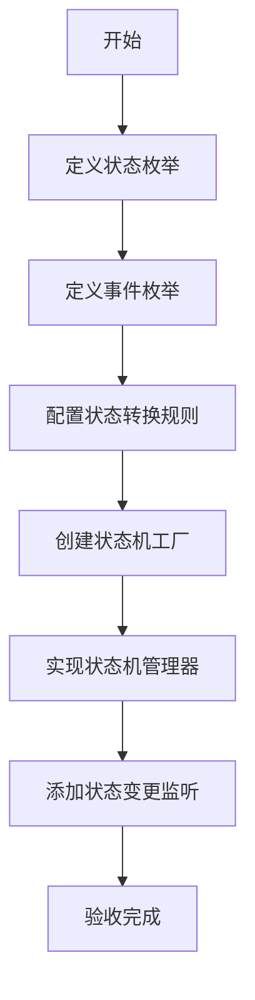
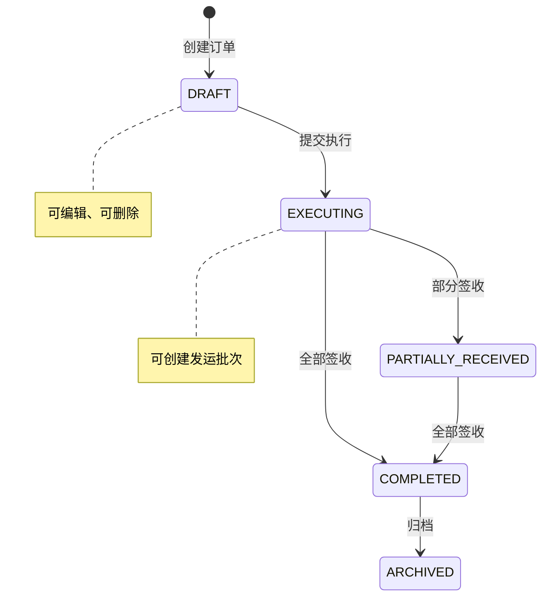

# 任务：状态机引擎

## 任务概述

### 任务描述
封装Spring StateMachine，提供统一的状态机管理API，支持订单等业务对象的状态流转。

### 任务目的
实现业务对象状态的规范管理，确保状态变更可追踪、可审计。

---

## 依赖关系

### 前置条件
- **前置任务**：plan_02（公共模块）
- **需要的资源**：Spring StateMachine依赖
- **环境要求**：无特殊要求

### 对后续的影响
- **后续任务**：plan_07（订单聚合）、plan_12（发运聚合）
- **提供的产出**：状态机管理器、状态机配置基类

---

## 可视化辅助

### 步骤流程图


### 订单状态机图


### 风险监控表
| 风险项 | 等级 | 触发信号 | 应对策略 | 责任人 |
|--------|------|----------|----------|--------|
| 状态机配置复杂 | 高 | 状态流转错误 | 使用配置表驱动 | 架构师 |
| 并发状态变更 | 中 | 状态不一致 | 加锁处理 | 开发者 |
| 事件丢失 | 中 | 日志缺失 | 持久化状态变更事件 | 开发者 |

---

## 执行步骤

### 步骤1：添加Spring StateMachine依赖
- **操作**：在pom.xml添加spring-statemachine-starter
- **输入**：依赖版本
- **输出**：可用的状态机框架
- **注意事项**：版本要与Spring Boot兼容

### 步骤2：定义状态和事件枚举基类
- **操作**：创建通用状态和事件接口
- **输入**：业务状态定义
- **输出**：BaseState、BaseEvent
- **注意事项**：使用枚举确保类型安全

### 步骤3：创建状态机配置基类
- **操作**：抽象状态机配置逻辑
- **输入**：状态转换规则
- **输出**：BaseStateMachineConfig
- **注意事项**：支持配置表驱动

### 步骤4：实现状态机管理器
- **操作**：封装状态机操作API
- **输入**：业务对象、事件
- **输出**：StateMachineManager
- **注意事项**：支持多业务对象

### 步骤5：添加状态变更监听
- **操作**：监听状态变更事件
- **输入**：状态变更事件
- **输出**：StateChangeListener
- **注意事项**：异步处理避免影响主流程

### 步骤6：创建状态事件日志表
- **操作**：记录所有状态变更
- **输入**：状态变更数据
- **输出**：t_state_event_log表
- **注意事项**：事件不可变，追加-only

---

## 核心接口定义

### 主要类/接口
```java
// 状态机管理器
public interface StateMachineManager<S, E, T> {
    // 发送事件触发状态变更
    boolean sendEvent(T entity, E event);
    // 获取当前状态
    S getCurrentState(T entityId);
    // 检查是否可转换
    boolean canTransition(T entityId, E event);
    // 获取历史状态
    List<S> getHistoryStates(T entityId);
}

// 状态变更监听器
public interface StateChangeListener<S, E> {
    void onStateChange(StateChangeEvent<S, E> event);
}

// 状态事件
@Data
public class StateChangeEvent<S, E> {
    private Long entityId;
    private S oldState;
    private S newState;
    private E event;
    private Long userId;
    private LocalDateTime timestamp;
}

// 订单状态枚举
public enum OrderStatus {
    DRAFT,           // 草稿
    EXECUTING,       // 执行中
    PARTIALLY_RECEIVED, // 部分到货
    COMPLETED,       // 完成
    ARCHIVED         // 已归档
}

// 订单事件枚举
public enum OrderEvent {
    SUBMIT,          // 提交执行
    PARTIAL_RECEIVE, // 部分签收
    FULL_RECEIVE,    // 全部签收
    ARCHIVE          // 归档
}
```

### 数据结构
- t_state_event_log：状态事件日志表

---

## 文件操作清单

### 需要创建的文件
- `order-platform-common/src/main/java/{package}/statemachine/StateMachineManager.java`
- `order-platform-common/src/main/java/{package}/statemachine/config/BaseStateMachineConfig.java`
- `order-platform-common/src/main/java/{package}/statemachine/enums/BaseState.java`
- `order-platform-common/src/main/java/{package}/statemachine/listener/StateChangeListener.java`
- `order-platform-common/src/main/java/{package}/statemachine/event/StateChangeEvent.java`
- `order-platform-common/src/main/resources/db/migration/V5__create_state_event_log.sql`

### 需要读取的文件
- `.claude/CLAUDE.md` - 订单状态枚举定义

---

## 验收标准

### 功能验收
1. [ ] 状态机正确初始化
2. [ ] 状态变更符合配置的转换规则
3. [ ] 非法转换被拒绝
4. [ ] 状态变更事件被正确记录
5. [ ] 可查询状态变更历史

### 性能验收
- [ ] 状态变更耗时 < 50ms
- [ ] 并发状态变更不会产生数据不一致

---

## 注意事项

### 技术注意点
- Spring StateMachine配置较复杂，建议充分测试
- 状态变更要加锁，避免并发问题

### 安全注意点
- 状态变更需要记录操作人
- 敏感状态变更需要二次确认

### 性能注意点
- 状态机实例复用，避免重复创建
- 状态事件日志异步写入
