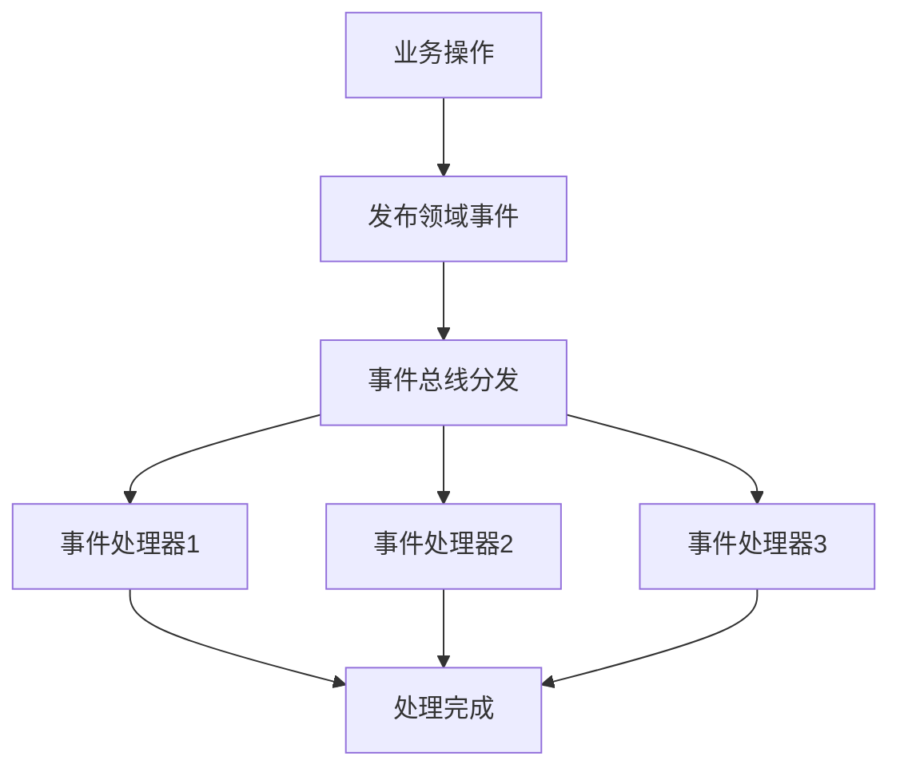

# 任务：事件总线

## 任务概述

### 任务描述
实现领域事件总线，支持事件的发布、订阅和处理，实现模块间的解耦通信。

### 任务目的
通过事件驱动架构，实现业务模块之间的松耦合通信。

---

## 依赖关系

### 前置条件
- **前置任务**：plan_02（公共模块）
- **需要的资源**：Spring ApplicationEvent
- **环境要求**：无特殊要求

### 对后续的影响
- **后续任务**：plan_07（订单聚合）、plan_31（看板聚合）
- **提供的产出**：事件发布器、事件处理器基类

---

## 可视化辅助

### 步骤流程图


### 事件流向图
```
┌─────────────────────────────────────────────────┐
│                   订单聚合                        │
│  ┌─────────────┐       发布       ┌────────────┐ │
│  │  订单服务   │────────────────→│ 订单创建事件│ │
│  └─────────────┘                   └────────────┘ │
└─────────────────────────────────────────────────┘
                    │
                    ▼
┌─────────────────────────────────────────────────┐
│                  事件总线                         │
│  ┌─────────────────────────────────────────┐   │
│  │           EventPublisher               │   │
│  └─────────────────────────────────────────┘   │
└─────────────────────────────────────────────────┘
                    │
        ┌───────────┼───────────┐
        ▼           ▼           ▼
┌───────────┐ ┌───────────┐ ┌───────────┐
│ 看板聚合   │ │ 发运聚合   │ │ 通知服务   │
│ 更新KPI   │ │ 准备发运   │ │ 发送消息   │
└───────────┘ └───────────┘ └───────────┘
```

### 风险监控表
| 风险项 | 等级 | 触发信号 | 应对策略 | 责任人 |
|--------|------|----------|----------|--------|
| 事件处理失败 | 中 | 处理器异常 | 重试机制 | 开发者 |
| 事件丢失 | 高 | 数据不一致 | 事件持久化 | 开发者 |
| 处理顺序错乱 | 中 | 数据错误 | 顺序控制 | 开发者 |

---

## 执行步骤

### 步骤1：定义领域事件基类
- **操作**：创建所有领域事件的父类
- **输入**：事件公共属性
- **输出**：DomainEvent.java
- **注意事项**：包含事件ID、时间戳、来源

### 步骤2：创建事件发布器
- **操作**：封装事件发布逻辑
- **输入**：领域事件
- **输出**：EventPublisher.java
- **注意事项**：支持异步发布

### 步骤3：创建事件处理器基类
- **操作**：定义事件处理规范
- **输入**：领域事件
- **输出**：EventHandler.java
- **注意事项**：使用@EventListener

### 步骤4：实现事件存储
- **操作**：创建事件日志表
- **输入**：事件数据
- **输出**：t_event表
- **注意事项**：事件不可变，只追加

### 步骤5：实现事件重放
- **操作**：支持从事件流重建状态
- **输入**：事件流
- **输出**：重放结果
- **注意事项**：幂等性处理

---

## 核心接口定义

### 主要类/接口
```java
// 领域事件基类
public abstract class DomainEvent {
    private final String eventId;
    private final String eventType;
    private final Long aggregateId;
    private final LocalDateTime occurredAt;
    private final Long version;
}

// 事件发布器
public interface EventPublisher {
    // 同步发布
    void publish(DomainEvent event);
    // 异步发布
    void publishAsync(DomainEvent event);
    // 批量发布
    void publish(List<DomainEvent> events);
}

// 事件处理器
@FunctionalInterface
public interface EventHandler<T extends DomainEvent> {
    void handle(T event);
}

// 事件存储
public interface EventStore {
    void save(DomainEvent event);
    List<DomainEvent> getEvents(Long aggregateId);
    List<DomainEvent> getEvents(Long aggregateId, Long fromVersion);
}

// 订单创建事件
public class OrderCreatedEvent extends DomainEvent {
    private final Long orderId;
    private final String orderNo;
    private final Long customerId;
    private final BigDecimal totalAmount;
}

// 订单状态变更事件
public class OrderStatusChangedEvent extends DomainEvent {
    private final Long orderId;
    private final String oldStatus;
    private final String newStatus;
}
```

### 数据结构
- t_event：事件日志表
- DomainEvent：领域事件基类

---

## 文件操作清单

### 需要创建的文件
- `order-platform-common/src/main/java/{package}/event/DomainEvent.java`
- `order-platform-common/src/main/java/{package}/event/EventPublisher.java`
- `order-platform-common/src/main/java/{package}/event/EventHandler.java`
- `order-platform-common/src/main/java/{package}/event/EventStore.java`
- `order-platform-common/src/main/java/{package}/event/annotation/EventHandler.java`
- `order-platform-common/src/main/resources/db/migration/V6__create_event_table.sql`

### 需要读取的文件
- `.claude/CLAUDE.md` - 事件溯源规范

---

## 验收标准

### 功能验收
1. [ ] 事件可正常发布
2. [ ] 订阅者可正常接收事件
3. [ ] 事件持久化到数据库
4. [ ] 支持事件重放
5. [ ] 异步事件不阻塞主流程

### 性能验收
- [ ] 事件发布耗时 < 20ms
- [ ] 异步事件处理不影响主流程响应时间

---

## 注意事项

### 技术注意点
- 使用Spring的@TransactionalEventListener确保事务一致性
- 事件处理器要保证幂等性

### 安全注意点
- 敏感事件需要记录操作人
- 事件内容需要审计

### 性能注意点
- 大量事件使用批量发布
- 非关键事件使用异步处理
- 事件表定期归档
