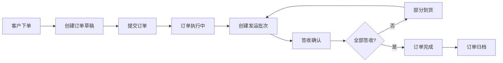
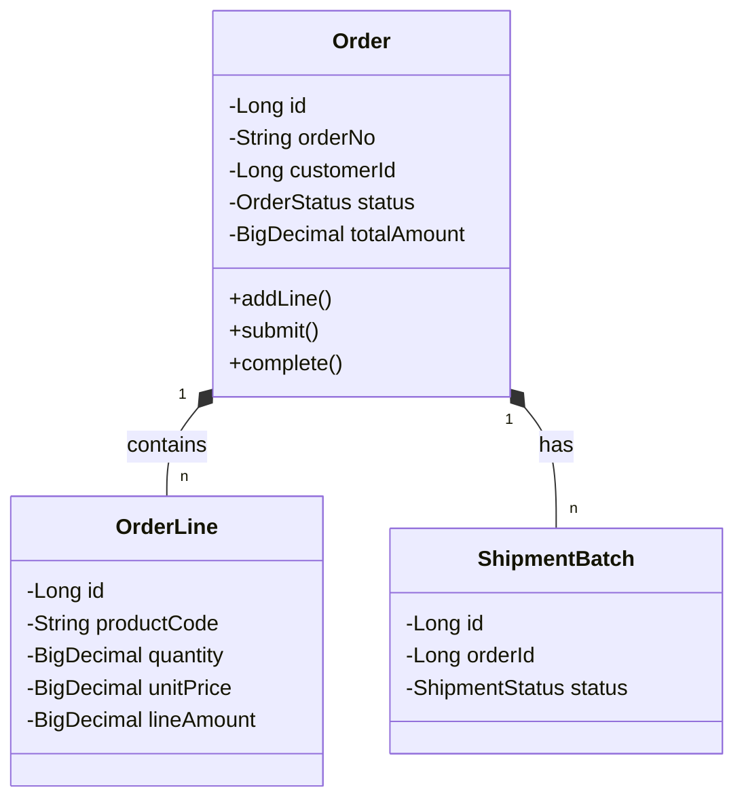

# 模块：订单聚合模块

## 模块概述

### 模块目标
实现订单的完整生命周期管理，是整个系统的核心聚合根。订单是业务链的起点，驱动后续的发运、签收、结算等环节。

### 在项目中的位置
订单聚合是核心业务模块，所有其他业务模块（发运、合作方、看板）都依赖于订单数据。

---

## 依赖关系

### 前置条件
- **前置任务**：plan_02（公共模块）
- **前置数据**：客户主数据、产品主数据
- **前置环境**：状态机引擎、事件总线可用

### 后续影响
- **后续任务**：plan_12（发运聚合）、plan_31（看板聚合）
- **产出数据**：
  - 订单实体和订单行
  - 订单状态事件
  - 订单API接口

---

## 子任务分解

- [ ] plan_08 - 订单数据模型（预估2天）
- [ ] plan_09 - 订单状态机（预估3天）
- [ ] plan_10 - 订单CRUD服务（预估3天）
- [ ] plan_11 - 订单API接口（预估4天）
- [ ] plan_70 - 订单事件溯源（预估2天）

---

## 可视化输出

### 模块流程图

### 订单聚合关系图

### 资源分配表
| 资源类型 | 负责人 | 参与时段 | 关键产出 | 风险/备注 |
| --- | --- | --- | --- | --- |
| 数据模型 | 后端开发者 | 第1-3天 | 实体类、Mapper | 字段类型确认 |
| 状态机 | 架构师 | 第3-6天 | 状态机配置 | 状态流转复杂 |
| 业务服务 | 后端开发者 | 第6-9天 | Service层 | 业务规则复杂 |
| API接口 | 后端开发者 | 第9-12天 | Controller | 接口规范 |
| 事件溯源 | 开发者 | 第10-12天 | 事件重放 | 数据迁移 |

---

## 技术方案

### 架构设计
采用DDD聚合根设计模式：
- **Order**：聚合根，管理订单生命周期
- **OrderLine**：值对象，属于Order
- **Repository**：订单仓储接口
- **Service**：领域服务，处理复杂业务逻辑

### 核心技术选型
- **持久化**：MyBatis-Plus
- **状态机**：Spring StateMachine
- **事件**：自定义事件总线

### 数据模型
- t_order：订单主表
- t_order_line：订单行表
- t_state_event_log：状态事件日志
- t_event：领域事件日志

### 接口设计
- POST /api/order/create：创建订单
- PUT /api/order/update：更新订单
- GET /api/order/{id}：查询订单详情
- GET /api/order/list：订单列表
- POST /api/order/{id}/submit：提交订单
- POST /api/order/{id}/complete：完成订单

---

## 执行摘要

### 输入
- 客户订单数据
- 产品信息
- 价格信息

### 处理
1. 创建订单草稿
2. 添加订单行
3. 计算订单金额
4. 提交执行
5. 状态流转
6. 发布领域事件

### 输出
- 订单实体
- 订单状态事件
- 订单API响应

---

## 验收标准

### 功能验收
- [ ] 订单可正常创建、编辑、删除
- [ ] 订单状态流转正确
- [ ] 订单行金额计算正确
- [ ] 订单事件正确发布
- [ ] 支持订单查询和筛选

### 性能验收
- [ ] 订单创建响应 < 500ms
- [ ] 订单列表查询 < 200ms
- [ ] 订单详情查询 < 300ms

---

## 交付物清单

### 代码文件
- `entity/Order.java`：订单聚合根
- `entity/OrderLine.java`：订单行
- `mapper/OrderMapper.java`：订单数据访问
- `service/OrderService.java`：订单服务
- `controller/OrderController.java`：订单API

### 配置文件
- `OrderStateMachineConfig.java`：订单状态机配置

### 文档
- 订单模块设计文档
- API接口文档
