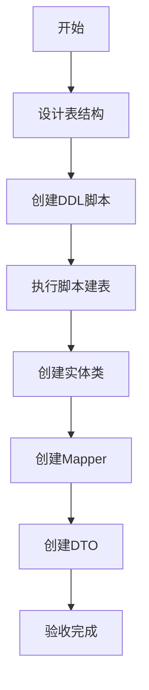
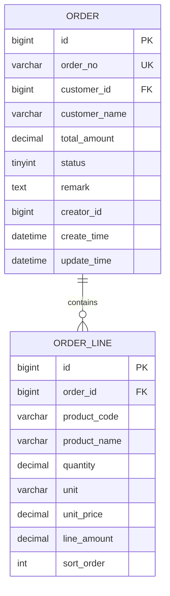

# 任务：订单数据模型

## 任务概述

### 任务描述
设计并创建订单主表t_order、订单行表t_order_line，创建对应的实体类Order、OrderLine，以及MyBatis-Plus的Mapper接口。

### 任务目的
建立订单的数据模型基础，支持订单的持久化和查询。

---

## 依赖关系

### 前置条件
- **前置任务**：plan_02（公共模块）、plan_55（数据库建表）
- **需要的资源**：数据库连接、Flyway配置
- **环境要求**：MySQL 8.0+

### 对后续的影响
- **后续任务**：plan_09（订单状态机）、plan_10（订单CRUD服务）
- **提供的产出**：实体类、Mapper接口、DDL脚本

---

## 可视化辅助

### 步骤流程图


### 数据模型ER图


### 风险监控表
| 风险项 | 等级 | 触发信号 | 应对策略 | 责任人 |
|--------|------|----------|----------|--------|
| 字段类型不匹配 | 中 | 数据溢出 | 使用DECIMAL | 开发者 |
| 索引缺失 | 高 | 查询慢 | 添加必要索引 | 开发者 |
| 外键约束 | 中 | 插入失败 | 考虑不设外键 | 开发者 |

---

## 执行步骤

### 步骤1：设计表结构
- **操作**：根据业务需求设计表结构
- **输入**：业务需求文档
- **输出**：表结构定义
- **注意事项**：遵循数据库命名规范

### 步骤2：创建DDL脚本
- **操作**：编写Flyway迁移脚本
- **输入**：表结构定义
- **输出**：V7__create_order_table.sql
- **注意事项**：添加必要的索引和约束

### 步骤3：创建实体类
- **操作**：创建Order、OrderLine实体类
- **输入**：表结构
- **输出**：实体类
- **注意事项**：使用MyBatis-Plus注解

### 步骤4：创建Mapper接口
- **操作**：创建OrderMapper、OrderLineMapper
- **输入**：实体类
- **输出**：Mapper接口
- **注意事项**：继承BaseMapper

### 步骤5：创建DTO类
- **操作**：创建OrderDTO、OrderLineDTO
- **输入**：实体类
- **输出**：DTO类
- **注意事项**：添加校验注解

### 步骤6：创建VO类
- **操作**：创建OrderVO、OrderDetailVO
- **输入**：DTO和业务需求
- **输出**：VO类
- **注意事项**：区分DTO和VO的使用场景

---

## 核心接口定义

### 主要类/接口
```java
// 订单实体
@TableName("t_order")
public class Order {
    @TableId(type = IdType.AUTO)
    private Long id;
    private String orderNo;
    private Long customerId;
    private String customerName;
    private BigDecimal totalAmount;
    private Integer status;
    private String remark;
    private Long creatorId;
    private LocalDateTime createTime;
    private LocalDateTime updateTime;
    // 订单行集合
    @TableField(exist = false)
    private List<OrderLine> lines;
}

// 订单行实体
@TableName("t_order_line")
public class OrderLine {
    @TableId(type = IdType.AUTO)
    private Long id;
    private Long orderId;
    private String productCode;
    private String productName;
    private BigDecimal quantity;
    private String unit;
    private BigDecimal unitPrice;
    private BigDecimal lineAmount;
    private Integer sortOrder;
}

// 订单Mapper
public interface OrderMapper extends BaseMapper<Order> {
    Order selectByOrderNo(@Param("orderNo") String orderNo);
    List<Order> selectByCustomerId(@Param("customerId") Long customerId);
}

// 订单行Mapper
public interface OrderLineMapper extends BaseMapper<OrderLine> {
    List<OrderLine> selectByOrderId(@Param("orderId") Long orderId);
}
```

### 数据结构
- Order：订单实体
- OrderLine：订单行实体
- OrderDTO：订单数据传输对象
- OrderVO：订单视图对象
- OrderDetailVO：订单详情视图对象

---

## 文件操作清单

### 需要创建的文件
- `order-platform-order/src/main/resources/db/migration/V7__create_order_table.sql`
- `order-platform-order/src/main/resources/db/migration/V8__create_order_line_table.sql`
- `order-platform-order/src/main/java/{package}/entity/Order.java`
- `order-platform-order/src/main/java/{package}/entity/OrderLine.java`
- `order-platform-order/src/main/java/{package}/mapper/OrderMapper.java`
- `order-platform-order/src/main/java/{package}/mapper/OrderLineMapper.java`
- `order-platform-order/src/main/java/{package}/dto/OrderDTO.java`
- `order-platform-order/src/main/java/{package}/dto/OrderLineDTO.java`
- `order-platform-order/src/main/java/{package}/vo/OrderVO.java`
- `order-platform-order/src/main/java/{package}/vo/OrderDetailVO.java`

### 需要读取的文件
- `.claude/CLAUDE.md` - 数据库命名规范
- `.claude/design-document.md` - 数据模型设计

---

## 验收标准

### 功能验收
1. [ ] 表结构正确创建，包含所有字段和索引
2. [ ] 实体类与表结构正确映射
3. [ ] Mapper可正常执行CRUD操作
4. [ ] DTO校验注解生效

### 质量验收
- [ ] 字段命名符合snake_case规范
- [ ] 索引设置合理
- [ ] 实体类包含完整注释

---

## 注意事项

### 技术注意点
- 金额字段使用DECIMAL类型，避免精度丢失
- 订单号设置唯一索引
- 状态字段使用tinyint存储枚举值

### 安全注意点
- 敏感字段不要在VO中返回
- 数据权限过滤在Service层实现

### 性能注意点
- 为查询字段添加索引（customer_id、status、create_time）
- 订单行数据量大时考虑分页查询
