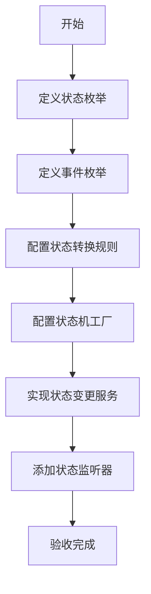
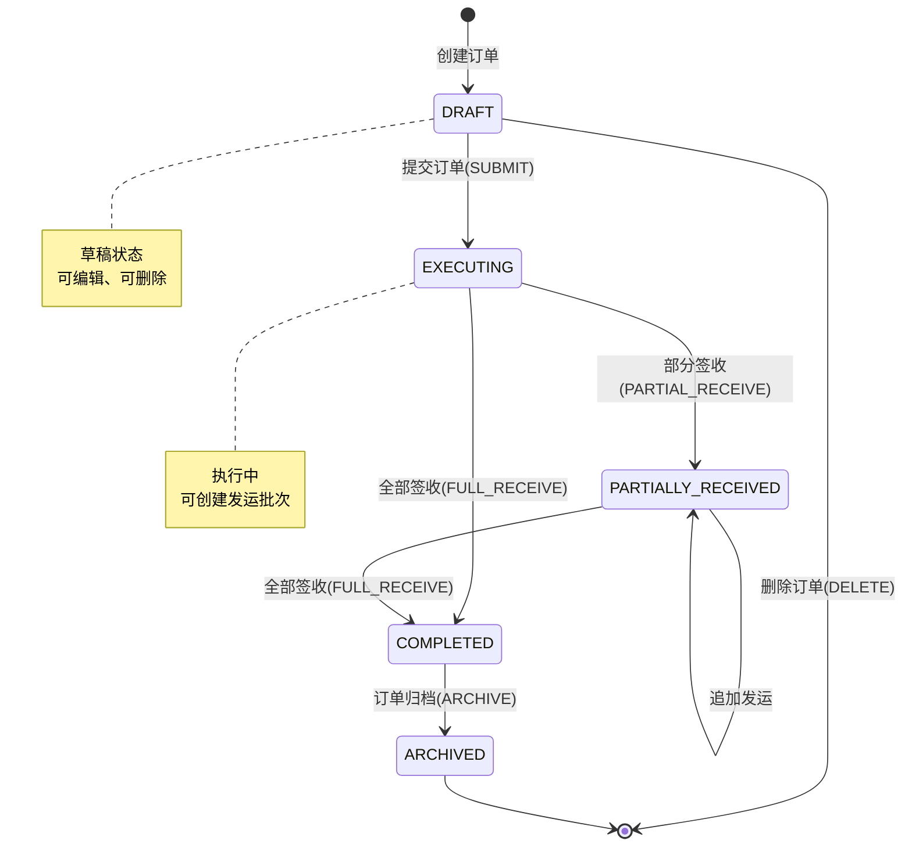

# 任务：订单状态机

## 任务概述

### 任务描述
配置订单状态机，定义订单状态和事件，实现订单状态的规范流转。

### 任务目的
确保订单状态变更符合业务规则，状态变更可追踪、可审计。

---

## 依赖关系

### 前置条件
- **前置任务**：plan_05（状态机引擎）、plan_08（订单数据模型）
- **需要的资源**：状态机配置、订单状态枚举
- **环境要求**：Spring StateMachine可用

### 对后续的影响
- **后续任务**：plan_10（订单CRUD服务）
- **提供的产出**：订单状态机配置、状态变更服务

---

## 可视化辅助

### 步骤流程图


### 订单状态流转图


### 风险监控表
| 风险项 | 等级 | 触发信号 | 应对策略 | 责任人 |
|--------|------|----------|----------|--------|
| 非法状态转换 | 高 | 业务异常 | 严格校验转换规则 | 开发者 |
| 并发状态变更 | 中 | 数据不一致 | 加锁处理 | 开发者 |
| 状态事件丢失 | 中 | 审计缺失 | 强制记录事件 | 开发者 |

---

## 执行步骤

### 步骤1：定义订单状态枚举
- **操作**：创建OrderStatus枚举
- **输入**：业务状态定义
- **输出**：OrderStatus.java
- **注意事项**：包含code和desc属性

### 步骤2：定义订单事件枚举
- **操作**：创建OrderEvent枚举
- **输入**：业务事件定义
- **输出**：OrderEvent.java
- **注意事项**：事件命名清晰表达意图

### 步骤3：配置状态转换规则
- **操作**：创建OrderStateMachineConfig
- **输入**：状态和事件定义
- **输出**：状态机配置类
- **注意事项**：使用Builder模式配置

### 步骤4：配置状态机工厂
- **操作**：创建StateMachineFactory
- **输入**：配置类
- **输出**：工厂Bean
- **注意事项**：支持多订单实例

### 步骤5：实现状态变更服务
- **操作**：创建OrderStateService
- **输入**：订单ID、事件
- **输出**：状态变更结果
- **注意事项**：事务一致性

### 步骤6：添加状态监听器
- **操作**：监听状态变更事件
- **输入**：状态变更事件
- **输出**：状态事件日志
- **注意事项**：异步处理

---

## 核心接口定义

### 主要类/接口
```java
// 订单状态枚举
public enum OrderStatus {
    DRAFT(0, "草稿"),
    EXECUTING(1, "执行中"),
    PARTIALLY_RECEIVED(2, "部分到货"),
    COMPLETED(3, "已完成"),
    ARCHIVED(4, "已归档");

    private final Integer code;
    private final String desc;
}

// 订单事件枚举
public enum OrderEvent {
    SUBMIT("提交订单"),
    PARTIAL_RECEIVE("部分签收"),
    FULL_RECEIVE("全部签收"),
    ARCHIVE("订单归档"),
    CANCEL("取消订单");

    private final String desc;
}

// 订单状态机配置
@Configuration
@EnableStateMachineFactory
public class OrderStateMachineConfig extends StateMachineConfigurerAdapter<OrderStatus, OrderEvent> {
    // 配置状态和转换
}

// 订单状态服务
public interface OrderStateService {
    // 发送事件触发状态变更
    boolean sendEvent(Long orderId, OrderEvent event);
    // 获取当前状态
    OrderStatus getCurrentState(Long orderId);
    // 检查是否可转换
    boolean canTransition(Long orderId, OrderEvent event);
    // 获取状态历史
    List<OrderStatusHistory> getHistory(Long orderId);
}

// 状态变更监听器
@Component
public class OrderStateChangeListener {
    @OnTransition
    public void onTransition(Event<OrderStatus, OrderEvent> event);
}
```

### 数据结构
- t_order_state_log：订单状态变更日志表

---

## 文件操作清单

### 需要创建的文件
- `order-platform-order/src/main/java/{package}/enums/OrderStatus.java`
- `order-platform-order/src/main/java/{package}/enums/OrderEvent.java`
- `order-platform-order/src/main/java/{package}/config/OrderStateMachineConfig.java`
- `order-platform-order/src/main/java/{package}/service/OrderStateService.java`
- `order-platform-order/src/main/java/{package}/listener/OrderStateChangeListener.java`
- `order-platform-order/src/main/resources/db/migration/V9__create_order_state_log.sql`

### 需要读取的文件
- `plan_05_状态机引擎.md` - 状态机引擎基类
- `.claude/CLAUDE.md` - 订单状态枚举定义

---

## 验收标准

### 功能验收
1. [ ] 订单状态正确初始化为DRAFT
2. [ ] SUBMIT事件使状态从DRAFT变为EXECUTING
3. [ ] 非法状态转换被拒绝
4. [ ] 状态变更事件被记录
5. [ ] 可查询状态变更历史

### 性能验收
- [ ] 状态变更耗时 < 50ms
- [ ] 并发状态变更不会产生数据不一致

---

## 注意事项

### 技术注意点
- Spring StateMachine配置较复杂，充分测试
- 状态变更要加分布式锁

### 安全注意点
- 状态变更需要记录操作人
- 敏感状态变更需要权限校验

### 性能注意点
- 状态机实例复用
- 状态事件日志异步写入
