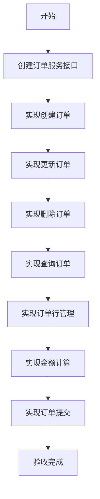
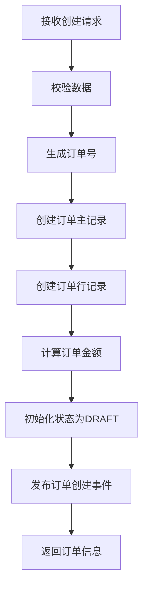

# 任务：订单CRUD服务

## 任务概述

### 任务描述
实现订单的增删改查业务逻辑，包括订单创建、订单行管理、金额计算、订单提交等核心业务功能。

### 任务目的
提供订单的核心业务能力，确保订单数据的一致性和业务规则的正确执行。

---

## 依赖关系

### 前置条件
- **前置任务**：plan_08（订单数据模型）、plan_09（订单状态机）
- **需要的资源**：订单Mapper、状态机服务
- **环境要求**：事务管理可用

### 对后续的影响
- **后续任务**：plan_11（订单API接口）
- **提供的产出**：订单Service层

---

## 可视化辅助

### 步骤流程图


### 订单创建流程图


### 风险监控表
| 风险项 | 等级 | 触发信号 | 应对策略 | 责任人 |
|--------|------|----------|----------|--------|
| 金额计算错误 | 高 | 数据不一致 | 统一计算服务 | 开发者 |
| 并发修改 | 中 | 数据覆盖 | 乐观锁机制 | 开发者 |
| 订单号重复 | 高 | 唯一约束冲突 | 分布式ID生成 | 开发者 |

---

## 执行步骤

### 步骤1：创建订单服务接口
- **操作**：定义OrderService接口
- **输入**：业务需求
- **输出**：OrderService.java
- **注意事项**：接口命名清晰

### 步骤2：实现创建订单
- **操作**：实现create方法
- **输入**：OrderDTO
- **输出**：订单ID
- **注意事项**：事务一致性

### 步骤3：实现更新订单
- **操作**：实现update方法
- **输入**：OrderDTO
- **输出**：更新结果
- **注意事项**：仅允许草稿状态更新

### 步骤4：实现删除订单
- **操作**：实现delete方法
- **输入**：订单ID
- **输出**：删除结果
- **注意事项**：仅允许草稿状态删除

### 步骤5：实现查询订单
- **操作**：实现getById和list方法
- **输入**：查询条件
- **输出**：订单信息
- **注意事项**：支持分页和筛选

### 步骤6：实现订单行管理
- **操作**：实现订单行的增删改
- **输入**：OrderLineDTO
- **输出**：操作结果
- **注意事项**：联动更新订单金额

### 步骤7：实现金额计算
- **操作**：计算订单和订单行金额
- **输入**：订单行数据
- **输出**：计算后的金额
- **注意事项**：使用BigDecimal精确计算

### 步骤8：实现订单提交
- **操作**：提交订单到执行状态
- **输入**：订单ID
- **输出**：提交结果
- **注意事项**：数据校验、状态流转

---

## 核心接口定义

### 主要类/接口
```java
// 订单服务接口
public interface OrderService {
    // 创建订单
    Long create(OrderDTO dto);
    // 更新订单
    void update(OrderDTO dto);
    // 删除订单
    void delete(Long orderId);
    // 查询订单详情
    OrderDetailVO getById(Long orderId);
    // 查询订单列表
    PageResult<OrderVO> list(OrderQuery query);
    // 提交订单
    void submit(Long orderId);
    // 完成订单
    void complete(Long orderId);
    // 取消订单
    void cancel(Long orderId, String reason);
}

// 订单DTO
@Data
public class OrderDTO {
    @NotNull(message = "客户ID不能为空")
    private Long customerId;
    @NotEmpty(message = "订单行不能为空")
    @Valid
    private List<OrderLineDTO> lines;
    private String remark;
}

// 订单行DTO
@Data
public class OrderLineDTO {
    @NotBlank(message = "产品编码不能为空")
    private String productCode;
    @NotBlank(message = "产品名称不能为空")
    private String productName;
    @NotNull(message = "数量不能为空")
    @DecimalMin("0.01")
    private BigDecimal quantity;
    private String unit;
    @NotNull(message = "单价不能为空")
    @DecimalMin("0.01")
    private BigDecimal unitPrice;
}

// 订单查询条件
@Data
public class OrderQuery {
    private String orderNo;
    private Long customerId;
    private Integer status;
    private LocalDate startDate;
    private LocalDate endDate;
    private Integer pageNum;
    private Integer pageSize;
}
```

### 数据结构
- OrderService：订单服务接口
- OrderDTO：订单数据传输对象
- OrderQuery：订单查询条件
- PageResult：分页结果

---

## 文件操作清单

### 需要创建的文件
- `order-platform-order/src/main/java/{package}/service/OrderService.java`
- `order-platform-order/src/main/java/{package}/service/impl/OrderServiceImpl.java`
- `order-platform-order/src/main/java/{package}/dto/OrderDTO.java`
- `order-platform-order/src/main/java/{package}/dto/OrderLineDTO.java`
- `order-platform-order/src/main/java/{package}/dto/OrderQuery.java`
- `order-platform-order/src/main/java/{package}/vo/PageResult.java`

### 需要读取的文件
- `plan_08_订单数据模型.md` - 实体和Mapper
- `plan_09_订单状态机.md` - 状态机服务

---

## 验收标准

### 功能验收
1. [ ] 订单创建成功，订单号唯一
2. [ ] 订单更新仅允许草稿状态
3. [ ] 订单删除仅允许草稿状态
4. [ ] 订单行金额计算正确
5. [ ] 订单总金额等于订单行金额之和
6. [ ] 订单提交状态正确流转
7. [ ] 订单列表分页查询正确

### 性能验收
- [ ] 订单创建响应 < 500ms
- [ ] 订单列表查询 < 200ms
- [ ] 订单详情查询 < 300ms

---

## 注意事项

### 技术注意点
- 金额计算使用BigDecimal，禁止double
- 订单号使用雪花算法生成
- 事务边界清晰

### 安全注意点
- 数据权限过滤
- 删除操作记录操作人

### 性能注意点
- 列表查询索引优化
- 避免N+1查询
- 大数据量分页优化
