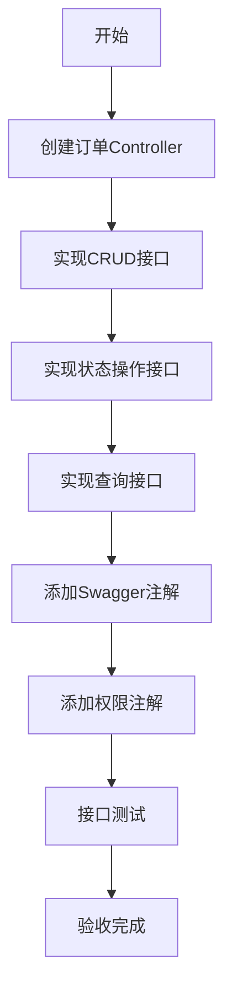

# 任务：订单API接口

## 任务概述

### 任务描述
创建订单模块的RESTful API接口，包括订单CRUD、状态操作等所有外部调用入口。

### 任务目的
提供规范化的API接口，支持前端页面和外部系统调用。

---

## 依赖关系

### 前置条件
- **前置任务**：plan_10（订单CRUD服务）
- **需要的资源**：订单Service
- **环境要求**：Swagger可用

### 对后续影响
- **提供的产出**：订单API接口、Swagger文档

---

## 可视化辅助

### 步骤流程图


### API接口图
```
┌─────────────────────────────────────────────────┐
│                  订单API模块                      │
├─────────────────────────────────────────────────┤
│  POST   /api/order/create      创建订单          │
│  PUT    /api/order/update      更新订单          │
│  DELETE /api/order/delete/{id}  删除订单          │
│  GET    /api/order/{id}        订单详情          │
│  GET    /api/order/list        订单列表          │
│  POST   /api/order/{id}/submit  提交订单          │
│  POST   /api/order/{id}/cancel  取消订单          │
│  GET    /api/order/{id}/timeline 订单时间线       │
└─────────────────────────────────────────────────┘
```

### 风险监控表
| 风险项 | 等级 | 触发信号 | 应对策略 | 责任人 |
|--------|------|----------|----------|--------|
| 接口参数校验缺失 | 中 | 400错误 | 添加@Valid | 开发者 |
| 权限控制缺失 | 高 | 越权访问 | 添加权限注解 | 开发者 |
| 接口文档不全 | 中 | 调用困难 | 完善Swagger | 开发者 |

---

## 执行步骤

### 步骤1：创建Controller类
- **操作**：创建OrderController
- **输入**：Service接口
- **输出**：Controller类
- **注意事项**：添加@RestController注解

### 步骤2：实现CRUD接口
- **操作**：创建、更新、删除、查询接口
- **输入**：DTO参数
- **输出**：Result响应
- **注意事项**：统一返回Result格式

### 步骤3：实现状态操作接口
- **操作**：提交、取消、完成等接口
- **输入**：订单ID
- **输出**：操作结果
- **注意事项**：调用状态机服务

### 步骤4：实现时间线接口
- **操作**：查询订单状态变更历史
- **输入**：订单ID
- **输出**：时间线数据
- **注意事项**：按时间倒序

### 步骤5：添加Swagger注解
- **操作**：添加@Tag、@Operation注解
- **输入**：接口说明
- **输出**：完整的API文档
- **注意事项**：参数说明完整

### 步骤6：添加权限注解
- **操作**：添加@PreAuthorize注解
- **输入**：权限表达式
- **输出**：受保护的接口
- **注意事项**：区分操作权限

### 步骤7：接口测试
- **操作**：使用Swagger测试所有接口
- **输入**：测试数据
- **输出**：测试报告
- **注意事项**：覆盖正常和异常场景

---

## 核心接口定义

### 主要类/接口
```java
// 订单控制器
@Tag(name = "订单管理", description = "订单相关接口")
@RestController
@RequestMapping("/api/order")
public class OrderController {

    // 创建订单
    @Operation(summary = "创建订单")
    @PostMapping("/create")
    public Result<Long> create(@Valid @RequestBody OrderDTO dto);

    // 更新订单
    @Operation(summary = "更新订单")
    @PutMapping("/update")
    public Result<Void> update(@Valid @RequestBody OrderDTO dto);

    // 删除订单
    @Operation(summary = "删除订单")
    @DeleteMapping("/delete/{id}")
    public Result<Void> delete(@PathVariable Long id);

    // 订单详情
    @Operation(summary = "查询订单详情")
    @GetMapping("/{id}")
    public Result<OrderDetailVO> getById(@PathVariable Long id);

    // 订单列表
    @Operation(summary = "查询订单列表")
    @GetMapping("/list")
    public Result<PageResult<OrderVO>> list(OrderQuery query);

    // 提交订单
    @Operation(summary = "提交订单")
    @PostMapping("/{id}/submit")
    public Result<Void> submit(@PathVariable Long id);

    // 取消订单
    @Operation(summary = "取消订单")
    @PostMapping("/{id}/cancel")
    public Result<Void> cancel(@PathVariable Long id, @RequestParam String reason);

    // 订单时间线
    @Operation(summary = "查询订单时间线")
    @GetMapping("/{id}/timeline")
    public Result<List<TimelineVO>> getTimeline(@PathVariable Long id);
}

// 时间线VO
@Data
public class TimelineVO {
    private String status;
    private String statusDesc;
    private LocalDateTime time;
    private String operator;
    private String remark;
}
```

### 数据结构
- Result：统一响应结果
- OrderDTO：订单数据传输对象
- OrderDetailVO：订单详情视图对象
- OrderVO：订单列表视图对象
- TimelineVO：时间线视图对象

---

## 文件操作清单

### 需要创建的文件
- `order-platform-order/src/main/java/{package}/controller/OrderController.java`
- `order-platform-order/src/main/java/{package}/vo/TimelineVO.java`

### 需要读取的文件
- `plan_10_订单CRUD服务.md` - Service接口定义
- `plan_03_统一响应与异常处理.md` - Result类定义

---

## 验收标准

### 功能验收
1. [ ] 所有CRUD接口正常工作
2. [ ] 状态操作接口正确调用状态机
3. [ ] 时间线接口返回完整历史
4. [ ] Swagger文档完整可读
5. [ ] 权限控制生效

### 性能验收
- [ ] 接口响应时间符合要求
- [ ] 并发请求正常处理

---

## 注意事项

### 技术注意点
- RESTful风格命名规范
- HTTP状态码正确使用
- 参数校验注解完整

### 安全注意点
- 敏感操作需要权限校验
- 操作日志记录完整

### 性能注意点
- 列表接口分页
- 详情接口缓存优化
