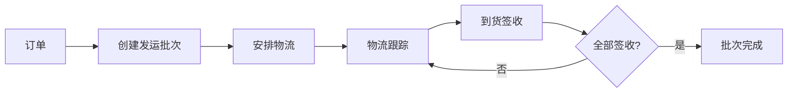

# 模块：发运聚合模块

## 模块概述

### 模块目标
实现发运批次管理，支持一单多批次、提货/到货信息录入、物流跟踪和签收确认。

### 在项目中的位置
发运聚合依赖订单数据，是订单执行环节的核心模块。

---

## 依赖关系

### 前置条件
- **前置任务**：plan_02（公共模块）、plan_07（订单聚合）
- **前置数据**：订单数据
- **前置环境**：状态机引擎、事件总线可用

### 后续影响
- **后续任务**：plan_34（可视化聚合）
- **产出数据**：发运批次、签收记录

---

## 子任务分解

- [ ] plan_13 - 发运数据模型（预估1.5天）
- [ ] plan_14 - 批次管理（预估2.5天）
- [ ] plan_15 - 签收管理（预估2天）
- [ ] plan_16 - 物流跟踪（预估4天）

---

## 可视化输出

### 模块流程图

### 资源分配表
| 资源类型 | 负责人 | 参与时段 | 关键产出 | 风险/备注 |
| --- | --- | --- | --- | --- |
| 数据模型 | 后端开发者 | 第1-2天 | 实体类、Mapper | 与订单关联 |
| 业务服务 | 后端开发者 | 第2-5天 | Service层 | 批次逻辑 |
| 签收管理 | 后端开发者 | 第5-7天 | 签收服务 | 差异处理 |
| 物流跟踪 | 后端开发者 | 第7-10天 | 物流API | 第三方对接 |

---

## 技术方案

### 架构设计
- ShipmentBatch：发运批次聚合根
- ShipmentLine：发运行（订单行关联）
- Receipt：签收记录
- 物流跟踪信息

### 接口设计
- POST /api/shipment/create：创建发运批次
- POST /api/shipment/{id}/receipt：签收确认
- GET /api/shipment/{id}/tracking：物流跟踪

---

## 验收标准

### 功能验收
- [ ] 发运批次可正常创建
- [ ] 支持一单多批次
- [ ] 签收数据正确记录
- [ ] 物流跟踪信息更新

---

## 交付物清单

### 代码文件
- `entity/ShipmentBatch.java`
- `service/ShipmentService.java`
- `controller/ShipmentController.java`
