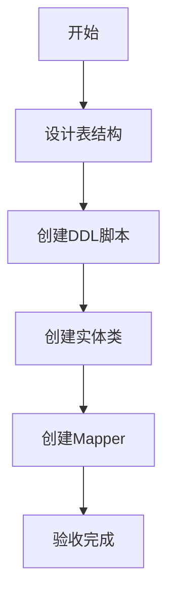
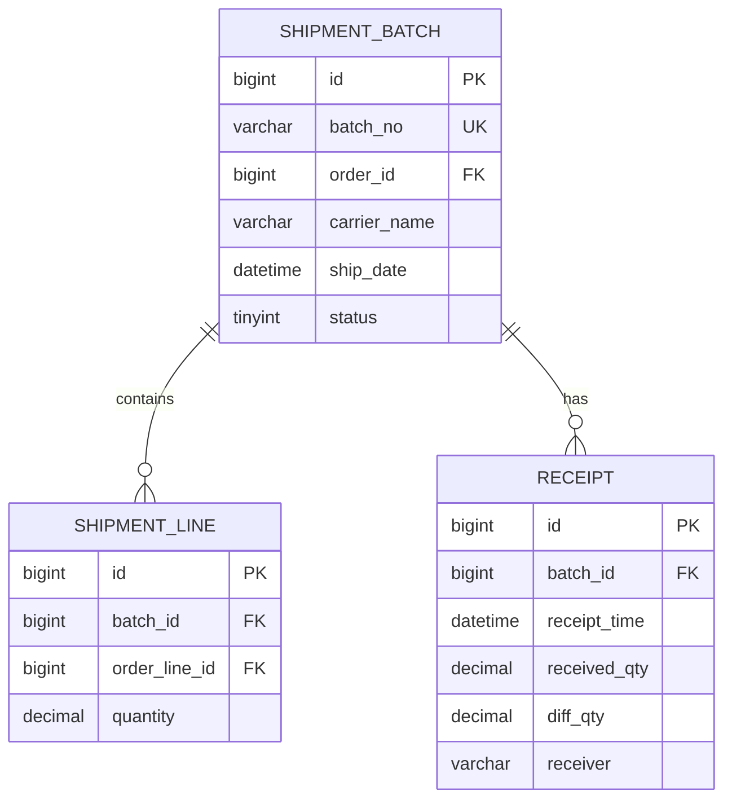

# 任务：发运数据模型

## 任务概述

### 任务描述
创建发运批次表t_shipment_batch、发运行表t_shipment_line、签收表t_receipt，创建对应实体类和Mapper接口。

### 任务目的
建立发运模块的数据模型基础。

---

## 依赖关系

### 前置条件
- **前置任务**：plan_07（订单聚合）
- **需要的资源**：数据库连接

### 对后续影响
- **后续任务**：plan_14（批次管理）

---

## 可视化辅助

### 步骤流程图


### 数据模型ER图


---

## 执行步骤

### 步骤1：创建DDL脚本
- 创建t_shipment_batch、t_shipment_line、t_receipt表

### 步骤2：创建实体类
- ShipmentBatch、ShipmentLine、Receipt

### 步骤3：创建Mapper接口

---

## 核心接口定义

### 主要类/接口
```java
@TableName("t_shipment_batch")
public class ShipmentBatch {
    @TableId(type = IdType.AUTO)
    private Long id;
    private String batchNo;
    private Long orderId;
    private String carrierName;
    private LocalDateTime shipDate;
    private Integer status;
}

public interface ShipmentBatchMapper extends BaseMapper<ShipmentBatch> {
    List<ShipmentBatch> selectByOrderId(Long orderId);
}
```

---

## 验收标准

### 功能验收
1. [ ] 表结构创建成功
2. [ ] 实体类映射正确
3. [ ] Mapper可正常工作

---

## 注意事项

- 批次号设置唯一索引
- 签收数量差异需要记录
