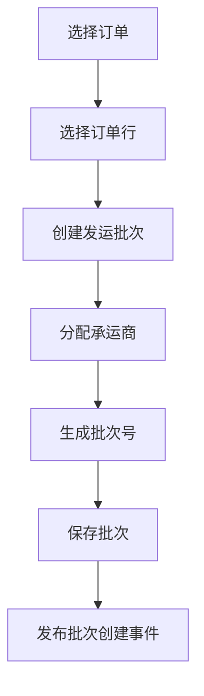

# 任务：批次管理

## 任务概述

### 任务描述
实现发运批次的创建、修改、删除、查询功能，支持订单行关联、批次拆分合并。

### 任务目的
提供发运批次的核心业务能力。

---

## 依赖关系

### 前置条件
- **前置任务**：plan_13（发运数据模型）

### 对后续影响
- **后续任务**：plan_15（签收管理）

---

## 可视化辅助

### 步骤流程图


---

## 执行步骤

### 步骤1：实现批次创建
- 校验订单状态
- 分配批次号
- 关联订单行

### 步骤2：实现批次查询

### 步骤3：实现批次修改

### 步骤4：实现批次删除

---

## 核心接口定义

### 主要类/接口
```java
public interface ShipmentBatchService {
    Long create(ShipmentBatchDTO dto);
    void update(ShipmentBatchDTO dto);
    void delete(Long batchId);
    ShipmentBatchVO getById(Long batchId);
    PageResult<ShipmentBatchVO> list(ShipmentBatchQuery query);
}
```

---

## 验收标准

### 功能验收
1. [ ] 批次创建成功
2. [ ] 支持批次拆分
3. [ ] 批次查询正常

---

## 注意事项

- 批次号使用雪花算法
- 删除批次需校验状态
