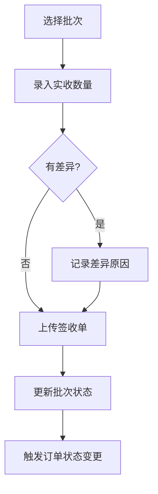

# 任务：签收管理

## 任务概述

### 任务描述
实现到货签收功能，支持实收数量记录、差异处理、签收单上传。

### 任务目的
完成发运批次的闭环管理。

---

## 依赖关系

### 前置条件
- **前置任务**：plan_14（批次管理）

### 对后续影响
- **后续任务**：plan_07（订单状态变更）

---

## 可视化辅助

### 步骤流程图


---

## 执行步骤

### 步骤1：实现签收创建

### 步骤2：实现差异处理

### 步骤3：实现签收单上传

### 步骤4：触发订单状态变更

---

## 核心接口定义

### 主要类/接口
```java
public interface ReceiptService {
    Long create(ReceiptDTO dto);
    void update(ReceiptDTO dto);
    ReceiptVO getById(Long receiptId);
    List<ReceiptVO> listByBatchId(Long batchId);
}
```

---

## 验收标准

### 功能验收
1. [ ] 签收记录创建成功
2. [ ] 差异正确处理
3. [ ] 签收单上传成功

---

## 注意事项

- 差异需要记录原因
- 签收单关联附件模块
