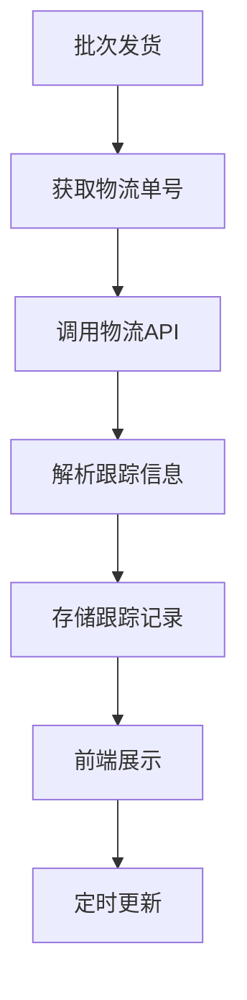

# 任务：物流跟踪

## 任务概述

### 任务描述
对接第三方物流API，实现物流跟踪信息的自动获取和展示。

### 任务目的
提供物流在途可视化能力。

---

## 依赖关系

### 前置条件
- **前置任务**：plan_14（批次管理）

### 对后续影响
- **后续任务**：plan_34（可视化聚合）

---

## 可视化辅助

### 步骤流程图


### 风险监控表
| 风险项 | 等级 | 触发信号 | 应对策略 | 责任人 |
|--------|------|----------|----------|--------|
| API限流 | 中 | 调用失败 | 降级处理 | 开发者 |
| 数据格式变化 | 中 | 解析失败 | 兼容处理 | 开发者 |

---

## 执行步骤

### 步骤1：选择物流服务商API

### 步骤2：实现API调用封装

### 步骤3：实现跟踪信息解析

### 步骤4：实现定时更新任务

### 步骤5：实现跟踪查询接口

---

## 核心接口定义

### 主要类/接口
```java
public interface TrackingService {
    // 查询跟踪信息
    TrackingVO getTracking(Long batchId);
    // 刷新跟踪信息
    void refreshTracking(Long batchId);
    // 批量刷新
    void batchRefresh();
}
```

---

## 验收标准

### 功能验收
1. [ ] 物流信息正确获取
2. [ ] 跟踪信息定时更新
3. [ ] 查询接口正常

---

## 注意事项

- API调用需要限流控制
- 跟踪信息缓存处理
