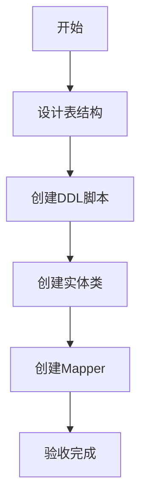
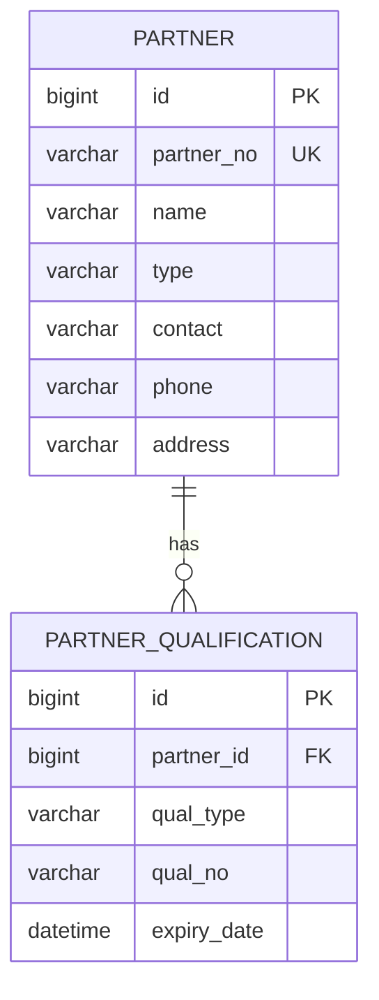

# 任务：合作方数据模型

## 任务概述

### 任务描述
创建合作方表t_partner、资质表t_partner_qualification，创建对应实体类和Mapper接口。

### 任务目的
建立合作方模块的数据模型基础。

---

## 依赖关系

### 前置条件
- **前置任务**：plan_02（公共模块）

### 对后续影响
- **后续任务**：plan_19（合作方CRUD）

---

## 可视化辅助

### 步骤流程图


### 数据模型ER图


---

## 执行步骤

### 步骤1：创建DDL脚本
- 创建t_partner、t_partner_qualification表

### 步骤2：创建实体类
- Partner、PartnerQualification

### 步骤3：创建Mapper接口

---

## 核心接口定义

### 主要类/接口
```java
@TableName("t_partner")
public class Partner {
    @TableId(type = IdType.AUTO)
    private Long id;
    private String partnerNo;
    private String name;
    private String type; // 供应商/承运商
    private String contact;
    private String phone;
}

public interface PartnerMapper extends BaseMapper<Partner> {
    List<Partner> selectByType(String type);
}
```

---

## 验收标准

### 功能验收
1. [ ] 表结构创建成功
2. [ ] 实体类映射正确
3. [ ] Mapper可正常工作

---

## 注意事项

- 合作方号设置唯一索引
- 类型枚举值管理
