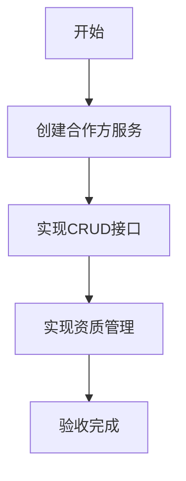

# 任务：合作方CRUD

## 任务概述

### 任务描述
实现合作方的创建、修改、删除、查询功能，支持资质信息管理。

### 任务目的
提供合作方的基础管理能力。

---

## 依赖关系

### 前置条件
- **前置任务**：plan_18（合作方数据模型）

### 对后续影响
- **后续任务**：plan_20（履约统计）

---

## 可视化辅助

### 步骤流程图


---

## 执行步骤

### 步骤1：实现合作方创建

### 步骤2：实现合作方更新

### 步骤3：实现合作方查询

### 步骤4：实现资质关联

---

## 核心接口定义

### 主要类/接口
```java
public interface PartnerService {
    Long create(PartnerDTO dto);
    void update(PartnerDTO dto);
    void delete(Long partnerId);
    PartnerVO getById(Long partnerId);
    PageResult<PartnerVO> list(PartnerQuery query);
}
```

---

## 验收标准

### 功能验收
1. [ ] 合作方CRUD正常
2. [ ] 资质关联正确

---

## 注意事项

- 合作方号生成规则
- 资质过期提醒
