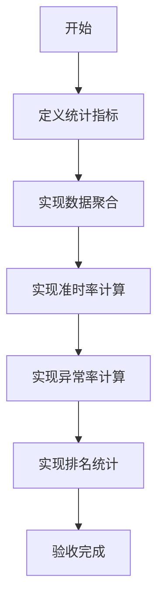

# 任务：履约统计

## 任务概述

### 任务描述
实现合作方履约表现统计，包括准时率、异常率、订单数量等指标。

### 任务目的
为看板和合作方评估提供数据支撑。

---

## 依赖关系

### 前置条件
- **前置任务**：plan_19（合作方CRUD）、plan_12（发运聚合）

### 对后续影响
- **后续任务**：plan_31（看板聚合）

---

## 可视化辅助

### 步骤流程图


### 风险监控表
| 风险项 | 等级 | 触发信号 | 应对策略 | 责任人 |
|--------|------|----------|----------|--------|
| 统计数据量大 | 中 | 查询慢 | 缓存+定时任务 | 开发者 |

---

## 执行步骤

### 步骤1：定义统计指标
- 准时率
- 异常率
- 订单数量
- 金额统计

### 步骤2：实现数据聚合服务

### 步骤3：实现统计查询接口

### 步骤4：实现定时统计任务

---

## 核心接口定义

### 主要类/接口
```java
public interface PartnerPerformanceService {
    // 获取履约统计
    PerformanceVO getPerformance(Long partnerId);
    // 获取排名
    List<PartnerRankingVO> getRanking(String type);
    // 刷新统计数据
    void refreshStats();
}

@Data
public class PerformanceVO {
    private Long partnerId;
    private String partnerName;
    private Integer totalOrders;
    private BigDecimal onTimeRate;
    private BigDecimal exceptionRate;
    private LocalDateTime lastUpdateTime;
}
```

---

## 验收标准

### 功能验收
1. [ ] 统计数据准确
2. [ ] 查询响应及时
3. [ ] 排名数据正确

---

## 注意事项

- 统计数据缓存处理
- 定时任务性能优化
