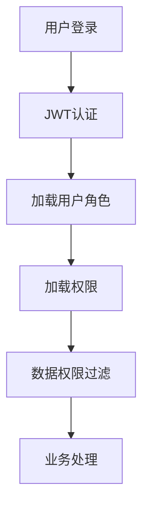

# 模块：用户权限模块

## 模块概述

### 模块目标
实现用户管理、角色管理、权限配置，提供RBAC权限控制和数据权限过滤。

### 在项目中的位置
用户权限模块是基础服务模块，被所有业务模块依赖。

---

## 依赖关系

### 前置条件
- **前置任务**：plan_02（公共模块）

### 后续影响
- **后续任务**：所有业务模块

---

## 子任务分解

- [ ] plan_22 - 用户管理（预估2天）
- [ ] plan_23 - 角色权限（预估4天）

---

## 可视化输出

### 模块流程图

---

## 技术方案

### 架构设计
- User：用户实体
- Role：角色实体
- Permission：权限实体
- UserRole：用户角色关联
- RolePermission：角色权限关联

### 接口设计
- POST /api/user/login：用户登录
- POST /api/user/create：创建用户
- GET /api/user/list：用户列表

---

## 验收标准

### 功能验收
- [ ] 用户CRUD正常
- [ ] 角色权限配置生效
- [ ] 数据权限过滤生效

---

## 交付物清单

### 代码文件
- `entity/User.java`
- `service/UserService.java`
- `controller/UserController.java`
