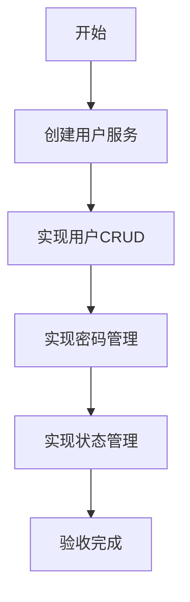

# 任务：用户管理

## 任务概述

### 任务描述
实现用户的创建、编辑、删除、查询功能，支持用户状态管理、密码重置。

### 任务目的
提供用户的基础管理能力。

---

## 依赖关系

### 前置条件
- **前置任务**：plan_02（公共模块）

### 对后续影响
- **后续任务**：plan_23（角色权限）

---

## 可视化辅助

### 步骤流程图


---

## 执行步骤

### 步骤1：实现用户创建
- 密码BCrypt加密
- 用户号生成

### 步骤2：实现用户查询
- 支持分页
- 支持筛选

### 步骤3：实现用户更新
- 基础信息更新
- 状态更新

### 步骤4：实现密码重置

---

## 核心接口定义

### 主要类/接口
```java
public interface UserService {
    Long create(UserDTO dto);
    void update(UserDTO dto);
    void delete(Long userId);
    UserVO getById(Long userId);
    PageResult<UserVO> list(UserQuery query);
    void resetPassword(Long userId);
}

@Data
public class UserDTO {
    @NotBlank
    private String username;
    @NotBlank
    private String password;
    @NotBlank
    private String realName;
    private String email;
    private String phone;
}
```

---

## 验收标准

### 功能验收
1. [ ] 用户创建成功
2. [ ] 密码加密存储
3. [ ] 密码重置正常

---

## 注意事项

- 密码必须BCrypt加密
- 用户名唯一性校验
