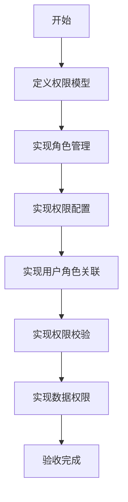

# 任务：角色权限

## 任务概述

### 任务描述
实现角色管理、权限配置、用户角色关联，提供RBAC权限控制能力。

### 任务目的
实现细粒度的权限控制，包括菜单权限、按钮权限、数据权限。

---

## 依赖关系

### 前置条件
- **前置任务**：plan_22（用户管理）

### 对后续影响
- **后续任务**：所有业务模块

---

## 可视化辅助

### 步骤流程图


### 权限模型图
```
┌─────────────────────────────────────────┐
│              权限模型                     │
├─────────────────────────────────────────┤
│  用户 ─── 多对多 ─── 角色               │
│  角色 ─── 多对多 ─── 权限               │
│  权限类型：菜单、按钮、数据              │
│  数据权限：全部、部门、本人、自定义       │
└─────────────────────────────────────────┘
```

### 风险监控表
| 风险项 | 等级 | 触发信号 | 应对策略 | 责任人 |
|--------|------|----------|----------|--------|
| 权限配置错误 | 高 | 越权访问 | 严格校验 | 开发者 |
| 数据权限泄露 | 高 | 数据越界 | 强制过滤 | 开发者 |

---

## 执行步骤

### 步骤1：定义权限模型
- Role：角色
- Permission：权限
- UserRole：用户角色
- RolePermission：角色权限
- DataPermission：数据权限

### 步骤2：实现角色管理
- 角色CRUD
- 角色权限配置

### 步骤3：实现用户角色关联
- 分配角色
- 移除角色

### 步骤4：实现权限校验
- 接口权限注解
- 权限拦截器

### 步骤5：实现数据权限
- 数据权限规则
- MyBatis拦截器

---

## 核心接口定义

### 主要类/接口
```java
public interface RoleService {
    Long create(RoleDTO dto);
    void update(RoleDTO dto);
    void delete(Long roleId);
    RoleVO getById(Long roleId);
    List<RoleVO> list();
    void assignPermission(Long roleId, List<Long> permissionIds);
}

public interface PermissionService {
    List<PermissionVO> getTree();
    List<PermissionVO> getByRoleId(Long roleId);
}

@Data
public class RoleDTO {
    @NotBlank
    private String roleName;
    private String roleCode;
    private String description;
    private List<Long> permissionIds;
}
```

---

## 验收标准

### 功能验收
1. [ ] 角色CRUD正常
2. [ ] 权限配置生效
3. [ ] 数据权限过滤生效
4. [ ] 权限注解正常工作

---

## 注意事项

- 权限标识唯一性
- 数据权限SQL注入防护
- 权限缓存更新及时
