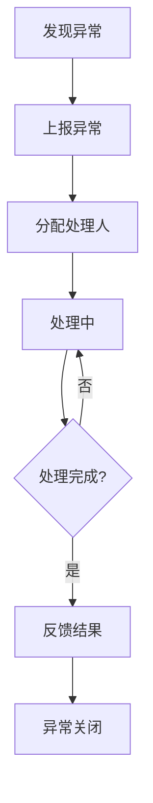

# 模块：异常聚合模块

## 模块概述

### 模块目标
实现异常的上报、分配、处理、反馈闭环管理，确保所有异常都有处理结果。

### 在项目中的位置
异常聚合是支撑模块，与订单、发运模块关联。

---

## 依赖关系

### 前置条件
- **前置任务**：plan_02（公共模块）

### 后续影响
- **提供的产出**：异常处理记录

---

## 子任务分解

- [ ] plan_25 - 异常上报与记录（预估2天）
- [ ] plan_26 - 异常处理流程（预估4天）

---

## 可视化输出

### 异常处理流程图

---

## 技术方案

### 架构设计
- Exception：异常实体
- ExceptionHandling：处理记录
- ExceptionFeedback：反馈信息

### 接口设计
- POST /api/exception/report：上报异常
- POST /api/exception/{id}/handle：处理异常
- GET /api/exception/list：异常列表

---

## 验收标准

### 功能验收
- [ ] 异常可正常上报
- [ ] 处理流程闭环完整
- [ ] 反馈信息记录完整
