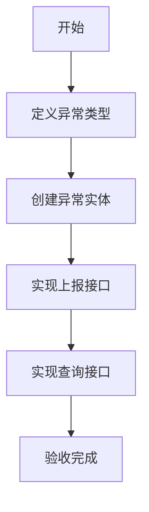

# 任务：异常上报与记录

## 任务概述

### 任务描述
实现异常的上报功能，支持异常类型管理、异常信息记录、异常附件关联。

### 任务目的
提供异常的统一上报入口和记录能力。

---

## 依赖关系

### 前置条件
- **前置任务**：plan_02（公共模块）

### 对后续影响
- **后续任务**：plan_26（异常处理流程）

---

## 可视化辅助

### 步骤流程图


### 异常类型图
```
┌─────────────────────────────────────────┐
│              异常类型                     │
├─────────────────────────────────────────┤
│  运输延迟：发运后未按时到货               │
│  到货差异：实收与发货数量不符             │
│  货损问题：运输过程中货物损坏             │
│  凭证缺失：签收单、发票等缺失             │
│  质量问题：货物质量不符                   │
│  其他：其他类型异常                       │
└─────────────────────────────────────────┘
```

---

## 执行步骤

### 步骤1：定义异常类型枚举

### 步骤2：创建异常实体和表

### 步骤3：实现异常上报服务

### 步骤4：实现异常查询服务

---

## 核心接口定义

### 主要类/接口
```java
public enum ExceptionType {
    TRANSPORT_DELAY,    // 运输延迟
    QUANTITY_DIFF,      // 到货差异
    GOODS_DAMAGE,       // 货损问题
    DOC_MISSING,        // 凭证缺失
    QUALITY_ISSUE,      // 质量问题
    OTHER               // 其他
}

public interface ExceptionService {
    Long report(ExceptionDTO dto);
    ExceptionVO getById(Long exceptionId);
    PageResult<ExceptionVO> list(ExceptionQuery query);
}
```

---

## 验收标准

### 功能验收
1. [ ] 异常上报成功
2. [ ] 异常信息完整
3. [ ] 附件关联正常

---

## 注意事项

- 异常状态待处理/处理中/已关闭
- 异常需要关联业务对象
