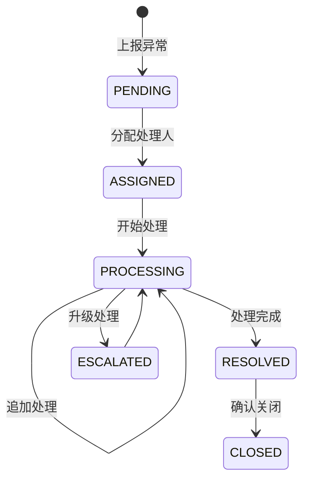

# 任务：异常处理流程

## 任务概述

### 任务描述
实现异常的分配、处理、反馈闭环流程，支持处理人指派、处理记录、结果反馈。

### 任务目的
确保每个异常都有处理结果，实现闭环管理。

---

## 依赖关系

### 前置条件
- **前置任务**：plan_25（异常上报与记录）

---

## 可视化辅助

### 异常处理状态图


### 风险监控表
| 风险项 | 等级 | 触发信号 | 应对策略 | 责任人 |
|--------|------|----------|----------|--------|
| 异常未处理 | 高 | 超时未处理 | 自动提醒 | 系统管理员 |
| 处理记录缺失 | 中 | 审计缺失 | 强制填写 | 开发者 |

---

## 执行步骤

### 步骤1：实现异常分配
- 指派处理人
- 设置处理期限

### 步骤2：实现处理记录
- 记录处理过程
- 支持多条记录

### 步骤3：实现结果反馈
- 填写处理结果
- 上传处理凭证

### 步骤4：实现异常关闭
- 确认处理完成
- 关闭异常

### 步骤5：实现超时提醒

---

## 核心接口定义

### 主要类/接口
```java
public interface ExceptionHandlingService {
    // 分配处理人
    void assign(Long exceptionId, Long handlerId);
    // 提交处理记录
    void addHandling(Long exceptionId, HandlingDTO dto);
    // 反馈结果
    void feedback(Long exceptionId, FeedbackDTO dto);
    // 关闭异常
    void close(Long exceptionId);
}

@Data
public class HandlingDTO {
    private String description;
    private List<Long> attachmentIds;
}

@Data
public class FeedbackDTO {
    private String result;
    private String solution;
    private List<Long> attachmentIds;
}
```

---

## 验收标准

### 功能验收
1. [ ] 异常可正常分配
2. [ ] 处理记录完整
3. [ ] 反馈信息记录
4. [ ] 异常可正常关闭

---

## 注意事项

- 处理记录不可修改
- 异常关闭需有处理记录
