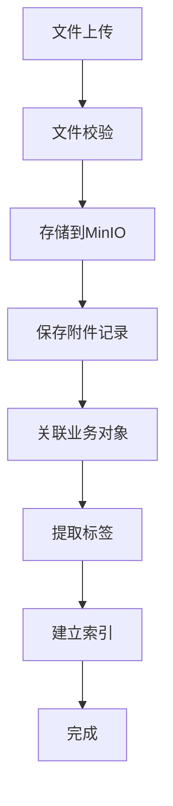

# 模块：附件聚合模块

## 模块概述

### 模块目标
实现文件的上传、下载、存储管理，支持标签分类、全文检索。

### 在项目中的位置
附件聚合是支撑模块，被所有业务模块使用。

---

## 依赖关系

### 前置条件
- **前置任务**：plan_02（公共模块）

### 后续影响
- **提供的产出**：附件存储能力、检索能力

---

## 子任务分解

- [ ] plan_28 - 文件上传下载（预估2天）
- [ ] plan_29 - 标签管理（预估1.5天）
- [ ] plan_30 - 全文检索集成（预估4.5天）

---

## 可视化输出

### 附件处理流程图

---

## 技术方案

### 架构设计
- Attachment：附件实体
- AttachmentTag：附件标签
- AttachmentRelation：业务关联

### 接口设计
- POST /api/attachment/upload：文件上传
- GET /api/attachment/{id}：文件下载
- GET /api/attachment/search：全文检索

---

## 验收标准

### 功能验收
- [ ] 文件上传下载正常
- [ ] 标签管理正常
- [ ] 全文检索可用

---

## 交付物清单

### 代码文件
- `entity/Attachment.java`
- `service/AttachmentService.java`
- `controller/AttachmentController.java`
