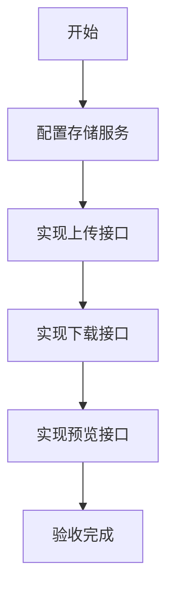

# 任务：文件上传下载

## 任务概述

### 任务描述
实现文件的上传、下载、预览功能，支持MinIO/OSS存储，支持大文件分片上传。

### 任务目的
提供统一的文件存储能力。

---

## 依赖关系

### 前置条件
- **前置任务**：plan_02（公共模块）

### 对后续影响
- **后续任务**：plan_29（标签管理）

---

## 可视化辅助

### 步骤流程图


### 文件存储图
```
┌─────────────────────────────────────────┐
│              文件上传流程                  │
├─────────────────────────────────────────┤
│  前端 ───→ 上传文件 ───→ API网关         │
│                              ↓           │
│                        校验(类型/大小)    │
│                              ↓           │
│                        存储到MinIO       │
│                              ↓           │
│                        保存附件记录       │
│                              ↓           │
│                        返回文件ID       │
└─────────────────────────────────────────┘
```

### 风险监控表
| 风险项 | 等级 | 触发信号 | 应对策略 | 责任人 |
|--------|------|----------|----------|--------|
| 文件类型不安全 | 高 | 上传失败 | 白名单校验 | 开发者 |
| 存储空间不足 | 中 | 上传失败 | 监控告警 | 运维 |

---

## 执行步骤

### 步骤1：配置MinIO客户端

### 步骤2：实现文件上传服务
- 类型校验
- 大小限制
- 病毒扫描（可选）

### 步骤3：实现文件下载服务
- 权限校验
- 断点续传

### 步骤4：实现文件预览
- 图片预览
- PDF预览

---

## 核心接口定义

### 主要类/接口
```java
public interface AttachmentService {
    // 上传文件
    String upload(MultipartFile file);
    // 上传到指定业务
    String uploadForBusiness(MultipartFile file, String businessType, Long businessId);
    // 下载文件
    byte[] download(Long attachmentId);
    // 获取文件URL
    String getUrl(Long attachmentId);
}

@Data
public class AttachmentVO {
    private Long id;
    private String fileName;
    private Long fileSize;
    private String fileType;
    private String url;
    private LocalDateTime uploadTime;
}
```

---

## 验收标准

### 功能验收
1. [ ] 文件上传成功
2. [ ] 文件下载正常
3. [ ] 预览功能可用

---

## 注意事项

- 文件类型白名单
- 上传文件大小限制
- 存储路径规则
