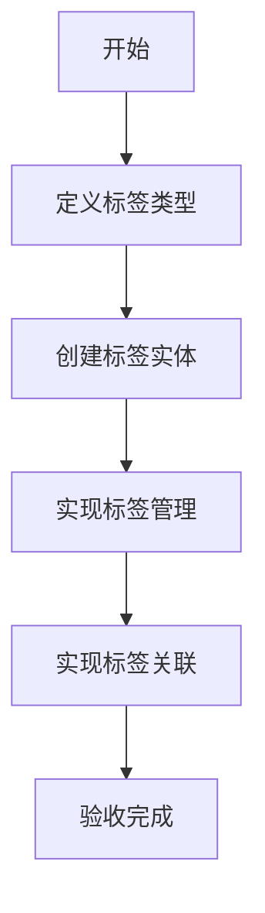

# 任务：标签管理

## 任务概述

### 任务描述
实现附件的标签管理功能，支持标签创建、标签关联、标签查询。

### 任务目的
通过标签实现附件的分类管理和快速检索。

---

## 依赖关系

### 前置条件
- **前置任务**：plan_28（文件上传下载）

---

## 可视化辅助

### 步骤流程图


### 标签类型图
```
┌─────────────────────────────────────────┐
│              标签类型                     │
├─────────────────────────────────────────┤
│  业务类型：订单/发运/合作方/异常          │
│  文档类型：合同/发票/凭证/报价单          │
│  产品类型：按产品分类                    │
│  自定义标签：用户自定义                   │
└─────────────────────────────────────────┘
```

---

## 执行步骤

### 步骤1：定义标签类型枚举

### 步骤2：创建标签实体和表

### 步骤3：实现标签CRUD服务

### 步骤4：实现附件标签关联

---

## 核心接口定义

### 主要类/接口
```java
public interface AttachmentTagService {
    // 创建标签
    Long create(TagDTO dto);
    // 关联标签
    void attach(Long attachmentId, List<Long> tagIds);
    // 按标签查询附件
    List<AttachmentVO> findByTags(List<Long> tagIds);
}
```

---

## 验收标准

### 功能验收
1. [ ] 标签创建成功
2. [ ] 标签关联正常
3. [ ] 按标签查询正常

---

## 注意事项

- 标签名称唯一性
- 标签颜色配置
