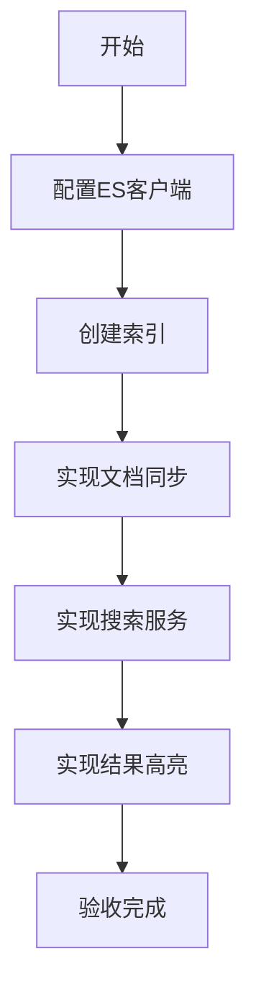

# 任务：全文检索集成

## 任务概述

### 任务描述
集成Elasticsearch，实现附件的全文检索功能，支持文件名、内容、标签的综合检索。

### 任务目的
提供附件的快速检索能力，解决"资料难找"的问题。

---

## 依赖关系

### 前置条件
- **前置任务**：plan_28（文件上传下载）、plan_29（标签管理）

---

## 可视化辅助

### 步骤流程图


### 检索流程图
```
┌─────────────────────────────────────────┐
│              全文检索流程                 │
├─────────────────────────────────────────┤
│  附件上传 ───→ 解析内容 ───→ 建立ES索引  │
│                              ↓           │
│  检索请求 ───→ ES查询 ───→ 返回结果     │
│                              ↓           │
│  结果高亮 ───→ 展示列表                 │
└─────────────────────────────────────────┘
```

### 风险监控表
| 风险项 | 等级 | 触发信号 | 应对策略 | 责任人 |
|--------|------|----------|----------|--------|
| ES服务不可用 | 中 | 检索失败 | 降级为数据库查询 | 开发者 |
| 索引同步延迟 | 低 | 数据不一致 | 定时同步 | 开发者 |

---

## 执行步骤

### 步骤1：配置Elasticsearch客户端

### 步骤2：创建附件索引

### 步骤3：实现文档同步服务
- 附件上传时建立索引
- 附件更新时同步索引

### 步骤4：实现全文检索服务
- 关键词搜索
- 高亮显示
- 分页结果

### 步骤5：实现聚合检索
- 按标签筛选
- 按时间筛选
- 按业务类型筛选

---

## 核心接口定义

### 主要类/接口
```java
public interface AttachmentSearchService {
    // 同步到ES
    void index(Attachment attachment);
    // 搜索
    PageResult<AttachmentVO> search(SearchRequest request);
}

@Data
public class SearchRequest {
    private String keyword;
    private List<Long> tagIds;
    private String businessType;
    private LocalDate startDate;
    private LocalDate endDate;
    private Integer pageNum;
    private Integer pageSize;
}
```

---

## 验收标准

### 功能验收
1. [ ] ES索引创建成功
2. [ ] 文档同步正常
3. [ ] 搜索结果准确
4. [ ] 高亮显示正确
5. [ ] ES降级正常

---

## 注意事项

- ES索引分片配置
- 搜索结果缓存
- ES服务降级处理
