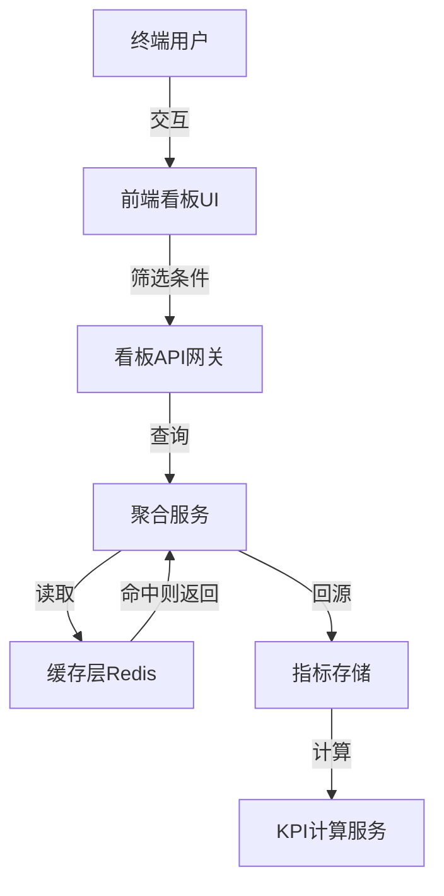

# 模块：看板聚合模块

## 模块概述

### 模块目标
实现大屏看板的KPI计算和数据聚合服务，提供实时、准确的数据指标。

### 在项目中的位置
看板聚合是数据分析模块，依赖订单、发运、合作方等业务数据。

---

## 依赖关系

### 前置条件
- **前置任务**：plan_07（订单聚合）、plan_12（发运聚合）、plan_17（合作方聚合）

### 后续影响
- **后续任务**：plan_37（前端应用）

---

## 子任务分解

- [ ] plan_32 - KPI计算服务（预估5天）
- [ ] plan_33 - 数据聚合服务（预估5天）

---

## 可视化输出

### 看板数据流图

### 看板指标映射表
| 节点 | 职责 | 输入数据 | 输出数据 |
| --- | --- | --- | --- |
| 前端看板UI | 渲染逻辑 | 筛选条件 | 视图 |
| 看板API网关 | 接口聚合 | 请求参数 | 统一响应 |
| 聚合服务 | 数据组装 | 缓存/DB | 指标DTO |
| KPI计算服务 | 指标计算 | 业务数据 | KPI值 |

---

## 技术方案

### 架构设计
- KpiCalculateService：统一KPI计算入口
- DataAggregateService：数据聚合服务
- Redis缓存：热点数据缓存

### 接口设计
- GET /api/dashboard/kpi：KPI指标
- GET /api/dashboard/trend：趋势数据
- GET /api/dashboard/ranking：排行榜

---

## 验收标准

### 功能验收
- [ ] KPI数据准确
- [ ] 趋势图表正确
- [ ] 排行榜数据正确
- [ ] 缓存策略有效

---

## 交付物清单

### 代码文件
- `service/KpiCalculateService.java`
- `service/DataAggregateService.java`
- `controller/DashboardController.java`
