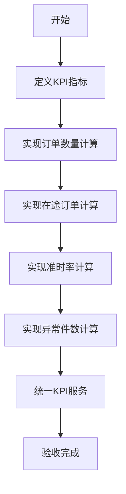
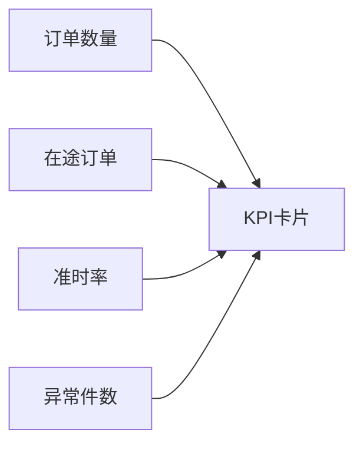

# 任务：KPI计算服务

## 任务概述

### 任务描述
实现核心KPI指标的计算逻辑，包括订单数量、在途订单、准时率、异常件数等。

### 任务目的
提供统一的数据口径，确保KPI计算的一致性。

---

## 依赖关系

### 前置条件
- **前置任务**：plan_07（订单聚合）、plan_12（发运聚合）、plan_24（异常聚合）

---

## 可视化辅助

### KPI计算流程图


### KPI指标定义


### 风险监控表
| 风险项 | 等级 | 触发信号 | 应对策略 | 责任人 |
|--------|------|----------|----------|--------|
| 计算口径不一致 | 高 | 数据差异 | 统一计算入口 | 产品经理 |
| 数据量大 | 中 | 计算慢 | 缓存+定时任务 | 开发者 |

---

## 执行步骤

### 步骤1：定义KPI指标
- 订单总数：按创建时间统计
- 在途订单：发运已启动但未完成签收
- 准时率：按时签收订单数/总完成订单数
- 异常件数：存在到货差异或运输异常

### 步骤2：实现订单数量计算

### 步骤3：实现在途订单计算
- 状态=EXECUTING或PARTIALLY_RECEIVED
- 存在在途发运批次

### 步骤4：实现准时率计算
- 按时签收定义：实际到货时间<=计划到货时间
- 计算公式：准时签收数/总签收数

### 步骤5：实现异常件数计算
- 存在到货差异
- 存在运输异常记录

### 步骤6：统一KPI服务入口
- 所有KPI通过KpiCalculateService获取

---

## 核心接口定义

### 主要类/接口
```java
public interface KpiCalculateService {
    // 统一KPI计算入口
    KpiVO calculate(KpiRequest request);
}

@Data
public class KpiVO {
    private Long totalOrders;      // 订单总数
    private Long inTransitOrders;  // 在途订单
    private BigDecimal onTimeRate; // 准时率
    private Long exceptionCount;   // 异常件数
}

@Data
public class KpiRequest {
    private LocalDate startDate;
    private LocalDate endDate;
    private List<Long> customerIds;
    private List<Integer> statuses;
}
```

---

## 验收标准

### 功能验收
1. [ ] 订单数量统计准确
2. [ ] 在途订单定义正确
3. [ ] 准时率计算正确
4. [ ] 异常件数统计准确

### 性能验收
- [ ] KPI计算 < 1秒
- [ ] 缓存命中率 > 80%

---

## 注意事项

- 统一时间范围口径
- 使用定时任务预计算
- Redis缓存过期策略
