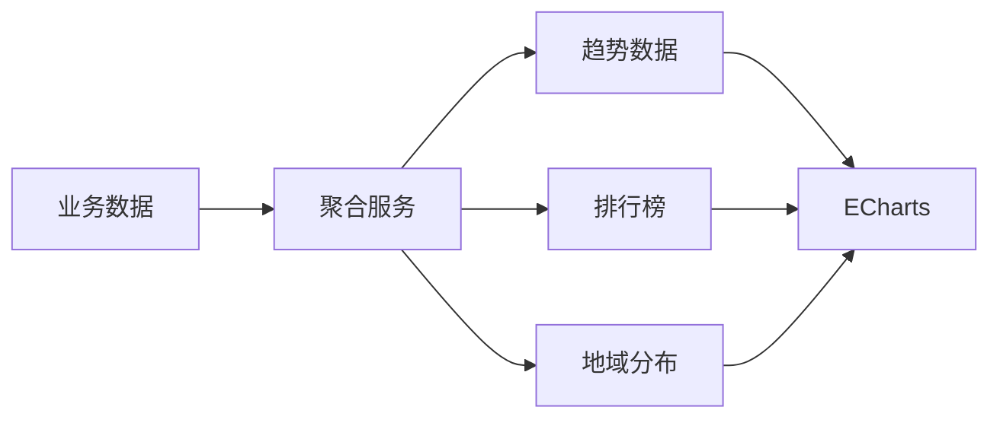

# 任务：数据聚合服务

## 任务概述

### 任务描述
实现看板所需的各种数据聚合服务，包括趋势图表、排行榜、地域分布等。

### 任务目的
为大屏看板提供完整的数据支撑。

---

## 依赖关系

### 前置条件
- **前置任务**：plan_32（KPI计算服务）

---

## 可视化辅助

### 数据聚合图


### 风险监控表
| 风险项 | 等级 | 触发信号 | 应对策略 | 责任人 |
|--------|------|----------|----------|--------|
| 聚合数据量大 | 中 | 查询慢 | 分级聚合+缓存 | 开发者 |

---

## 执行步骤

### 步骤1：实现趋势数据聚合
- 发运/到货趋势
- 异常数量趋势

### 步骤2：实现排行榜数据
- 承运商排名（按准时率）
- 供应商排名（按异常率）

### 步骤3：实现地域分布数据
- 起运地分布
- 到货地分布
- 线路热度

### 步骤4：实现看板API

---

## 核心接口定义

### 主要类/接口
```java
public interface DashboardAggregateService {
    // 趋势数据
    TrendVO getTrend(TrendRequest request);
    // 排行榜
    RankingVO getRanking(RankingRequest request);
    // 地域分布
    Map<String, Integer> getLocationDistribution(LocationRequest request);
}

@Data
public class TrendVO {
    private List<String> dates;
    private List<Integer> shipmentCounts;
    private List<Integer> receiptCounts;
    private List<Integer> exceptionCounts;
}

@Data
public class RankingVO {
    private List<PartnerRankingItem> carriers;
    private List<PartnerRankingItem> suppliers;
}
```

---

## 验收标准

### 功能验收
1. [ ] 趋势数据正确
2. [ ] 排行榜数据正确
3. [ ] 地域分布准确
4. [ ] API响应及时

---

## 注意事项

- 时间范围合理限制
- 分级聚合提升性能
- 结果缓存策略
