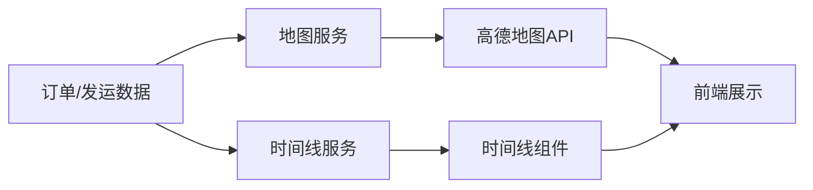

# 模块：可视化聚合模块

## 模块概述

### 模块目标
实现地图可视化和时间线可视化服务，提供业务数据的图形化展示能力。

### 在项目中的位置
可视化聚合依赖订单、发运数据，为前端提供地图和时间线数据。

---

## 依赖关系

### 前置条件
- **前置任务**：plan_07（订单聚合）、plan_12（发运聚合）

### 后续影响
- **后续任务**：plan_37（前端应用）

---

## 子任务分解

- [ ] plan_35 - 地图服务（预估4天）
- [ ] plan_36 - 时间线服务（预估4天）

---

## 可视化输出

### 可视化架构图

---

## 技术方案

### 架构设计
- MapService：地图数据服务
- TimelineService：时间线数据服务

### 接口设计
- GET /api/visualization/map：地图数据
- GET /api/visualization/timeline：时间线数据

---

## 验收标准

### 功能验收
- [ ] 地图线路正确显示
- [ ] 时间线节点完整
- [ ] 数据更新及时

---

## 交付物清单

### 代码文件
- `service/MapService.java`
- `service/TimelineService.java`
- `controller/VisualizationController.java`
