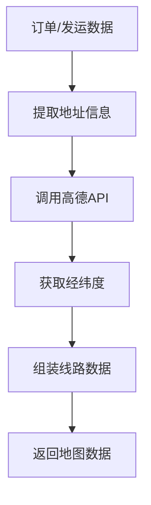

# 任务：地图服务

## 任务概述

### 任务描述
实现基于高德地图的订单线路可视化，支持发货点到收货点的线路展示、多线路叠加、线路热度分析。

### 任务目的
提供业务地图的可视化能力，解决"一单多线路难以统一管理与回溯"的问题。

---

## 依赖关系

### 前置条件
- **前置任务**：plan_07（订单聚合）、plan_12（发运聚合）

---

## 可视化辅助

### 地图数据流程图


### 地图数据结构
```
┌─────────────────────────────────────────┐
│              地图数据结构                 │
├─────────────────────────────────────────┤
│  origin: {lng, lat, name}    起运地      │
│  destination: {lng, lat, name} 目的地    │
│  waypoints: [{lng, lat}]     途经点      │
│  status: 在途/已完成         状态        │
│  path: "..."                 线路路径     │
└─────────────────────────────────────────┘
```

### 风险监控表
| 风险项 | 等级 | 触发信号 | 应对策略 | 责任人 |
|--------|------|----------|----------|--------|
| API调用限流 | 中 | 获取失败 | 缓存+降级 | 开发者 |
| 地址解析失败 | 中 | 经纬度为空 | 人工维护 | 开发者 |

---

## 执行步骤

### 步骤1：配置高德地图API

### 步骤2：实现地址解析服务
- 地址转经纬度（地理编码）
- 经纬度转地址（逆地理编码）

### 步骤3：实现线路规划服务
- 驾车线路规划
- 距离计算

### 步骤4：实现地图数据聚合
- 按订单聚合线路
- 多线路叠加处理

### 步骤5：实现线路热度统计

---

## 核心接口定义

### 主要类/接口
```java
public interface MapService {
    // 获取订单线路数据
    List<OrderLineVO> getOrderLines(Long orderId);
    // 获取区域订单分布
    Map<String, Integer> getOrderDistribution(OrderDistributionRequest request);
    // 获取线路热度
    List<RouteHeatVO> getRouteHeat(RouteHeatRequest request);
}

@Data
public class OrderLineVO {
    private String orderNo;
    private Point origin;      // 起运地
    private Point destination; // 目的地
    private String status;     // 状态
    private String path;       // 线路
}

@Data
public class Point {
    private Double lng;
    private Double lat;
    private String name;
    private String address;
}
```

---

## 验收标准

### 功能验收
1. [ ] 地址解析正确
2. [ ] 线路绘制正确
3. [ ] 多线路叠加显示
4. [ ] 线路热度统计准确

---

## 注意事项

- 高德API调用频率限制
- 经纬度缓存处理
- 线路数据简化（减少点数）
