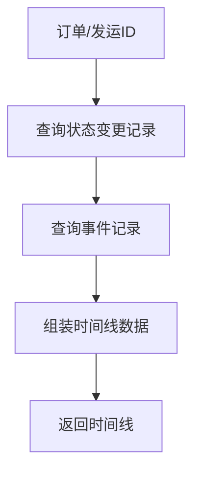

# 任务：时间线服务

## 任务概述

### 任务描述
实现订单/发运的时间线数据服务，展示关键节点的时间和状态。

### 任务目的
提供业务流程的时间可视化能力。

---

## 依赖关系

### 前置条件
- **前置任务**：plan_07（订单聚合）、plan_12（发运聚合）

---

## 可视化辅助

### 时间线数据流程图


### 时间线结构
```
┌─────────────────────────────────────────┐
│              时间线结构                   │
├─────────────────────────────────────────┤
│  ┌────────┐    ┌────────┐    ┌────────┐ │
│  │ 订单创建│───→│ 发运批次│───→│ 签收确认│ │
│  └────────┘    └────────┘    └────────┘ │
│       ↓             ↓              ↓     │
│   01-20        01-22          01-25    │
│   10:30        14:00          09:30    │
└─────────────────────────────────────────┘
```

### 风险监控表
| 风险项 | 等级 | 触发信号 | 应对策略 | 责任人 |
|--------|------|----------|----------|--------|
| 事件记录缺失 | 中 | 时间线不完整 | 补充事件记录 | 开发者 |

---

## 执行步骤

### 步骤1：定义时间线事件类型

### 步骤2：实现订单时间线
- 订单创建
- 订单提交
- 发运批次创建
- 签收确认
- 订单完成

### 步骤3：实现发运批次时间线
- 批次创建
- 提货
- 在途更新
- 到货签收

### 步骤4：实现时间线聚合

---

## 核心接口定义

### 主要类/接口
```java
public interface TimelineService {
    // 获取订单时间线
    List<TimelineItemVO> getOrderTimeline(Long orderId);
    // 获取发运时间线
    List<TimelineItemVO> getShipmentTimeline(Long batchId);
}

@Data
public class TimelineItemVO {
    private String type;        // 类型：订单/发运/签收
    private String status;      // 状态
    private String statusDesc;  // 状态描述
    private LocalDateTime time;
    private String operator;
    private String description;
    private String icon;        // 图标
    private String color;       // 颜色
}
```

---

## 验收标准

### 功能验收
1. [ ] 时间线节点完整
2. [ ] 时间顺序正确
3. [ ] 状态描述清晰
4. [ ] 支持多对象聚合

---

## 注意事项

- 时间线数据缓存
- 异常状态高亮显示
- 时间格式统一
