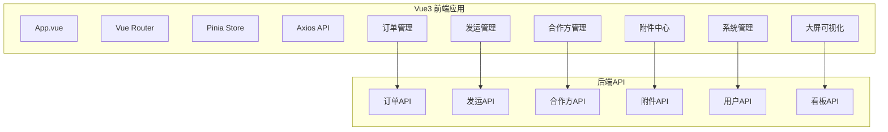

# 模块：前端应用

## 模块概述

### 模块目标
实现Vue3前端应用，包括订单管理页面、发运管理页面、合作方管理页面、附件中心页面、系统管理页面、大屏可视化。

### 在项目中的位置
前端应用是用户交互入口，依赖所有后端模块的API。

---

## 依赖关系

### 前置条件
- **前置任务**：plan_54（前端项目初始化）、所有后端模块API

### 后续影响
- **提供的产出**：完整的用户界面

---

## 子任务分解

- [ ] plan_38 - Vue3项目初始化（预估2天）
- [ ] plan_39 - 订单管理页面（预估3天）
- [ ] plan_40 - 发运管理页面（预估2天）
- [ ] plan_41 - 合作方管理页面（预估2天）
- [ ] plan_42 - 附件中心页面（预估2天）
- [ ] plan_43 - 系统管理页面（预估3天）
- [ ] plan_44 - 大屏可视化（预估4天）

---

## 可视化输出

### 前端架构图

---

## 技术方案

### 架构设计
- Vue 3 Composition API
- TypeScript 5.2+
- Element Plus 2.4+
- Vue Router 4.x
- Pinia 2.x
- Axios
- ECharts 5.4+
- 高德地图API

### 页面结构
- layout：布局组件
- views：页面组件
- components：公共组件
- api：API接口
- stores：状态管理
- utils：工具函数

---

## 验收标准

### 功能验收
- [ ] 所有页面正常显示
- [ ] API调用正常
- [ ] 表单提交正常
- [ ] 数据展示正确

### 质量验收
- [ ] TypeScript无类型错误
- [ ] ESLint检查通过
- [ ] 页面响应式布局
