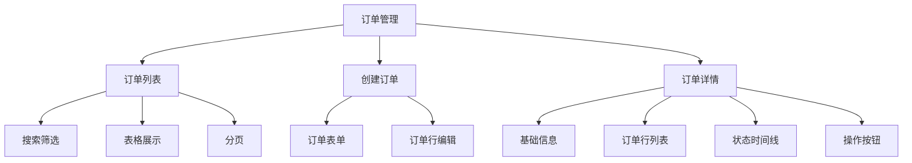

# 任务：订单管理页面

## 任务概述

### 任务描述
实现订单管理的完整页面，包括订单列表、订单创建、订单详情、订单状态操作。

### 任务目的
提供订单的完整管理界面。

---

## 依赖关系

### 前置条件
- **前置任务**：plan_38（Vue3项目初始化）、plan_11（订单API接口）

---

## 可视化辅助

### 页面结构图


### 风险监控表
| 风险项 | 等级 | 触发信号 | 应对策略 | 责任人 |
|--------|------|----------|----------|--------|
| 表单校验不全 | 中 | 提交失败 | 完善校验规则 | 前端开发者 |

---

## 执行步骤

### 步骤1：创建订单列表页
- 搜索筛选表单
- 数据表格
- 分页组件
- 操作按钮列

### 步骤2：创建订单创建弹窗
- 基础信息表单
- 订单行编辑组件
- 表单校验

### 步骤3：创建订单详情页
- 基础信息卡片
- 订单行表格
- 状态时间线
- 操作按钮

### 步骤4：实现API对接

---

## 核心接口定义

### 主要类/接口
```typescript
// 订单API
export const orderApi = {
  // 订单列表
  list: (params: OrderQuery) => request.get<PageResult<OrderVO>>('/api/order/list', { params }),
  // 订单详情
  getById: (id: number) => request.get<OrderDetailVO>(`/api/order/${id}`),
  // 创建订单
  create: (data: OrderDTO) => request.post<number>('/api/order/create', data),
  // 提交订单
  submit: (id: number) => request.post(`/api/order/${id}/submit`),
  // 取消订单
  cancel: (id: number, reason: string) => request.post(`/api/order/${id}/cancel`, null, { params: { reason } })
};
```

---

## 验收标准

### 功能验收
1. [ ] 订单列表正常显示
2. [ ] 搜索筛选正常
3. [ ] 创建订单成功
4. [ ] 订单详情完整
5. [ ] 状态操作正常

---

## 注意事项

- 订单行支持动态增删
- 金额字段格式化显示
- 状态标签颜色区分
