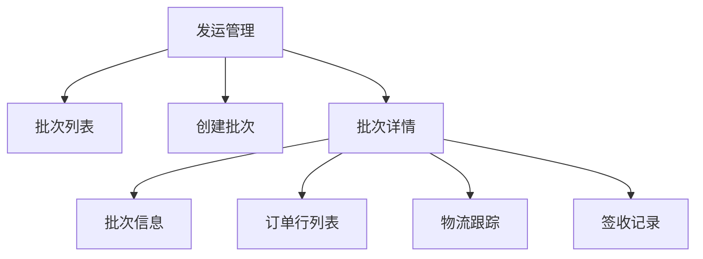

# 任务：发运管理页面

## 任务概述

### 任务描述
实现发运批次管理页面，包括批次列表、批次创建、批次详情、物流跟踪。

### 任务目的
提供发运管理的操作界面。

---

## 依赖关系

### 前置条件
- **前置任务**：plan_38（Vue3项目初始化）、plan_16（物流跟踪）

---

## 可视化辅助

### 页面结构图


---

## 执行步骤

### 步骤1：创建批次列表页

### 步骤2：创建批次创建弹窗
- 选择订单
- 选择订单行
- 选择承运商

### 步骤3：创建批次详情页
- 批次信息卡片
- 订单行表格
- 物流跟踪
- 签收记录

### 步骤4：实现API对接

---

## 核心接口定义

### 主要类/接口
```typescript
export const shipmentApi = {
  // 批次列表
  list: (params: ShipmentQuery) => request.get<PageResult<ShipmentBatchVO>>('/api/shipment/list', { params }),
  // 创建批次
  create: (data: ShipmentBatchDTO) => request.post<number>('/api/shipment/create', data),
  // 批次详情
  getById: (id: number) => request.get<ShipmentDetailVO>(`/api/shipment/${id}`),
  // 物流跟踪
  getTracking: (id: number) => request.get<TrackingVO>(`/api/shipment/${id}/tracking`)
};
```

---

## 验收标准

### 功能验收
1. [ ] 批次列表正常
2. [ ] 创建批次成功
3. [ ] 物流跟踪正常
4. [ ] 签收记录完整

---

## 注意事项

- 批次状态颜色区分
- 物流信息实时更新
