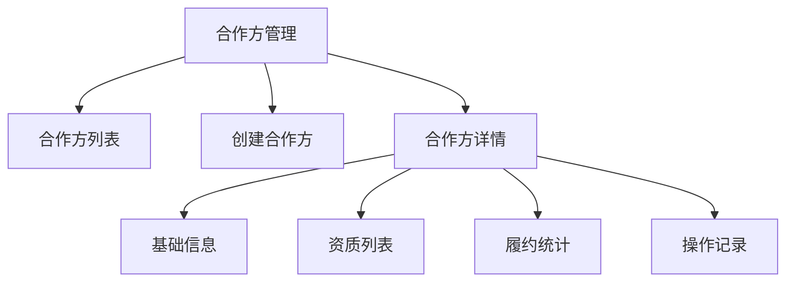

# 任务：合作方管理页面

## 任务概述

### 任务描述
实现合作方管理页面，包括供应商/承运商列表、合作方创建、资质管理、履约统计。

### 任务目的
提供合作方的管理界面。

---

## 依赖关系

### 前置条件
- **前置任务**：plan_38（Vue3项目初始化）、plan_19（合作方CRUD）

---

## 可视化辅助

### 页面结构图


---

## 执行步骤

### 步骤1：创建合作方列表页
- 类型切换（供应商/承运商）
- 搜索表单
- 数据表格

### 步骤2：创建合作方弹窗
- 基础信息表单
- 资质上传

### 步骤3：创建履约统计展示
- 准时率卡片
- 订单数量卡片
- 异常率卡片

### 步骤4：实现API对接

---

## 核心接口定义

### 主要类/接口
```typescript
export const partnerApi = {
  // 合作方列表
  list: (params: PartnerQuery) => request.get<PageResult<PartnerVO>>('/api/partner/list', { params }),
  // 创建合作方
  create: (data: PartnerDTO) => request.post<number>('/api/partner/create', data),
  // 履约统计
  getPerformance: (id: number) => request.get<PerformanceVO>(`/api/partner/${id}/performance`)
};
```

---

## 验收标准

### 功能验收
1. [ ] 合作方列表正常
2. [ ] 创建合作方成功
3. [ ] 资质上传正常
4. [ ] 履约统计显示

---

## 注意事项

- 类型标签颜色区分
- 资质文件预览支持
