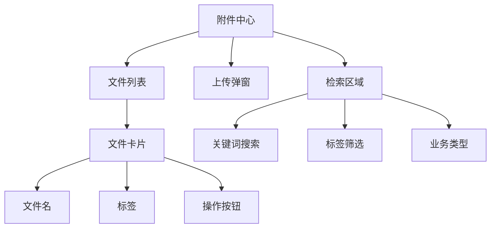

# 任务：附件中心页面

## 任务概述

### 任务描述
实现附件中心页面，支持文件上传、下载、标签管理、全文检索。

### 任务目的
提供附件的统一管理界面。

---

## 依赖关系

### 前置条件
- **前置任务**：plan_38（Vue3项目初始化）、plan_28（文件上传下载）

---

## 可视化辅助

### 页面结构图


---

## 执行步骤

### 步骤1：创建文件列表页
- 文件卡片布局
- 筛选条件
- 分页

### 步骤2：创建上传弹窗
- 拖拽上传
- 进度显示
- 标签选择

### 步骤3：创建检索区域
- 关键词搜索
- 标签筛选
- 高级筛选

### 步骤4：实现API对接

---

## 核心接口定义

### 主要类/接口
```typescript
export const attachmentApi = {
  // 上传文件
  upload: (file: File) => {
    const formData = new FormData();
    formData.append('file', file);
    return request.post<string>('/api/attachment/upload', formData);
  },
  // 文件列表
  list: (params: AttachmentQuery) => request.get<PageResult<AttachmentVO>>('/api/attachment/list', { params }),
  // 全文检索
  search: (params: SearchRequest) => request.get<PageResult<AttachmentVO>>('/api/attachment/search', { params })
};
```

---

## 验收标准

### 功能验收
1. [ ] 文件上传成功
2. [ ] 文件下载正常
3. [ ] 标签管理正常
4. [ ] 全文检索可用

---

## 注意事项

- 支持大文件上传
- 上传进度显示
- 文件预览支持
