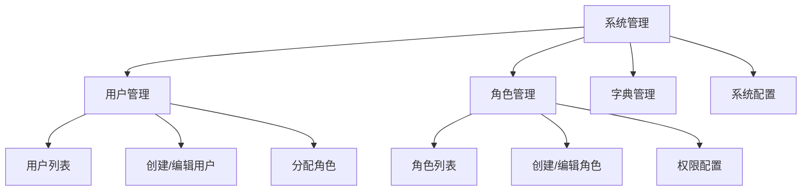

# 任务：系统管理页面

## 任务概述

### 任务描述
实现系统管理页面，包括用户管理、角色管理、权限配置、字典管理、系统配置。

### 任务目的
提供系统管理的操作界面。

---

## 依赖关系

### 前置条件
- **前置任务**：plan_38（Vue3项目初始化）、plan_22（用户管理）、plan_23（角色权限）

---

## 可视化辅助

### 页面结构图


---

## 执行步骤

### 步骤1：创建用户管理页
- 用户列表
- 用户编辑弹窗
- 角色分配

### 步骤2：创建角色管理页
- 角色列表
- 角色编辑弹窗
- 权限树选择器

### 步骤3：创建字典管理页
- 字典类型列表
- 字典项列表
- 字典项编辑

### 步骤4：实现API对接

---

## 核心接口定义

### 主要类/接口
```typescript
export const userApi = {
  // 用户列表
  list: (params: UserQuery) => request.get<PageResult<UserVO>>('/api/user/list', { params }),
  // 创建用户
  create: (data: UserDTO) => request.post<number>('/api/user/create', data),
  // 重置密码
  resetPassword: (id: number) => request.post(`/api/user/${id}/reset-password`)
};

export const roleApi = {
  // 角色列表
  list: () => request.get<RoleVO[]>('/api/role/list'),
  // 创建角色
  create: (data: RoleDTO) => request.post<number>('/api/role/create', data),
  // 权限树
  permissions: () => request.get<PermissionVO[]>('/api/permission/tree')
};
```

---

## 验收标准

### 功能验收
1. [ ] 用户管理正常
2. [ ] 角色管理正常
3. [ ] 权限配置生效
4. [ ] 字典管理正常

---

## 注意事项

- 密码重置需要二次确认
- 权限树支持父子联动
