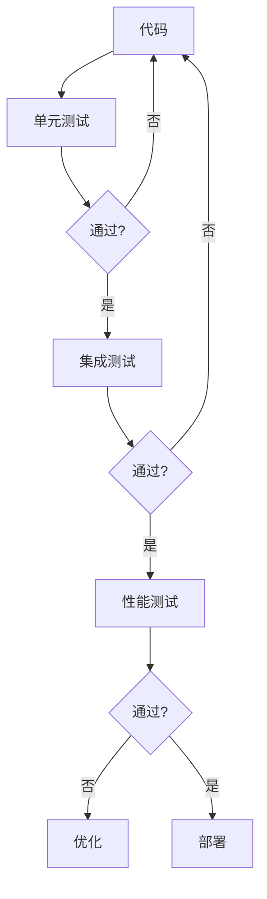

# 模块：测试与部署

## 模块概述

### 任务目标
实现单元测试、集成测试、性能测试，以及部署方案设计和文档编写。

### 在项目中的位置
测试与部署是项目的最后阶段，依赖所有功能模块。

---

## 依赖关系

### 前置条件
- **前置任务**：所有业务模块

### 后续影响
- **提供的产出**：测试报告、部署方案、操作文档

---

## 子任务分解

- [ ] plan_46 - 单元测试与集成测试（预估2天）
- [ ] plan_47 - 性能测试与优化（预估2天）
- [ ] plan_48 - 部署方案设计（预估2天）
- [ ] plan_49 - 文档编写与培训（预估2天）

---

## 可视化输出

### 测试流程图

---

## 技术方案

### 测试工具
- JUnit 5：单元测试
- Mockito：Mock框架
- TestContainers：集成测试
- JMeter：性能测试

### 部署方案
- Docker容器化
- Nginx反向代理
- MySQL主从
- Redis哨兵

---

## 验收标准

### 功能验收
- [ ] 测试覆盖率 > 70%
- [ ] 性能指标达标
- [ ] 部署成功

### 质量验收
- [ ] 无严重Bug
- [ ] 文档完整
