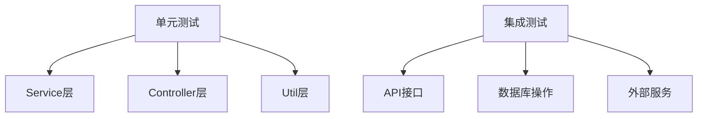

# 任务：单元测试与集成测试

## 任务概述

### 任务描述
编写单元测试和集成测试用例，确保代码质量和功能正确性。

### 任务目的
达到测试覆盖率 > 70% 的质量目标。

---

## 依赖关系

### 前置条件
- **前置任务**：所有业务模块代码

---

## 可视化辅助

### 测试范围图


---

## 执行步骤

### 步骤1：编写单元测试
- Service层测试
- Controller层测试
- 工具类测试

### 步骤2：编写集成测试
- API接口测试
- 数据库操作测试

### 步骤3：生成测试报告

---

## 核心接口定义

### 主要测试类
```java
@SpringBootTest
@AutoConfigureMockMvc
class OrderControllerTest {
    @Autowired
    private MockMvc mockMvc;

    @Test
    void testCreateOrder() throws Exception {
        // 测试创建订单
    }
}

@DataJpaTest
class OrderRepositoryTest {
    @Autowired
    private TestEntityManager entityManager;

    @Test
    void testFindById() {
        // 测试查询订单
    }
}
```

---

## 验收标准

### 功能验收
1. [ ] 单元测试覆盖率 > 80%
2. [ ] 集成测试覆盖核心场景
3. [ ] 测试报告生成

---

## 注意事项

- Mock外部依赖
- 测试数据隔离
