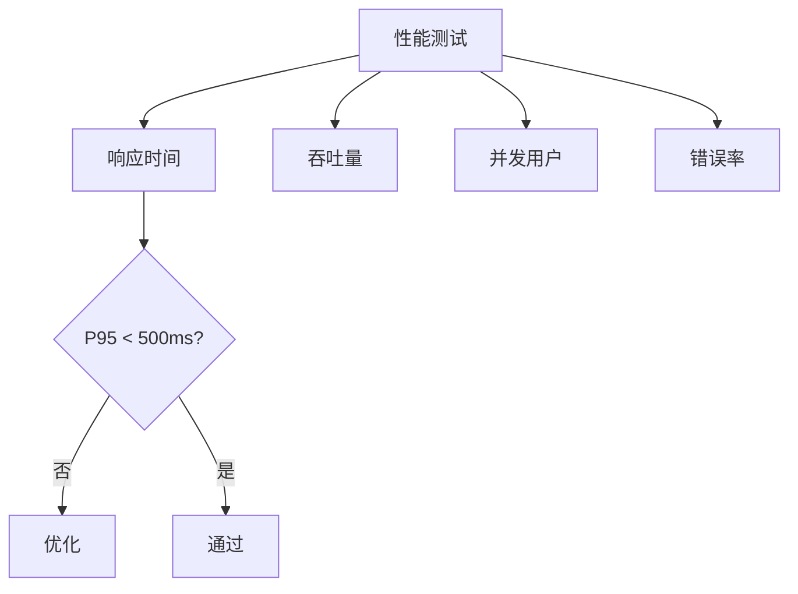

# 任务：性能测试与优化

## 任务概述

### 任务描述
使用JMeter进行性能测试，验证系统是否满足性能指标要求，并进行优化。

### 任务目的
确保系统满足性能要求：API P95 < 500ms，订单列表 P95 < 200ms，支持1000 QPS。

---

## 依赖关系

### 前置条件
- **前置任务**：plan_46（单元测试与集成测试）

---

## 可视化辅助

### 性能指标图

---

## 执行步骤

### 步骤1：设计测试场景
- 登录接口
- 订单列表查询
- 订单创建
- 看板数据查询

### 步骤2：编写JMeter脚本

### 步骤3：执行性能测试

### 步骤4：分析瓶颈

### 步骤5：实施优化
- SQL优化
- 索引优化
- 缓存优化
- 代码优化

---

## 核心接口定义

### 性能指标
| 指标 | 目标 | 测试方法 |
|------|------|----------|
| API响应时间P95 | < 500ms | JMeter |
| 订单列表P95 | < 200ms | JMeter |
| 附件检索P95 | < 2s | JMeter |
| 并发支持 | 1000 QPS | JMeter |

---

## 验收标准

### 功能验收
1. [ ] 所有性能指标达标
2. [ ] 并发测试通过
3. [ ] 优化措施实施

---

## 注意事项

- 测试环境与生产环境一致
- 预热后再正式测试
- 记录测试报告
