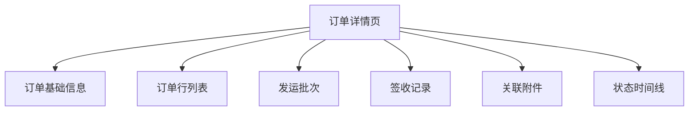

# 模块：订单详情页整合

## 模块概述

### 任务目标
实现订单详情页面的整合功能，将订单信息、发运批次、签收记录、附件、时间线等信息整合到一个页面。

### 在项目中的位置
订单详情页整合是独立模块，依赖订单、发运、附件模块。

---

## 依赖关系

### 前置条件
- **前置任务**：plan_07（订单聚合）、plan_12（发运聚合）、plan_27（附件聚合）

### 后续影响
- **提供的产出**：整合后的订单详情页

---

## 子任务分解

- [ ] plan_51 - 详情页组件整合（预估3天）

---

## 可视化输出

### 详情页结构图

---

## 技术方案

### 组件设计
- OrderDetailContainer：详情容器
- OrderBasicInfo：基础信息卡片
- OrderLinesTable：订单行表格
- ShipmentList：发运批次列表
- ReceiptList：签收记录列表
- AttachmentList：附件列表
- Timeline：时间线组件

---

## 验收标准

### 功能验收
- [ ] 详情页信息完整
- [ ] 各模块数据正确
- [ ] 时间线连贯
