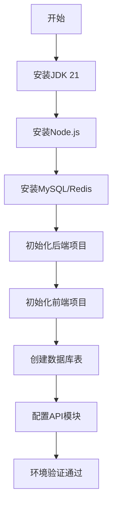
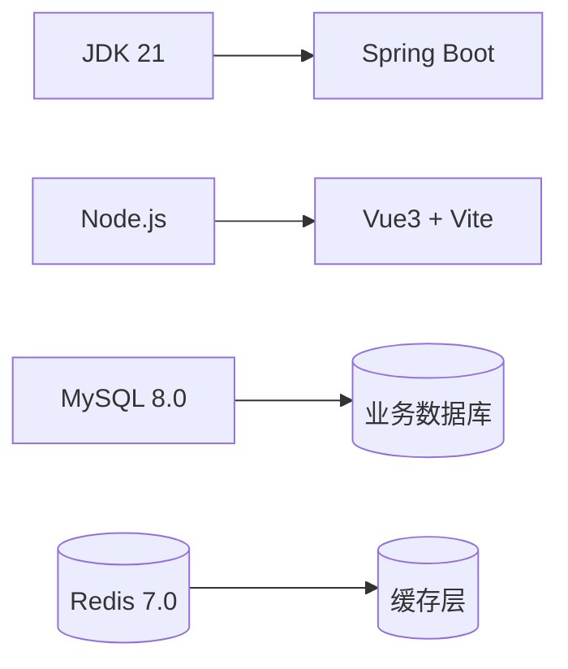

# 模块：环境搭建

## 模块概述

### 模块目标
搭建项目开发运行所需的基础环境，包括后端Spring Boot项目、前端Vue3项目、数据库结构和API启动模块配置。

### 在项目中的位置
这是项目的第一步，所有后续模块都依赖本模块提供的基础环境。

---

## 依赖关系

### 前置条件
- **前置任务**：无
- **前置数据**：无
- **前置环境**：JDK 21、Node.js 18+、MySQL 8.0+、Redis 7.0+

### 后续影响
- **后续任务**：plan_02（公共模块）、plan_37（前端应用）
- **产出数据**：项目结构、数据库表结构、运行环境

---

## 子任务分解

- [ ] plan_53 - 后端项目初始化（预估1.5天）
- [ ] plan_54 - 前端项目初始化（预估1天）
- [ ] plan_55 - 数据库建表（预估1.5天）
- [ ] plan_56 - API启动模块配置（预估1天）

---

## 可视化输出

### 模块流程图

### 环境依赖图

### 资源分配表
| 资源类型 | 负责人 | 参与时段 | 关键产出 | 风险/备注 |
| --- | --- | --- | --- | --- |
| 开发环境 | 开发者 | 第1-2天 | JDK/Node/MySQL安装 | 版本兼容性 |
| 后端项目 | 后端开发者 | 第2-3天 | 可运行的后端项目 | 依赖下载慢 |
| 前端项目 | 前端开发者 | 第3-4天 | 可运行的前端项目 | npm安装失败 |
| 数据库 | DBA/开发者 | 第4-5天 | 表结构DDL | 字段类型调整 |

---

## 技术方案

### 架构设计
采用多模块Maven项目结构，前后端分离架构：
- 后端：Spring Boot 3.2.x多模块项目
- 前端：Vue 3 + TypeScript + Vite
- 数据库：MySQL 8.0 + Flyway版本管理

### 核心技术选型
- **项目构建**：Maven 3.9+（后端）、Vite 4.4+（前端）
- **版本管理**：Flyway 9.0（数据库迁移）
- **API文档**：Knife4j 4.4.0
- **开发工具**：IntelliJ IDEA / VS Code

### 数据模型
本阶段创建核心业务表的基础结构，具体表结构见各聚合模块。

### 接口设计
API启动模块提供统一的RESTful接口入口，配置Swagger文档。

---

## 执行摘要

### 输入
- 技术栈规范文档
- 数据库设计文档
- 开发环境机器

### 处理
1. 安装开发环境（JDK、Node.js、MySQL、Redis）
2. 初始化后端Maven多模块项目
3. 初始化前端Vue3项目
4. 创建数据库和基础表结构
5. 配置API启动模块和Swagger文档

### 输出
- 可运行的后端项目
- 可运行的前端项目
- 数据库表结构
- Swagger API文档地址

---

## 验收标准

### 功能验收
- [ ] 后端项目可正常启动，访问健康检查接口返回200
- [ ] 前端项目可正常启动，显示欢迎页面
- [ ] 数据库表结构创建成功，可正常连接
- [ ] Swagger文档可正常访问

### 性能验收
- [ ] 项目启动时间 < 30秒
- [ ] API健康检查响应时间 < 100ms

---

## 交付物清单

### 代码文件
- `pom.xml`：Maven父项目配置
- `order-platform-api/pom.xml`：API启动模块
- `order-platform-common/pom.xml`：公共模块
- `package.json`：前端项目配置

### 配置文件
- `application.yml`：Spring Boot配置
- `flyway migrations`：数据库迁移脚本

### 文档
- 环境搭建手册
- 本地开发指南
