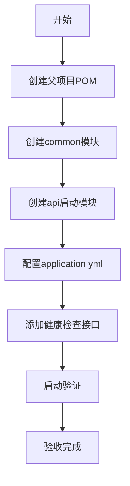

# 任务：后端项目初始化

## 任务概述

### 任务描述
创建Spring Boot 3.2.x多模块Maven项目，配置父项目和各子模块依赖，确保项目可以正常启动。

### 任务目的
建立后端项目的基础结构，为后续业务模块开发提供统一的框架支撑。

---

## 依赖关系

### 前置条件
- **前置任务**：无
- **需要的资源**：JDK 21、Maven 3.9+、IDE
- **环境要求**：JAVA_HOME配置正确，Maven可用

### 对后续的影响
- **后续任务**：plan_02（公共模块）、plan_55（数据库建表）
- **提供的产出**：可运行的后端项目框架

---

## 可视化辅助

### 步骤流程图


### 风险监控表
| 风险项 | 等级 | 触发信号 | 应对策略 | 责任人 |
|--------|------|----------|----------|--------|
| JDK版本不兼容 | 高 | 编译失败 | 检查JAVA_HOME版本 | 开发者 |
| 依赖下载失败 | 中 | 网络超时 | 配置阿里云镜像 | 开发者 |
| 启动失败 | 高 | 报错日志 | 检查端口占用/配置 | 开发者 |

---

## 执行步骤

### 步骤1：创建父项目结构
- **操作**：创建Maven多模块项目目录结构
- **输入**：项目名称、包路径规范
- **输出**：父pom.xml和子模块目录
- **注意事项**：遵循Spring Boot 3.2.x版本规范

### 步骤2：配置父POM
- **操作**：设置依赖管理、插件管理
- **输入**：技术栈版本号
- **输出**：配置完整的父pom.xml
- **注意事项**：使用dependencyManagement统一版本管理

### 步骤3：创建API启动模块
- **操作**：创建order-platform-api模块，添加启动类
- **输入**：包名规范
- **输出**：可启动的Spring Boot应用
- **注意事项**：添加@SpringBootApplication注解

### 步骤4：配置文件
- **操作**：创建application.yml，配置端口、数据源等
- **输入**：环境参数
- **输出**：配置文件
- **注意事项**：区分dev/prod环境配置

### 步骤5：添加健康检查
- **操作**：创建Actuator健康检查接口
- **输入**：无
- **输出**：/actuator/health接口
- **注意事项**：验证Spring Boot正常运行

---

## 核心接口定义

### 主要类/接口
```java
// 应用启动类
@SpringBootApplication
public class OrderPlatformApplication {
    public static void main(String[] args) {
        SpringApplication.run(OrderPlatformApplication.class, args);
    }
}

// 健康检查控制器
@RestController
@RequestMapping("/api/health")
public interface HealthController {
    Result<String> health();
}
```

### 数据结构
- Result：统一响应结果（code、message、data、timestamp）

---

## 文件操作清单

### 需要创建的文件
- `pom.xml` - 父项目POM配置
- `order-platform-api/pom.xml` - API启动模块
- `order-platform-api/src/main/java/{package}/OrderPlatformApplication.java` - 启动类
- `order-platform-api/src/main/resources/application.yml` - 配置文件
- `order-platform-common/pom.xml` - 公共模块（占位）
- `order-platform-order/pom.xml` - 订单模块（占位）
- `order-platform-shipment/pom.xml` - 发运模块（占位）

### 需要读取的文件
- `.claude/CLAUDE.md` - 技术栈规范
- `.claude/tech-stack.md` - 技术架构设计

---

## 验收标准

### 功能验收
1. [ ] Maven构建成功，无依赖冲突
2. [ ] 项目可正常启动，端口8080监听成功
3. [ ] 访问/actuator/health返回{"status":"UP"}
4. [ ] 日志输出正常，无ERROR级别日志

### 质量验收
- [ ] POM配置符合Maven规范
- [ ] 包路径符合com.company.order.visual规范

---

## 注意事项

### 技术注意点
- Spring Boot 3.x要求JDK 17+，推荐JDK 21
- Jakarta EE 9变更：javax.*改为jakarta.*

### 安全注意点
- 生产环境配置不要提交到代码仓库

### 性能注意点
- 配置JVM参数优化启动速度
